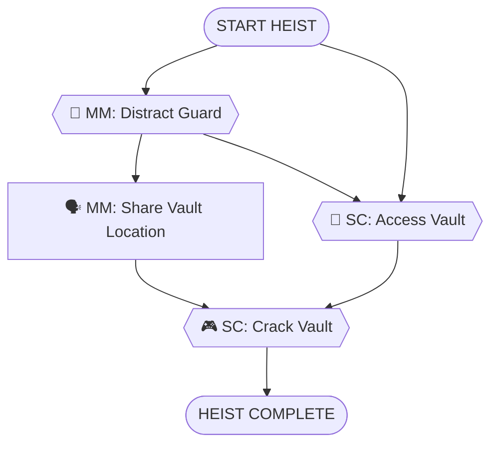

# Museum Gala Vault Heist - Simple Experience

**ID**: `museum_gala_vault`
**Scenario**: Museum Gala Vault Heist
**Selected Roles**: Mastermind, Safe Cracker
**Player Count**: 2 players

## Objective

Steal the Eye of Orion jewels from the museum vault during the gala and escape.

## Locations

### Crew Hideout (Starting Location)
- **Crew Hideout** - Secret base where the crew plans the heist. All players start here.

### Museum Interior
- **Grand Hall** - Main gala space where guests mingle
- **Museum Basement** - Corridor leading to the restricted vault area
- **Vault Room** - Secure basement vault containing the Eye of Orion jewels

**Total Locations**: 4

## Task Types

Every task in this heist is one of five types:

- **🎮 Minigame**: Player-controlled action from `roles.json`
- **💬 NPC/LLM**: Dialogue or interaction with AI-controlled character
- **🔍 Search/Hunt**: Player searches a location for hidden items
- **🤝 Item Handoff**: Physical item transfer between players (tracked in inventory)
- **🗣️ Info Share**: Verbal information exchange between players (real-life conversation)

## Roles & Dependencies

### Mastermind

**Tasks:**
1. **MM1. 💬 NPC** - Chat with Security Guard
   - *Description:* Engage the museum guard in friendly conversation. While distracting him, subtly learn about the vault location and security details.
   - *NPC: Security Guard (bored, chatty, lonely) - "Another quiet night at the museum. Say, did you see the game last night? I've been stuck down here guarding that new vault exhibit in the basement all week..."*
   - *Location:* Grand Hall
   - *Dependencies:* None (starting task)

2. **MM2. 🗣️ INFO** - Share Vault Intel with Safe Cracker
   - *Description:* Radio the Safe Cracker with the vault's location (basement, east wing) and the guard's patrol schedule you learned.
   - *Location:* Grand Hall
   - *Dependencies:* `MM1` (learned vault location from guard)

### Safe Cracker

**Tasks:**
1. **SC1. 💬 NPC** - Navigate to Basement Vault
   - *Description:* Using the intel from Mastermind, make your way to the basement vault in the east wing while the guard is distracted.
   - *NPC: Yourself (focused, professional) - "Copy that. Guard's occupied. Heading to basement vault, east wing."*
   - *Location:* Museum Basement
   - *Dependencies:* `MM1` (guard distracted), `MM2` (received vault location)

2. **SC2. 🎮 dial_rotation** - Crack the Vault Lock
   - *Description:* Use your expert skills to manipulate the vault's combination dial and retrieve the Eye of Orion jewels.
   - *Location:* Vault Room
   - *Dependencies:* `SC1` (reached vault)

## Task Summary

Total tasks: 4
Critical path tasks: 4
Supporting tasks: 0

By type:
- Minigames (🎮): 1 (25%)
- NPC/LLM interactions (💬): 2 (50%)
- Info shares (🗣️): 1 (25%)

## Dependency Tree Diagram

## Key Collaboration Points

- **Intelligence Gathering**: Mastermind chats with guard to learn vault location and security details
- **Distraction**: Same conversation keeps guard occupied and away from his post
- **Information Sharing**: Mastermind radios the vault intel to Safe Cracker
- **Execution**: Safe Cracker uses the intel to navigate to vault and crack it

## Story Flow

1. Mastermind strikes up conversation with lonely security guard
2. Guard mentions he's been "guarding that new vault exhibit in the basement all week"
3. Mastermind keeps him talking (distraction) while learning key details
4. Mastermind radios Safe Cracker: "Basement, east wing, guard's away"
5. Safe Cracker navigates to vault using the intel
6. Safe Cracker cracks the combination lock and retrieves the jewels
