# Museum Gala Vault Heist - Simple Experience

**ID**: `museum_gala_vault`
**Scenario**: Museum Gala Vault Heist
**Selected Roles**: Mastermind, Safe Cracker
**Player Count**: 2 players

## Objective

Steal the Eye of Orion jewels from the museum vault during the gala and escape.

## Locations

### Crew Hideout (Starting Location)
- **ID**: `crew_hideout`
- **Name**: Crew Hideout
- **Description**: Secret base where the crew plans the heist. All players start here.
- **Visual**: Gritty underground hideout with exposed brick walls, dim industrial lighting with hanging bulbs, large planning table covered in blueprints and photos, corkboard wall with red strings connecting evidence, vintage leather couch, old metal lockers, scattered tactical gear and equipment, monitors showing security feeds, noir aesthetic with dramatic shadows, purple and cyan accent lighting

### Museum Interior
- **ID**: `grand_hall`
- **Name**: Grand Hall
- **Description**: Main gala space where guests mingle
- **Visual**: Elegant museum hall with high vaulted ceilings, marble floors with geometric patterns, ornate chandeliers casting warm light, classical art pieces on walls in gold frames, wealthy guests in formal attire mingling, champagne glasses, modern art sculptures, grand staircase in background, ambient purple uplighting on columns, sophisticated heist movie atmosphere

- **ID**: `museum_basement`
- **Name**: Museum Basement
- **Description**: Corridor leading to the restricted vault area
- **Visual**: Industrial concrete corridor with exposed pipes along ceiling, flickering fluorescent lights, restricted area warning signs on walls, security doors with keypads, metal grating on floors, emergency exit signs, cold blue-green lighting, ominous atmosphere, steel support beams, utility boxes and electrical panels, narrow passage leading deeper

- **ID**: `vault_room`
- **Name**: Vault Room
- **Description**: Secure basement vault containing the Eye of Orion jewels
- **Visual**: High-security vault with massive circular steel door featuring chrome combination lock wheel, dramatic spotlight illuminating the vault entrance, reinforced concrete walls, security camera in corner with blinking red light, keypad access panel, polished metal surfaces, tense heist moment lighting with cyan and purple dramatic highlights, professional bank vault aesthetic

**Total Locations**: 4

## Items by Location

### Crew Hideout
- **ID**: `safe_cracking_tools`
  - **Name**: Safe Cracking Tools
  - **Description**: Professional lockpick set, dial manipulation tools, and stethoscope for listening to tumblers
  - **Visual**: Open black leather case containing shiny metallic lockpicks, tension wrenches, dial manipulation tools, and professional stethoscope with chrome ear pieces, tools arranged neatly in foam cutouts, reflective metal surfaces, professional safe-cracking kit, heist movie prop aesthetic, purple velvet lining visible
  - **Required For**: SC2 (Crack the Vault Lock)
  - **Hidden**: false

- **ID**: `earpiece_set`
  - **Name**: Radio Earpiece Set
  - **Description**: Two-way radio earpieces for team communication
  - **Visual**: Pair of sleek black wireless earpieces with curved design, small cyan LED indicator lights, flexible black cables, compact communication devices, modern spy tech aesthetic, glossy black finish with purple accent trim, professional covert operations equipment
  - **Required For**: MM3 (Share Vault Intel)
  - **Hidden**: false

### Grand Hall
- **ID**: `patrol_schedule`
  - **Name**: Guard Patrol Schedule
  - **Description**: A folded printout left on a side table near the security station - lists guard rotation times and break windows
  - **Visual**: Crumpled white paper with printed grid showing guard names, times, and zones, coffee ring stain in corner, handwritten notes in margins, highlighted 9 PM break window, official museum security letterhead, folded twice
  - **Required For**: MM4 (knowing the break window helps convince Marcus)
  - **Hidden**: false

### Vault Room
- **ID**: `eye_of_orion`
  - **Name**: Eye of Orion Jewels
  - **Description**: Stunning collection of rare sapphire and diamond jewels - the target!
  - **Required For**: Win condition (must be picked up to complete heist)
  - **Hidden**: false
  - **Unlock**:
    - Task `SC2` (vault must be cracked open first)

## NPCs

### Museum Curator - Dr. Elena Vasquez
- **ID**: `museum_curator`
- **Role**: Senior Museum Curator
- **Location**: Grand Hall
- **Age**: 52
- **Gender**: female
- **Ethnicity**: Latina
- **Clothing**: Elegant black evening dress with pearl necklace
- **Expression**: friendly
- **Attitude**: proud, knowledgeable, enthusiastic about art
- **Details**: Holding wine glass, wearing museum ID badge
- **Personality**: Passionate about the museum's collection. Loves talking about the exhibits and their history. Very proud of the new Eye of Orion acquisition. Professional but warm at social events.
- **Relationships**: Knows Marcus Romano (the security guard) — thinks he's reliable but a bit bored on night shifts. Respects the museum director but finds him overly paranoid about security lately.
- **Story Context**: The Eye of Orion jewels are NOT on public display — they are locked in a high-security vault in the museum basement (east wing). The museum director insisted on vault storage due to their extreme value ($12M). Elena wishes they were on display but understands the security concern. She would never casually offer to show someone the vault or take them there. The vault location is not common knowledge among gala guests.
- **Information Known**:
  - `vault_location` HIGH: The Eye of Orion jewels are kept in the new vault in the basement, east wing
  - LOW: The jewels were just acquired for $12 million
  - LOW: Only three people know the vault combination
- **Actions Available**: (none)
- **Cover Story Options**:
  - `art_collector`: "Private art collector, considering a major donation to the museum" -- (would love to impress a potential donor, might share insider details)
  - `journalist`: "Arts journalist writing a feature on the museum's new acquisitions" -- (happy to talk about exhibits but cautious about security topics)
  - `pizza_guy`: "Lost pizza delivery guy who wandered in looking for the loading dock" -- (confused but amused, definitely not sharing anything important)

### Security Guard - Marcus Romano
- **ID**: `security_guard`
- **Role**: Museum Security Guard
- **Location**: Grand Hall
- **Age**: 45
- **Gender**: male
- **Ethnicity**: White
- **Clothing**: Navy security uniform with badge and radio
- **Expression**: bored
- **Attitude**: lonely, chatty
- **Details**: Holding clipboard, wearing glasses
- **Personality**: Bored and lonely on the night shift. Loves sports and misses the excitement of his old job. Gets chatty when someone shows interest in his stories. Genuinely believes nothing interesting ever happens at the museum.
- **Relationships**: Works under Dr. Elena Vasquez's department — respects her but finds the gala crowd stuffy. Friendly with the other guards but prefers working alone.
- **Story Context**: Marcus is assigned to patrol near the basement vault area tonight but is currently stationed in the Grand Hall during the gala. He takes a regular smoke break at 9 PM — this is his routine and he'd welcome an excuse to step away early. He doesn't think anyone would actually try to rob the museum, so he's not particularly vigilant. He knows the vault is in the basement but considers it "not his problem" — his job is just to walk the rounds.
- **Information Known**:
  - LOW: He's been assigned to guard the vault exhibit all week
  - LOW: The museum director is paranoid about security since the last incident
- **Actions Available**:
  - `leave_post` HIGH: Can be convinced to leave his post early for a smoke break - he's bored and would welcome an excuse
- **Cover Story Options**:
  - `new_guard`: "New security guard, just transferred here - first night on the job" -- (fellow guard, would share tips and be friendly)
  - `caterer`: "Catering staff working the gala event tonight" -- (friendly to service workers but guarded about security)
  - `tourist`: "Enthusiastic tourist who thinks this is a wax museum" -- (bewildered by this person, not sharing anything)

## Task Types

Every task in this heist is one of these types:

- **🎮 Minigame**: Player-controlled action (e.g., dial_rotation, wire_connecting)
- **💬 NPC/LLM**: Dialogue or interaction with AI-controlled character
- **🔍 Search/Hunt**: Player searches a location for items
- **🤝 Item Handoff**: Physical item transfer between players (tracked in inventory)
- **🗣️ Info Share**: Verbal information exchange between players (real-life conversation)

## Roles & Tasks

### Mastermind

**Tasks:**
1. **MM1. 💬 NPC_LLM** - Learn Vault Location from Curator
   - *Description:* Talk to Dr. Vasquez at the gala to learn where the Eye of Orion jewels are being kept. She's proud of the acquisition - use that.
   - *NPC:* `museum_curator` (Dr. Elena Vasquez)
   - *Target Outcomes:* `vault_location`
   - *Location:* Grand Hall
   - *Prerequisites:* None (starting task)

2. **MM2. 🔍 SEARCH** - Find Guard Patrol Schedule
   - *Description:* Search the Grand Hall for any intel on guard rotations. There might be something useful near the security station.
   - *Search Items:* patrol_schedule
   - *Location:* Grand Hall
   - *Prerequisites:* None (starting task)

3. **MM3. 🗣️ INFO** - Share Vault Intel with Safe Cracker
   - *Description:* Radio the Safe Cracker with the vault's location (basement, east wing) and the guard's break window you found.
   - *Location:* Any (radio communication)
   - *Prerequisites:*
     - Task `MM1` (learned vault location from Elena)
     - Task `MM2` (found the patrol schedule)

4. **MM4. 💬 NPC_LLM** - Convince Guard to Leave His Post
   - *Description:* You know the guard takes a break at 9 PM. Convince Marcus to step away early - he's bored, give him a reason.
   - *NPC:* `security_guard` (Marcus Romano)
   - *Target Outcomes:* `leave_post`
   - *Location:* Grand Hall
   - *Prerequisites:*
     - Task `MM2` (knowing his break schedule helps you approach this naturally)

### Safe Cracker

**Tasks:**
1. **SC1. 🔍 SEARCH** - Gather Equipment
   - *Description:* Grab your safe cracking tools from the crew hideout before heading to the museum.
   - *Search Items:* safe_cracking_tools
   - *Location:* Crew Hideout
   - *Prerequisites:* None (starting task)

2. **SC2. 🎮 dial_rotation** - Crack the Vault Lock
   - *Description:* Use your expert skills and tools to crack the vault's combination dial and retrieve the Eye of Orion jewels.
   - *Location:* Vault Room
   - *Prerequisites:*
     - Task `MM3` (received vault location and guard patrol info from Mastermind)
     - Outcome `leave_post` (guard has left his post)
     - Item `safe_cracking_tools` (need your tools to crack the lock)

## Dependency Tree Diagram

```mermaid
flowchart TD
    START([START HEIST])

    START --> MM1["💬 MM1: Learn Vault Location\n(talk to Elena)"]
    START --> MM2["🔍 MM2: Find Patrol Schedule\n(search Grand Hall)"]
    START --> SC1["🔍 SC1: Gather Equipment\n(get tools)"]

    MM1 --> MM3["🗣️ MM3: Share Vault Intel\nwith Safe Cracker"]
    MM2 --> MM3
    MM2 --> MM4["💬 MM4: Convince Guard\nto Leave Post\n(talk to Marcus)"]

    MM3 --> SC2["🎮 SC2: Crack the\nVault Lock"]
    MM4 -->|"leave_post"| SC2
    SC1 -->|"safe_cracking_tools"| SC2

    SC2 --> COMPLETE([HEIST COMPLETE])
```

## Story Flow

1. Both players start at the Crew Hideout
2. Safe Cracker grabs the safe cracking tools
3. Mastermind heads to the Grand Hall
4. Mastermind chats with Dr. Vasquez and learns the jewels are in the basement, east wing
5. Mastermind searches near the security station and finds a guard patrol schedule
6. Mastermind radios Safe Cracker: "Basement, east wing. Guard breaks at 9 PM."
7. Mastermind finds Marcus the guard and convinces him to take an early smoke break
8. With the guard away and intel received, Safe Cracker heads to the vault and cracks the combination lock
9. Safe Cracker retrieves the Eye of Orion jewels — heist complete!
