# Museum Gala Vault Heist - Simple Experience

**ID**: `museum_gala_vault`
**Scenario**: Museum Gala Vault Heist
**Selected Roles**: Mastermind, Safe Cracker
**Player Count**: 2 players

## Objective

Steal the Eye of Orion jewels from the museum vault during the gala and escape.

## Locations

### Crew Hideout (Starting Location)
- **ID**: `crew_hideout`
- **Name**: Crew Hideout
- **Description**: Secret base where the crew plans the heist. All players start here.
- **Visual**: Gritty underground hideout with exposed brick walls, dim industrial lighting with hanging bulbs, large planning table covered in blueprints and photos, corkboard wall with red strings connecting evidence, vintage leather couch, old metal lockers, scattered tactical gear and equipment, monitors showing security feeds, noir aesthetic with dramatic shadows, purple and cyan accent lighting

### Museum Interior
- **ID**: `grand_hall`
- **Name**: Grand Hall
- **Description**: Main gala space where guests mingle
- **Visual**: Elegant museum hall with high vaulted ceilings, marble floors with geometric patterns, ornate chandeliers casting warm light, classical art pieces on walls in gold frames, wealthy guests in formal attire mingling, champagne glasses, modern art sculptures, grand staircase in background, ambient purple uplighting on columns, sophisticated heist movie atmosphere

- **ID**: `museum_basement`
- **Name**: Museum Basement
- **Description**: Corridor leading to the restricted vault area
- **Visual**: Industrial concrete corridor with exposed pipes along ceiling, flickering fluorescent lights, restricted area warning signs on walls, security doors with keypads, metal grating on floors, emergency exit signs, cold blue-green lighting, ominous atmosphere, steel support beams, utility boxes and electrical panels, narrow passage leading deeper

- **ID**: `vault_room`
- **Name**: Vault Room
- **Description**: Secure basement vault containing the Eye of Orion jewels
- **Visual**: High-security vault with massive circular steel door featuring chrome combination lock wheel, dramatic spotlight illuminating the vault entrance, reinforced concrete walls, security camera in corner with blinking red light, keypad access panel, polished metal surfaces, tense heist moment lighting with cyan and purple dramatic highlights, professional bank vault aesthetic

**Total Locations**: 4

## Items by Location

### Crew Hideout
- **ID**: `safe_cracking_tools`
  - **Name**: Safe Cracking Tools
  - **Description**: Professional lockpick set, dial manipulation tools, and stethoscope for listening to tumblers
  - **Visual**: Open black leather case containing shiny metallic lockpicks, tension wrenches, dial manipulation tools, and professional stethoscope with chrome ear pieces, tools arranged neatly in foam cutouts, reflective metal surfaces, professional safe-cracking kit, heist movie prop aesthetic, purple velvet lining visible
  - **Required For**: SC3 (Crack the Vault Lock)
  - **Hidden**: false

- **ID**: `earpiece_set`
  - **Name**: Radio Earpiece Set
  - **Description**: Two-way radio earpieces for team communication
  - **Visual**: Pair of sleek black wireless earpieces with curved design, small cyan LED indicator lights, flexible black cables, compact communication devices, modern spy tech aesthetic, glossy black finish with purple accent trim, professional covert operations equipment
  - **Required For**: MM3 (Share Vault Intel) - makes communication easier
  - **Hidden**: false

- **ID**: `gala_invitation`
  - **Name**: Forged Gala Invitation
  - **Description**: Fake invitation to blend in at the museum gala
  - **Visual**: Elegant cream-colored invitation card with gold foil embossed museum logo, fancy calligraphy font reading "Museum Gala Evening", ornate border design, guest name line, sophisticated paper texture, high-quality forgery, slightly worn edges suggesting it's been handled, purple wax seal with museum insignia
  - **Required For**: None (flavor item, already "inside")
  - **Hidden**: false

### Grand Hall
- **ID**: `guest_list`
  - **Name**: Guest List
  - **Description**: Tonight's VIP guest list with names and table assignments
  - **Required For**: None (red herring)
  - **Hidden**: false

- **ID**: `event_program`
  - **Name**: Event Program
  - **Description**: Program listing tonight's gala schedule and speeches
  - **Required For**: None (might mention timing, minor hint)
  - **Hidden**: false

### Museum Basement
- **ID**: `maintenance_keycard`
  - **Name**: Maintenance Keycard
  - **Description**: Lost keycard from maintenance staff - might open service doors
  - **Required For**: None (alternative path, not required)
  - **Hidden**: false

### Vault Room
- **ID**: `eye_of_orion`
  - **Name**: Eye of Orion Jewels
  - **Description**: Stunning collection of rare sapphire and diamond jewels - the target!
  - **Required For**: Win condition (must be picked up to complete heist)
  - **Hidden**: false (visible after vault opens)

## NPCs

### Security Guard - Marcus Romano
- **ID**: `security_guard`
- **Role**: Museum Security Guard
- **Location**: Grand Hall
- **Age**: 45
- **Gender**: male
- **Ethnicity**: White
- **Clothing**: Navy security uniform with badge and radio
- **Expression**: bored
- **Attitude**: lonely, chatty
- **Details**: Holding clipboard, wearing glasses
- **Personality**: Bored and lonely on the night shift. Loves sports and misses the excitement of his old job. Gets chatty when someone shows interest in his stories. Genuinely believes nothing interesting ever happens at the museum.
- **Information Known**:
  - `vault_location` HIGH: The Eye of Orion jewels are in the new vault exhibit in the basement, east wing
  - `guard_assignment` HIGH: He's been assigned to guard the vault exhibit all week
  - `patrol_schedule` MEDIUM: His patrol schedule - he leaves the vault area around 9 PM for his break
  - `vault_age` MEDIUM: The vault was installed just two weeks ago
  - LOW: The museum director is paranoid about security since the last incident
- **Actions Available**:
  - `leave_post` HIGH: Can be convinced to leave his post early for a smoke break - he's bored and would welcome an excuse
- **Cover Story Options**:
  - `new_guard`: "New security guard, just transferred here - first night on the job" -- Trust: HIGH (fellow guard, would share tips and schedules freely)
  - `journalist`: "Reporter from Art Weekly magazine, covering tonight's gala" -- Trust: LOW (trained to say "no comment" to press, would be guarded)
  - `caterer`: "Catering staff working the gala event tonight" -- Trust: MEDIUM (friendly to service workers but wouldn't share security details)

### Museum Curator - Dr. Elena Vasquez
- **ID**: `museum_curator`
- **Role**: Senior Museum Curator
- **Location**: Grand Hall
- **Age**: 52
- **Gender**: female
- **Ethnicity**: Latina
- **Clothing**: Elegant black evening dress with pearl necklace
- **Expression**: friendly
- **Attitude**: proud, knowledgeable, enthusiastic about art
- **Details**: Holding wine glass, wearing museum ID badge
- **Personality**: Passionate about the museum's collection. Loves talking about the exhibits and their history. Very proud of the new Eye of Orion acquisition. Professional but warm at social events. Trusts that security has everything under control.
- **Information Known**:
  - `jewel_value` HIGH: The Eye of Orion was just acquired for $12 million
  - `display_date` HIGH: The jewels will be on public display starting Monday
  - `vault_lock_type` MEDIUM: The vault has a state-of-the-art combination lock system
  - `combo_holders` MEDIUM: Only three people know the combination - herself, the director, and head of security
  - LOW: The security system has backup power in case of outages
  - LOW: The museum's insurance company required extra security measures
- **Actions Available**:
  - `distract_director` VERY HIGH: Could be convinced to pull the museum director away from the security office for a toast, but would need a very compelling reason
- **Cover Story Options**:
  - `art_collector`: "Private art collector, considering a major donation to the museum" -- Trust: HIGH (would love to impress a potential donor, might share insider details about acquisitions)
  - `journalist`: "Arts journalist writing a feature on the museum's new acquisitions" -- Trust: MEDIUM (happy to talk about exhibits but cautious about security topics)
  - `new_guard`: "New security guard, checking in about exhibit protocols" -- Trust: LOW (would redirect to head of security, wouldn't share curatorial info)

## Task Types

Every task in this heist is one of these types:

- **🎮 Minigame**: Player-controlled action (e.g., dial_rotation, wire_connecting)
- **💬 NPC/LLM**: Dialogue or interaction with AI-controlled character
- **🔍 Search/Hunt**: Player searches a location for items
- **🤝 Item Handoff**: Physical item transfer between players (tracked in inventory)
- **🗣️ Info Share**: Verbal information exchange between players (real-life conversation)
- **🎯 Discovery**: Open-ended exploration task

## Roles & Tasks

### Mastermind

**Tasks:**
1. **MM1. 💬 NPC_LLM** - Gather Vault Intel from Security Guard
   - *Description:* Talk to the security guard at the gala to learn the vault's location and his patrol schedule. Be careful not to raise his suspicion.
   - *NPC:* `security_guard` (Marcus Romano)
   - *Target Outcomes:* `vault_location`, `patrol_schedule`
   - *Location:* Grand Hall
   - *Prerequisites:* None (starting task)

2. **MM2. 💬 NPC_LLM** - Convince Guard to Leave His Post
   - *Description:* Now that you know about the vault and Marcus's schedule, convince him to step away from his post early. He's bored - give him a reason to take a break.
   - *NPC:* `security_guard` (Marcus Romano)
   - *Target Outcomes:* `leave_post`
   - *Location:* Grand Hall
   - *Prerequisites:*
     - Outcome `vault_location` (need to know about the vault to approach this naturally)

3. **MM3. 🗣️ INFO** - Share Vault Intel with Safe Cracker
   - *Description:* Radio the Safe Cracker with the vault's location (basement, east wing) and the security patrol details you learned.
   - *Location:* Any (radio communication)
   - *Prerequisites:*
     - Task `MM1` (learned vault location and security details)

### Safe Cracker

**Tasks:**
1. **SC1. 🔍 SEARCH** - Gather Equipment
   - *Description:* Grab your safe cracking tools from the crew hideout before heading to the museum.
   - *Search Items:* safe_cracking_tools
   - *Location:* Crew Hideout
   - *Prerequisites:* None (starting task)

2. **SC2. 🔍 SEARCH** - Navigate to Basement Vault
   - *Description:* Using the intel from Mastermind, make your way to the basement vault in the east wing. The guard needs to be away from his post first.
   - *Location:* Museum Basement
   - *Prerequisites:*
     - Task `MM3` (received vault location from Mastermind)
     - Outcome `leave_post` (guard has left his post)

3. **SC3. 🎮 dial_rotation** - Crack the Vault Lock
   - *Description:* Use your expert skills and tools to manipulate the vault's combination dial and retrieve the Eye of Orion jewels.
   - *Location:* Vault Room
   - *Prerequisites:*
     - Task `SC2` (reached the vault)
     - Item `safe_cracking_tools` (need your tools to crack the lock)

## Task Summary

Total tasks: 6
Critical path tasks: 6
Supporting tasks: 0

By type:
- NPC/LLM (💬): 2 (33%)
- Search (🔍): 2 (33%)
- Minigames (🎮): 1 (17%)
- Info shares (🗣️): 1 (17%)

## Dependency Tree Diagram

```mermaid
flowchart TD
    START([START HEIST])

    START --> MM1["💬 MM1: Gather Vault Intel\n(talk to Marcus)"]
    START --> SC1["🔍 SC1: Gather Equipment\n(get tools)"]

    MM1 -->|"vault_location"| MM2["💬 MM2: Convince Guard\nto Leave Post"]
    MM1 --> MM3["🗣️ MM3: Share Vault Intel\nwith Safe Cracker"]

    MM2 -->|"leave_post"| SC2
    MM3 --> SC2["🔍 SC2: Navigate to\nBasement Vault"]

    SC2 --> SC3["🎮 SC3: Crack the\nVault Lock"]
    SC1 -->|"safe_cracking_tools"| SC3

    SC3 --> COMPLETE([HEIST COMPLETE])
```

## Key Collaboration Points

- **Intelligence Gathering**: Mastermind talks to the security guard to learn vault location and patrol schedule
- **NPC Manipulation**: Mastermind convinces the guard to leave his post, clearing the path
- **Information Sharing**: Mastermind radios the vault intel to Safe Cracker
- **Preparation**: Safe Cracker gathers equipment at the hideout
- **Execution**: Safe Cracker uses the intel and tools to navigate to vault and crack it

## Story Flow

1. Both players start at the Crew Hideout
2. Safe Cracker grabs the safe cracking tools
3. Mastermind heads to the Grand Hall and mingles at the gala
4. Mastermind spots the security guard and starts a conversation
5. Through careful conversation, learns the vault is in "basement, east wing" and the guard's schedule
6. Mastermind radios Safe Cracker: "Basement, east wing - but the guard is still at his post"
7. Mastermind continues talking to Marcus, building rapport, and convinces him to take a smoke break
8. With the guard away, Safe Cracker navigates through the basement to the vault
9. Safe Cracker uses the tools to crack the combination lock and retrieves the jewels
