# Museum Gala Vault Heist - Simple Experience

**ID**: `museum_gala_vault`
**Scenario**: Museum Gala Vault Heist
**Selected Roles**: Mastermind, Safe Cracker
**Player Count**: 2 players

## Objective

Steal the Eye of Orion jewels from the museum vault during the gala and escape.

## Locations

### Crew Hideout (Starting Location)
- **Crew Hideout** - Secret base where the crew plans the heist. All players start here.

### Museum Interior
- **Grand Hall** - Main gala space where guests mingle
- **Museum Basement** - Corridor leading to the restricted vault area
- **Vault Room** - Secure basement vault containing the Eye of Orion jewels

**Total Locations**: 4

## NPCs

### Security Guard - Marcus Romano
- **ID**: `security_guard`
- **Role**: Museum Security Guard
- **Location**: Grand Hall
- **Age**: 45
- **Gender**: male
- **Ethnicity**: White
- **Clothing**: Navy security uniform with badge and radio
- **Expression**: bored
- **Attitude**: lonely, chatty
- **Details**: Holding clipboard, wearing glasses
- **Personality**: Bored and lonely on the night shift. Loves sports and misses the excitement of his old job. Gets chatty when someone shows interest in his stories. Genuinely believes nothing interesting ever happens at the museum.
- **Information Known**:
  - HIGH: The Eye of Orion jewels are in the new vault exhibit in the basement, east wing
  - HIGH: He's been assigned to guard the vault exhibit all week
  - MEDIUM: His patrol schedule - he leaves the vault area around 9 PM for his break
  - MEDIUM: The vault was installed just two weeks ago
  - LOW: The museum director is paranoid about security since the last incident
- **Conversation Hints**: 
  - Bring up sports to get him talking
  - Show sympathy about his boring shift
  - Ask casual questions about the museum exhibits
  - Don't mention the vault directly at first

### Museum Curator - Dr. Elena Vasquez
- **ID**: `museum_curator`
- **Role**: Senior Museum Curator
- **Location**: Grand Hall
- **Age**: 52
- **Gender**: female
- **Ethnicity**: Latina
- **Clothing**: Elegant black evening dress with pearl necklace
- **Expression**: friendly
- **Attitude**: proud, knowledgeable, enthusiastic about art
- **Details**: Holding wine glass, wearing museum ID badge
- **Personality**: Passionate about the museum's collection. Loves talking about the exhibits and their history. Very proud of the new Eye of Orion acquisition. Professional but warm at social events. Trusts that security has everything under control.
- **Information Known**:
  - HIGH: The Eye of Orion was just acquired for $12 million
  - HIGH: The jewels will be on public display starting Monday
  - MEDIUM: The vault has a state-of-the-art combination lock system
  - MEDIUM: Only three people know the combination (herself, the director, and head of security)
  - LOW: The security system has backup power in case of outages
  - LOW: The museum's insurance company required extra security measures
- **Conversation Hints**:
  - Show interest in the museum's collection
  - Ask about recent acquisitions
  - Compliment the gala event
  - She won't give up security details easily unless she really trusts you

## Task Types

Every task in this heist is one of five types:

- **🎮 Minigame**: Player-controlled action from `roles.json`
- **💬 NPC/LLM**: Dialogue or interaction with AI-controlled character
- **🔍 Search/Hunt**: Player searches a location for hidden items
- **🤝 Item Handoff**: Physical item transfer between players (tracked in inventory)
- **🗣️ Info Share**: Verbal information exchange between players (real-life conversation)

## Roles & Dependencies

### Mastermind

**Tasks:**
1. **MM1. 💬 NPC** - Chat with Security Guard
   - *Description:* Engage the museum guard in friendly conversation. While distracting him, subtly learn about the vault location and security details.
   - *NPC:* `security_guard` (Marcus Romano)
   - *Objectives to Learn:*
     - Vault location (basement, east wing)
     - Guard's patrol schedule
   - *Location:* Grand Hall
   - *Dependencies:* None (starting task)

2. **MM2. 🗣️ INFO** - Share Vault Intel with Safe Cracker
   - *Description:* Radio the Safe Cracker with the vault's location (basement, east wing) and the guard's patrol schedule you learned.
   - *Location:* Grand Hall
   - *Dependencies:* `MM1` (learned vault location from guard)

### Safe Cracker

**Tasks:**
1. **SC1. 🔍 SEARCH** - Navigate to Basement Vault
   - *Description:* Using the intel from Mastermind, make your way to the basement vault in the east wing while the guard is distracted.
   - *Location:* Museum Basement
   - *Dependencies:* `MM1` (guard distracted), `MM2` (received vault location)

2. **SC2. 🎮 dial_rotation** - Crack the Vault Lock
   - *Description:* Use your expert skills to manipulate the vault's combination dial and retrieve the Eye of Orion jewels.
   - *Location:* Vault Room
   - *Dependencies:* `SC1` (reached vault)

## Task Summary

Total tasks: 4
Critical path tasks: 4
Supporting tasks: 0

By type:
- Minigames (🎮): 1 (25%)
- NPC/LLM interactions (💬): 2 (50%)
- Info shares (🗣️): 1 (25%)

## Dependency Tree Diagram

```mermaid
flowchart TD
    START([START HEIST])
    
    START --> MM1{{💬 MM: Distract Guard}}
    START --> SC1{{💬 SC: Access Vault}}
    
    MM1 --> MM2[🗣️ MM: Share Vault Location]
    MM1 --> SC1
    
    MM2 --> SC2{{🎮 SC: Crack Vault}}
    SC1 --> SC2
    
    SC2 --> COMPLETE([HEIST COMPLETE])
```

## Key Collaboration Points

- **Intelligence Gathering**: Mastermind chats with guard to learn vault location and security details
- **Distraction**: Same conversation keeps guard occupied and away from his post
- **Information Sharing**: Mastermind radios the vault intel to Safe Cracker
- **Execution**: Safe Cracker uses the intel to navigate to vault and crack it

## Story Flow

1. Mastermind strikes up conversation with lonely security guard
2. Guard mentions he's been "guarding that new vault exhibit in the basement all week"
3. Mastermind keeps him talking (distraction) while learning key details
4. Mastermind radios Safe Cracker: "Basement, east wing, guard's away"
5. Safe Cracker navigates to vault using the intel
6. Safe Cracker cracks the combination lock and retrieves the jewels
