# Museum Gala Vault Heist - Simple Experience

**ID**: `museum_gala_vault`
**Scenario**: Museum Gala Vault Heist
**Selected Roles**: Mastermind, Safe Cracker
**Player Count**: 2 players

## Objective

Steal the Eye of Orion jewels from the museum vault during the gala and escape.

## Locations

### Crew Hideout (Starting Location)
- **Crew Hideout** - Secret base where the crew plans the heist. All players start here.

### Museum Interior
- **Grand Hall** - Main gala space where guests mingle
- **Museum Basement** - Corridor leading to the restricted vault area
- **Vault Room** - Secure basement vault containing the Eye of Orion jewels

**Total Locations**: 4

## Items by Location

### Safe House
- **ID**: `safe_cracking_tools`
  - **Name**: Safe Cracking Tools
  - **Description**: Professional lockpick set, dial manipulation tools, and stethoscope for listening to tumblers
  - **Required For**: SC2 (Crack the Vault Lock)
  - **Hidden**: false

- **ID**: `earpiece_set`
  - **Name**: Radio Earpiece Set
  - **Description**: Two-way radio earpieces for team communication
  - **Required For**: MM2 (Share Vault Intel) - makes communication easier
  - **Hidden**: false

- **ID**: `gala_invitation`
  - **Name**: Forged Gala Invitation
  - **Description**: Fake invitation to blend in at the museum gala
  - **Required For**: None (flavor item, already "inside")
  - **Hidden**: true

### Grand Hall
- **ID**: `guest_list`
  - **Name**: Guest List
  - **Description**: Tonight's VIP guest list with names and table assignments
  - **Required For**: None (red herring)
  - **Hidden**: false

- **ID**: `event_program`
  - **Name**: Event Program
  - **Description**: Program listing tonight's gala schedule and speeches
  - **Required For**: None (might mention timing, minor hint)
  - **Hidden**: false

### Museum Basement
- **ID**: `maintenance_keycard`
  - **Name**: Maintenance Keycard
  - **Description**: Lost keycard from maintenance staff - might open service doors
  - **Required For**: None (alternative path, not required)
  - **Hidden**: true

### Vault Room
- **ID**: `eye_of_orion`
  - **Name**: Eye of Orion Jewels
  - **Description**: Stunning collection of rare sapphire and diamond jewels - the target!
  - **Required For**: Win condition (must be picked up to complete heist)
  - **Hidden**: false (visible after vault opens)

## NPCs

### Security Guard - Marcus Romano
- **ID**: `security_guard`
- **Role**: Museum Security Guard
- **Location**: Grand Hall
- **Age**: 45
- **Gender**: male
- **Ethnicity**: White
- **Clothing**: Navy security uniform with badge and radio
- **Expression**: bored
- **Attitude**: lonely, chatty
- **Details**: Holding clipboard, wearing glasses
- **Personality**: Bored and lonely on the night shift. Loves sports and misses the excitement of his old job. Gets chatty when someone shows interest in his stories. Genuinely believes nothing interesting ever happens at the museum.
- **Information Known**:
  - HIGH: The Eye of Orion jewels are in the new vault exhibit in the basement, east wing
  - HIGH: He's been assigned to guard the vault exhibit all week
  - MEDIUM: His patrol schedule - he leaves the vault area around 9 PM for his break
  - MEDIUM: The vault was installed just two weeks ago
  - LOW: The museum director is paranoid about security since the last incident
- **Conversation Hints**: 
  - Bring up sports to get him talking
  - Show sympathy about his boring shift
  - Ask casual questions about the museum exhibits
  - Don't mention the vault directly at first

### Museum Curator - Dr. Elena Vasquez
- **ID**: `museum_curator`
- **Role**: Senior Museum Curator
- **Location**: Grand Hall
- **Age**: 52
- **Gender**: female
- **Ethnicity**: Latina
- **Clothing**: Elegant black evening dress with pearl necklace
- **Expression**: friendly
- **Attitude**: proud, knowledgeable, enthusiastic about art
- **Details**: Holding wine glass, wearing museum ID badge
- **Personality**: Passionate about the museum's collection. Loves talking about the exhibits and their history. Very proud of the new Eye of Orion acquisition. Professional but warm at social events. Trusts that security has everything under control.
- **Information Known**:
  - HIGH: The Eye of Orion was just acquired for $12 million
  - HIGH: The jewels will be on public display starting Monday
  - MEDIUM: The vault has a state-of-the-art combination lock system
  - MEDIUM: Only three people know the combination (herself, the director, and head of security)
  - LOW: The security system has backup power in case of outages
  - LOW: The museum's insurance company required extra security measures
- **Conversation Hints**:
  - Show interest in the museum's collection
  - Ask about recent acquisitions
  - Compliment the gala event
  - She won't give up security details easily unless she really trusts you

## Task Types

Every task in this heist is one of five types:

- **🎮 Minigame**: Player-controlled action from `roles.json`
- **💬 NPC/LLM**: Dialogue or interaction with AI-controlled character
- **🔍 Search/Hunt**: Player searches a location for hidden items
- **🤝 Item Handoff**: Physical item transfer between players (tracked in inventory)
- **🗣️ Info Share**: Verbal information exchange between players (real-life conversation)
- **🎯 Discovery**: Open-ended exploration task - player discovers how to proceed

## Roles & Dependencies

### Mastermind

**Tasks:**
1. **MM1. 🎯 DISCOVERY** - Learn Vault Intel
   - *Description:* Gather intelligence about the vault location and security details. Explore the museum, mingle at the gala, and talk to people who might know. Look for security personnel, museum staff, or anyone who might reveal useful information.
   - *Objectives to Discover:*
     - Vault location (basement, east wing)
     - Security patrol schedule
     - Best time to access vault
   - *Location:* Any museum location (explore to find sources)
   - *Hint:* Try the Grand Hall - that's where the gala is happening
   - *Dependencies:* None (starting task)

2. **MM2. 🗣️ INFO** - Share Vault Intel with Safe Cracker
   - *Description:* Radio the Safe Cracker with the vault's location (basement, east wing) and the security details you learned.
   - *Location:* Any (radio communication)
   - *Dependencies:* `MM1` (learned vault location and security details)

### Safe Cracker

**Tasks:**
1. **SC1. 🔍 SEARCH** - Navigate to Basement Vault
   - *Description:* Using the intel from Mastermind, make your way to the basement vault in the east wing while the guard is distracted.
   - *Location:* Museum Basement
   - *Dependencies:* `MM1` (guard distracted), `MM2` (received vault location)

2. **SC2. 🎮 dial_rotation** - Crack the Vault Lock
   - *Description:* Use your expert skills to manipulate the vault's combination dial and retrieve the Eye of Orion jewels.
   - *Location:* Vault Room
   - *Dependencies:* `SC1` (reached vault)

## Task Summary

Total tasks: 4
Critical path tasks: 4
Supporting tasks: 0

By type:
- Minigames (🎮): 1 (25%)
- Discovery tasks (🎯): 1 (25%)
- Search tasks (🔍): 1 (25%)
- Info shares (🗣️): 1 (25%)

## Dependency Tree Diagram

```mermaid
flowchart TD
    START([START HEIST])
    
    START --> MM1{{🎯 MM: Learn Vault Intel}}
    START --> SC1{{🔍 SC: Navigate to Vault}}
    
    MM1 --> MM2[🗣️ MM: Share Vault Location]
    MM1 --> SC1
    
    MM2 --> SC2{{🎮 SC: Crack Vault}}
    SC1 --> SC2
    
    SC2 --> COMPLETE([HEIST COMPLETE])
```

## Key Collaboration Points

- **Intelligence Gathering**: Mastermind explores the gala and talks to people to learn vault location and security details
- **Exploration**: Player must discover which NPCs have useful information (Security Guard, Curator, etc.)
- **Information Sharing**: Mastermind radios the vault intel to Safe Cracker
- **Execution**: Safe Cracker uses the intel to navigate to vault and crack it

## Story Flow

1. Mastermind mingles at the gala, observing and gathering information
2. Mastermind talks to various people (security guard, curator, guests) to piece together intel
3. Through conversations, learns vault is in "basement, east wing" and guard's schedule
4. Mastermind radios Safe Cracker: "Basement, east wing, guard's away at 9 PM"
5. Safe Cracker navigates to vault using the intel
6. Safe Cracker cracks the combination lock and retrieves the jewels
