---
# Museum Gala Vault Heist

**ID**: `museum_gala_vault`
**Scenario**: Museum Gala Vault Heist
**Selected Roles**: Mastermind, Safe Cracker
**Player Count**: 2 players

## Objective
Steal the priceless Crimson Jewels from the museum's high-security vault during the annual black-tie gala and escape unnoticed.

## Locations

### Preparation
- **ID**: `safe_house`
  - **Name**: Safe House
  - **Description**: A secluded, rented house serving as the crew's operational base and equipment stash.
  - **Visual**: A slightly run-down suburban house, blinds drawn, with a messy table covered in blueprints and laptops inside.

### Entry & Public Areas
- **ID**: `museum_front_steps`
  - **Name**: Museum Front Steps
  - **Description**: The grand entrance of the museum, bustling with arriving gala guests and security personnel.
  - **Visual**: Marble steps leading up to large ornate doors, red carpet, velvet ropes, and elegantly dressed guests.
- **ID**: `grand_hall`
  - **Name**: Grand Hall
  - **Description**: The opulent main hall of the museum, where the gala is in full swing with music, champagne, and mingling guests.
  - **Visual**: A vast, high-ceilinged room with polished marble floors, classical sculptures, glittering chandeliers, and a crowd of well-dressed people.

### Restricted Staff & Vault Areas
- **ID**: `staff_service_area`
  - **Name**: Staff Service Area
  - **Description**: A combined area for staff breaks, janitorial supplies, and access to service corridors. It includes a small lounge, lockers, and cleaning equipment.
  - **Visual**: A utilitarian room with a coffee machine, worn sofas, lockers, and cleaning carts, leading to a service corridor.
- **ID**: `vault_complex`
  - **Name**: Vault Complex
  - **Description**: The highly secured area containing the museum's main vault, including a security monitoring station and the vault corridor itself.
  - **Visual**: A sterile, concrete hallway with thick steel doors, blinking red lights from motion sensors, security cameras, and a massive circular steel vault door.

### Escape Route
- **ID**: `escape_point`
  - **Name**: Escape Point
  - **Description**: A discreet service exit leading to a secluded alley where the getaway vehicle is waiting.
  - **Visual**: A plain metal door with a keycard reader, located down a narrow, dimly lit service alley, with a nondescript sedan idling nearby.

## Items by Location

### `safe_house`
- **ID**: `safe_cracking_tools`
  - **Name**: Safe Cracking Tools
  - **Description**: A specialized kit containing picks, tension wrenches, and an acoustic amplifier for intricate safe mechanisms.
  - **Visual**: A compact, worn leather case filled with gleaming metal tools, including various picks, a stethoscope-like device, and small wrenches.
  - **Required For**: `SC7`, `SC8`
  - **Hidden**: false
- **ID**: `lockpicking_kit`
  - **Name**: Lockpicking Kit
  - **Description**: A smaller, more versatile set of picks and tension bars for standard door locks.
  - **Visual**: A slim, black pouch containing a selection of thin metal picks and tension wrenches.
  - **Required For**: `SC4`
  - **Hidden**: false
- **ID**: `gala_guest_list`
  - **Name**: Forged Gala Guest List
  - **Description**: A seemingly official document listing high-profile attendees, useful for social engineering.
  - **Visual**: A pristine, embossed document with the museum's logo, featuring a list of names and affiliations.
  - **Required For**: `MM5`
  - **Hidden**: false
- **ID**: `forged_invitation`
  - **Name**: Forged Gala Invitation
  - **Description**: A meticulously crafted fake invitation to the exclusive museum gala.
  - **Visual**: A heavy cardstock invitation with intricate gold foil lettering and the museum's crest.
  - **Required For**: `MM4`
  - **Hidden**: false

### `staff_service_area`
- **ID**: `janitors_keycard`
  - **Name**: Janitor's Keycard
  - **Description**: A magnetic access card granting entry to most staff-only areas.
  - **Visual**: A standard plastic ID card with a barcode and a generic "Museum Staff" label, attached to a lanyard.
  - **Required For**: `SC5`
  - **Hidden**: true
  - **Unlock**:
    - Outcome `janitor_distracted` (Janitor must be distracted first)
- **ID**: `maintenance_uniform`
  - **Name**: Maintenance Uniform
  - **Description**: A generic, slightly oversized museum maintenance worker's uniform.
  - **Visual**: A baggy, dark blue jumpsuit with a few stains and a "Museum Maintenance" patch sewn onto the chest.
  - **Required For**: `SC11`
  - **Hidden**: true
  - **Unlock**:
    - Outcome `janitor_distracted` (Janitor must be distracted first)

### `grand_hall`
- **ID**: `security_office_blueprints`
  - **Name**: Security Office Blueprints
  - **Description**: A detailed floor plan of the museum's security office, including camera blind spots.
  - **Visual**: A rolled-up architectural drawing on yellowed paper, showing a layout with labeled rooms and security points.
  - **Required For**: `SC6`
  - **Hidden**: true
  - **Unlock**:
    - Outcome `gala_infiltrated` (Need to be inside to find it)

### `vault_complex`
- **ID**: `vault_schematics`
  - **Name**: Vault Schematics
  - **Description**: Technical drawings of the vault's internal mechanisms, vital for cracking it.
  - **Visual**: A highly detailed diagram showing gears, tumblers, and wiring of a complex vault lock.
  - **Required For**: `SC7`, `SC8`
  - **Hidden**: true
  - **Unlock**:
    - Outcome `security_room_clear` (Security room must be empty to search)
- **ID**: `crimson_jewels`
  - **Name**: Crimson Jewels
  - **Description**: A breathtaking collection of rubies and diamonds, the target of the heist.
  - **Visual**: A velvet-lined display case holding a dazzling ruby necklace and matching earrings, sparkling under spotlights.
  - **Required For**: `SC14`
  - **Hidden**: true
  - **Unlock**:
    - Task `SC8` (Vault must be cracked open)

## NPCs

### Player - Safe Cracker
- **ID**: `safe_cracker_player`
- **Role**: Safe Cracker (Player Character)
- **Location**: `safe_house`
- **Age**: 30
- **Gender**: person
- **Ethnicity**: Diverse
- **Clothing**: Practical, dark clothing
- **Expression**: Focused
- **Attitude**: Professional
- **Details**: Carrying a large duffel bag
- **Personality**: A quiet professional, highly skilled in mechanical and electronic bypasses. Prefers to let their actions speak louder than words, but can be direct when necessary.
- **Relationships**: A key member of the crew, relies heavily on the Mastermind for intel and distractions.
- **Story Context**: Is the primary operative for physical infiltration and vault access. Needs precise information and clear paths to succeed. Is currently at the `safe_house` preparing.
- **Information Known**:
  - LOW: Knows the tools well
- **Actions Available**: (none)
- **Cover Story Options**:
  - `tech_support`: "I'm here for tech support, the Mastermind sent me." -- (Acknowledge with a nod)
  - `delivery_person`: "I'm a delivery person, just dropping off a package." -- (Confused look, but understands)
  - `pizza_delivery`: "I'm the pizza delivery guy, extra anchovies." -- (Raises an eyebrow, a slight chuckle)

### Door Guard - Frank, Door Guard
- **ID**: `door_guard_frank`
- **Role**: Gala Entrance Security Guard
- **Location**: `museum_front_steps`
- **Age**: 48
- **Gender**: male
- **Ethnicity**: Caucasian
- **Clothing**: Crisp, dark blue security uniform with a name badge.
- **Expression**: Stern, slightly bored.
- **Attitude**: By-the-book, but can be swayed by confidence or distraction.
- **Details**: Stands rigidly at the entrance, occasionally checks his watch.
- **Personality**: Frank has been a museum guard for over 20 years and seen it all. He's tired, a bit cynical, and mostly just wants to get through his shift without incident. He respects authority but is susceptible to flattery or a good story.
- **Relationships**: Considers Beatrice, the Gala Host, to be a bit too "fluffy" for serious security, but respects Supervisor Mike.
- **Story Context**: Is assigned to the main entrance, checking invitations. His primary concern is preventing unauthorized entry and maintaining order. He is not aware of any specific threats to the vault, only general gala security. The vault itself is far from his post.
- **Information Known**:
  - LOW: Complains about long hours.
  - LOW: Mentions how many VIPS are attending.
- **Actions Available**:
  - `gala_infiltrated` HIGH: Grants access to the gala.
- **Cover Story Options**:
  - `event_planner`: "I'm an event planner, just making sure everything's perfect." -- (Nods slowly, "Seen a lot of you tonight.")
  - `vip_guest`: "I'm a VIP guest, my invitation must be misplaced." -- (Sighs, "Happens every year.")
  - `lost_tourist`: "I'm a lost tourist, thought this was the gift shop." -- (Stares blankly, "The gala is not a gift shop.")

### Gala Host - Beatrice, Gala Host
- **ID**: `gala_host_beatrice`
- **Role**: Museum Gala Host
- **Location**: `grand_hall`
- **Age**: 35
- **Gender**: female
- **Ethnicity**: Mixed-race
- **Clothing**: Elegant black evening gown, museum pin.
- **Expression**: Energetic, slightly stressed smile.
- **Attitude**: Overly enthusiastic, easily flattered, but prone to panic under pressure.
- **Details**: Carries a clipboard, constantly checking on guests and staff.
- **Personality**: Beatrice is ambitious and wants this gala to be a resounding success. She's a people-pleaser, eager to impress the museum board and important donors. She loves to gossip about the guests but gets flustered if things go off script.
- **Relationships**: Views the museum curator as a rival for attention, finds the security staff a bit too rigid.
- **Story Context**: Her main objective is to ensure the smooth running of the gala, keeping guests happy and on schedule. She knows the layout of the public areas but has no access to or knowledge of the restricted security areas or the vault. She is currently overwhelmed by the event's demands.
- **Information Known**:
  - LOW: Complains about a missing catering order.
  - LOW: Mentions a wealthy donor who is particularly difficult.
- **Actions Available**:
  - `host_distracted` HIGH: Becomes engrossed in conversation, ignoring surroundings.
- **Cover Story Options**:
  - `fellow_organizer`: "I'm helping with the event, just checking on a detail." -- (Relieved, "Oh thank goodness, I need help!")
  - `donor_representative`: "I'm a representative for a major donor, just observing." -- (Beaming, "Wonderful! Do let me know if you need anything.")
  - `food_critic`: "I'm a secret food critic, here to review the canapés." -- (Gasps, "Oh dear! Please be kind!")

### Gala Waiter - Sophia, Gala Waiter
- **ID**: `gala_waiter_sophia`
- **Role**: Catering Staff
- **Location**: `grand_hall`
- **Age**: 22
- **Gender**: female
- **Ethnicity**: Hispanic
- **Clothing**: Standard black waiter's uniform, white apron.
- **Expression**: Harried, wide-eyed.
- **Attitude**: Stressed, overworked, but willing to share information if approached kindly.
- **Details**: Juggles multiple trays, constantly looking over her shoulder.
- **Personality**: Sophia is a college student working to pay tuition. She's exhausted and slightly overwhelmed by the demands of the gala. She's not malicious but is easily frazzled and might accidentally reveal information if she feels comfortable or desperate.
- **Relationships**: Fears the head chef more than anyone. Doesn't pay much attention to the security staff.
- **Story Context**: Is responsible for serving drinks and appetizers in the Grand Hall. Has limited knowledge of restricted areas but has overheard staff conversations about break times and common routes. She does not know about the vault or its security. Her primary concern is not getting fired.
- **Information Known**:
  - `staff_schedule_intel` HIGH: Provides information on staff break times and common routes in service corridors.
  - LOW: Complains about rude guests.
- **Actions Available**: (none)
- **Cover Story Options**:
  - `concerned_guest`: "Are you alright? You look swamped, can I help?" -- (Grateful, "Oh, you're too kind! It's just... a lot.")
  - `fellow_staff`: "Hey, I'm new here, where's the best place to grab a quick break?" -- (Sighs, "Wish I knew, but I heard the janitor takes his around...")
  - `talent_scout`: "I'm a talent scout for a modeling agency, you have a striking look!" -- (Blushes, "Oh, really? Me?")

### Museum Janitor - Eddie, Museum Janitor
- **ID**: `museum_janitor_eddie`
- **Role**: Museum Janitor
- **Location**: `staff_service_area`
- **Age**: 60
- **Gender**: male
- **Ethnicity**: African American
- **Clothing**: Faded blue overalls, worn work boots.
- **Expression**: Gruff but with a twinkle in his eye.
- **Attitude**: Grumpy but secretly helpful, loves to gossip and feels undervalued.
- **Details**: Carries a large ring of keys, often seen pushing a cleaning cart.
- **Personality**: Eddie has worked at the museum longer than anyone. He knows every nook and cranny, every secret shortcut, and every staff member's habits. He's bored with his job and loves a good story or a chance to feel important. He's a bit of a conspiracy theorist about the museum's "secrets."
- **Relationships**: Has seen many security supervisors come and go, thinks they're all "too green." Occasionally shares coffee with Frank.
- **Story Context**: Has access to nearly all non-vault areas of the museum via his master keycard. He knows the general layout of the building and the location of various maintenance panels. He is currently on duty but would love an excuse for an early break. He has no direct knowledge of the vault's internal workings.
- **Information Known**:
  - `janitor_distracted` HIGH: Leaves his post and keycard unattended.
  - LOW: Complains about the new cleaning schedule.
  - LOW: Mentions a rumor about the curator hiding something.
- **Actions Available**:
  - `janitor_distracted` HIGH: Leaves his post and keycard unattended.
  - `sc_disguised` HIGH: Safe Cracker successfully dons a maintenance uniform.
- **Cover Story Options**:
  - `inspection_officer`: "I'm here for a routine facilities inspection." -- (Squints, "Never seen you before, but okay.")
  - `replacement_shift`: "I'm your replacement, you can head out early!" -- (Eyes light up, "Really? You're a lifesaver!")
  - `ghost_hunter`: "I'm investigating paranormal activity, heard this place is haunted." -- (Chuckles, "You ain't wrong, but not the way you think.")

### Security Supervisor - Mike, Security Supervisor
- **ID**: `security_supervisor_mike`
- **Role**: Head of Gala Security
- **Location**: `grand_hall`
- **Age**: 40
- **Gender**: male
- **Ethnicity**: Caucasian
- **Clothing**: Impeccable black suit, earpiece, stern expression.
- **Expression**: Alert, constantly scanning the crowd.
- **Attitude**: Highly professional, by-the-book, easily annoyed by disruptions, ambitious.
- **Details**: Carries a discreet radio, often seen conferring with other guards.
- **Personality**: Mike is a rising star in museum security, eager to prove himself. He takes his job very seriously and is hyper-aware of any potential threats or breaches of protocol. He values efficiency and order above all else.
- **Relationships**: Oversees Frank and other guards, often clashes with Beatrice over "security vs. aesthetics."
- **Story Context**: His primary responsibility is the overall security of the gala, including the public areas and ensuring no unauthorized personnel enter restricted zones. He has direct oversight of the security room but relies on his guards to staff it. He is acutely aware of the jewels' presence and their security protocols but won't divulge details easily.
- **Information Known**:
  - LOW: Mentions the high value of the jewels.
  - LOW: Complains about understaffing.
- **Actions Available**:
  - `supervisor_distracted` HIGH: Is drawn away from supervising the security room.
- **Cover Story Options**:
  - `fire_marshal`: "I'm the Fire Marshal, conducting a safety check." -- (Raises an eyebrow, "Right now?")
  - `board_member`: "I'm a board member, just inspecting the security arrangements." -- (Stands straighter, "Of course, sir/ma'am.")
  - `celebrity_bodyguard`: "I'm a celebrity bodyguard, my client needs privacy." -- (Looks around, "Which celebrity?")

### Patrol Guard - Patrol Guard
- **ID**: `security_guard_patrol`
- **Role**: Generic Security Guard
- **Location**: `grand_hall`
- **Age**: 28
- **Gender**: male
- **Ethnicity**: Asian
- **Clothing**: Standard museum security uniform.
- **Expression**: Confused, slightly annoyed.
- **Attitude**: Easily redirected, follows orders without question.
- **Details**: Carries a flashlight and a radio.
- **Personality**: A new recruit, eager to please but easily flustered. He's not very observant and will follow instructions from perceived authority figures.
- **Relationships**: Looks up to Supervisor Mike.
- **Story Context**: Is on patrol in the public areas. If an alarm goes off, his protocol is to investigate. He has no knowledge of the vault.
- **Information Known**:
  - LOW: Complains about his feet hurting.
- **Actions Available**:
  - `security_room_clear` HIGH: Responds to a diversion, leaving the security room unattended.
- **Cover Story Options**:
  - `lost_staff`: "I'm lost, can you direct me to the nearest exit?" -- (Points, "That way.")
  - `guest_assistance`: "I need assistance, my spouse is missing." -- (Concerned, "Oh no, let's look.")
  - `alien_invasion`: "There's an alien invasion, we need to secure the building!" -- (Stares, "Excuse me?")

### AI - Getaway Driver
- **ID**: `getaway_driver_ai`
- **Role**: Getaway Driver (AI-controlled)
- **Location**: `escape_point`
- **Age**: 40
- **Gender**: male
- **Ethnicity**: Hispanic
- **Clothing**: Dark, casual clothes.
- **Expression**: Focused.
- **Attitude**: Professional, no-nonsense.
- **Details**: Always has the car running.
- **Personality**: A professional wheelman who values punctuality and a clean escape. He doesn't ask questions and simply executes the plan. His only concern is the signal for extraction and the route being clear.
- **Relationships**: Only interacts with the Mastermind for coordination.
- **Story Context**: Is waiting in the `escape_point` at a pre-arranged location. His car is prepped and ready. He will not move until given the `getaway_ready` signal.
- **Information Known**:
  - `getaway_ready` HIGH: Confirms the getaway vehicle is in position and ready for extraction.
- **Actions Available**: (none)
- **Cover Story Options**:
  - `taxi_service`: "I'm your taxi, called for a VIP pickup." -- (Checks watch, "About time.")
  - `private_chauffeur`: "I'm a private chauffeur for Mr./Ms. [Fake Name]." -- (Nods, "Get in.")
  - `ice_cream_truck`: "I'm the ice cream man, want a scoop?" -- (Stares, "Wrong vehicle.")

### AI - Security Camera System
- **ID**: `security_camera_system`
- **Role**: Museum Security System (AI-controlled)
- **Location**: `vault_complex`
- **Age**: N/A
- **Gender**: N/A
- **Ethnicity**: N/A
- **Clothing**: N/A
- **Expression**: N/A
- **Attitude**: Automated, vigilant.
- **Details**: Blinking red lights, whirring sounds.
- **Personality**: A purely logical, automated system. It responds only to direct commands or detected anomalies. It has no "feelings" but is designed to be highly resistant to tampering without the correct access.
- **Relationships**: Interacts with security staff for monitoring.
- **Story Context**: The camera system covers the `vault_complex` with high-resolution feeds. It's connected to a central server that requires specific commands to disable or loop feeds. It's not voice-activated.
- **Information Known**:
  - `corridor_cameras_disabled` HIGH: Confirms that the security cameras in the vault corridor are disabled or looped.
- **Actions Available**: (none)
- **Cover Story Options**:
  - `routine_maintenance`: "Performing routine system maintenance." -- (System logs indicate authorized access.)
  - `software_update`: "Initiating a mandatory software update." -- (System verifies update protocol.)
  - `alien_hack`: "Undergoing an alien hacking attempt." -- (System logs 'unidentified anomaly'.)

### AI - Museum Layout System
- **ID**: `museum_layout_system`
- **Role**: Building Navigation System (AI-controlled)
- **Location**: `escape_point`
- **Age**: N/A
- **Gender**: N/A
- **Ethnicity**: N/A
- **Clothing**: N/A
- **Expression**: N/A
- **Attitude**: Informative, precise.
- **Details**: Digital map interface, glowing pathways.
- **Personality**: A helpful, if somewhat rigid, navigational AI. It provides accurate routing based on current access levels and known staff movements. It doesn't understand improvisation.
- **Relationships**: Interacts with staff via digital terminals.
- **Story Context**: Provides optimal routes through the museum's service corridors, avoiding high-traffic areas or active security patrols, based on real-time data or pre-programmed schedules. Requires proper credentials to access.
- **Information Known**:
  - `service_corridors_navigated` HIGH: Confirms the optimal, unseen route through the service corridors has been successfully identified and followed.
- **Actions Available**: (none)
- **Cover Story Options**:
  - `emergency_evacuation`: "Plotting emergency evacuation route." -- (System prioritizes safety protocols.)
  - `delivery_route`: "Optimizing large delivery route." -- (System calculates most efficient path.)
  - `finding_narnia`: "Searching for the secret Narnia portal." -- (System displays 'Error: Destination not found'.)

### Side Entrance Guard - Carl, Side Entrance Guard
- **ID**: `side_entrance_guard_carl`
- **Role**: Side Entrance Guard
- **Location**: `escape_point`
- **Age**: 55
- **Gender**: male
- **Ethnicity**: Hispanic
- **Clothing**: Standard security uniform, slightly rumpled.
- **Expression**: Tired, suspicious.
- **Attitude**: Cautious, easily startled, but can be placated with a good excuse.
- **Details**: Sits at a small desk, often nodding off.
- **Personality**: Carl is nearing retirement and just wants an easy shift. He's easily startled and a bit forgetful, but he takes his job seriously enough not to let just anyone through the side entrance. He's more concerned with avoiding trouble than actively seeking it.
- **Relationships**: Knows Eddie from years of working together. Doesn't interact much with the gala staff.
- **Story Context**: Is assigned to the `escape_point` to monitor staff and deliveries. He is aware that unauthorized personnel should not use this entrance, especially during a gala. He has no knowledge of the vault's status but is generally alert to unusual activity.
- **Information Known**:
  - LOW: Complains about the late shift.
  - LOW: Mentions a delivery that never arrived.
- **Actions Available**:
  - `sc_exited_museum` HIGH: Allows the Safe Cracker to exit the museum via the side entrance.
- **Cover Story Options**:
  - `maintenance_shift`: "Just finishing up my maintenance shift." -- (Nods, "Long night, huh?")
  - `early_delivery`: "Early delivery for tomorrow, just dropping off." -- (Squints, "Bit early, but okay.")
  - `escape_alien`: "I'm escaping an alien abduction, let me out!" -- (Stares wide-eyed, "What in tarnation?")

### Player - Mastermind
- **ID**: `mastermind_player`
- **Role**: Mastermind (Player Character)
- **Location**: `safe_house`
- **Age**: 32
- **Gender**: person
- **Ethnicity**: Diverse
- **Clothing**: Sharp, tactical yet elegant.
- **Expression**: Calculating.
- **Attitude**: Confident, strategic.
- **Details**: Often seen with a tablet or earpiece.
- **Personality**: The brains of the operation, meticulous in planning and execution. Excels at social engineering and coordination, preferring to orchestrate from a distance or through key interactions.
- **Relationships**: Leads the crew, relies on the Safe Cracker for physical tasks.
- **Story Context**: Is the primary strategist and coordinator for the heist. Needs constant updates and is responsible for managing distractions and intel. Is currently at the `safe_house` preparing.
- **Information Known**:
  - LOW: Knows the overall plan.
- **Actions Available**:
  - `all_clear_signal` HIGH: Mastermind gives the "all clear" signal for extraction.
- **Cover Story Options**:
  - `security_consultant`: "I'm a security consultant, observing the event." -- (Intrigued, "Interesting.")
  - `art_dealer`: "I'm an art dealer, here to appraise a piece." -- (Politely interested, "Which piece?")
  - `time_traveler`: "I'm a time traveler from the future, here to prevent a paradox." -- (Skeptical, "Right.")

## Task Types

Every task in this heist is one of five types:

- **🎮 Minigame**: Player-controlled action from `roles.json`
- **💬 NPC/LLM**: Dialogue or interaction with AI-controlled character
- **🔍 Search/Hunt**: Player searches a location for hidden items
- **🤝 Item Handoff**: Physical item transfer between players (tracked in inventory)
- **🗣️ Info Share**: Verbal information exchange between players (real-life conversation)

## Roles & Tasks

### Mastermind

**Tasks:**
1.  **MM1. 💬 NPC_LLM** - Brief Crew in Safehouse
    - *Description:* Review the plan, roles, and contingencies with the Safe Cracker.
    - *NPC:* `safe_cracker_player` (Safe Cracker)
    - *Target Outcomes:* `heist_briefed`
    - *Location:* `safe_house`
    - *Prerequisites:* None
2.  **MM2. 🔍 Search** - Locate Guest List for Target
    - *Description:* Search the safe house for the stolen guest list to identify a high-profile target for distraction.
    - *Search Items:* `gala_guest_list`
    - *Location:* `safe_house`
    - *Prerequisites:* Task `MM1` (briefing complete)
3.  **MM3. 🔍 Search** - Find Forged Invitation
    - *Description:* Retrieve the forged gala invitation from a hidden compartment in the safe house.
    - *Search Items:* `forged_invitation`
    - *Location:* `safe_house`
    - *Prerequisites:* Task `MM1` (briefing complete)
4.  **MM4. 💬 NPC_LLM** - Infiltrate Gala
    - *Description:* Use your charm and wit to get past the initial security checkpoint at the museum entrance.
    - *NPC:* `door_guard_frank` (Frank, Door Guard)
    - *Target Outcomes:* `gala_infiltrated`
    - *Location:* `museum_front_steps`
    - *Prerequisites:* Item `forged_invitation` (need forged invitation)
5.  **MM5. 💬 NPC_LLM** - Distract Gala Host
    - *Description:* Engage the museum's gala host in conversation, using information from the guest list to keep them occupied and draw attention away from the Safe Cracker.
    - *NPC:* `gala_host_beatrice` (Beatrice, Gala Host)
    - *Target Outcomes:* `host_distracted`
    - *Location:* `grand_hall`
    - *Prerequisites:* Outcome `gala_infiltrated` (must be inside), Item `gala_guest_list` (need guest list intel)
6.  **MM6. 💬 NPC_LLM** - Learn Staff Schedules from Waiter
    - *Description:* Discreetly chat with a stressed waiter to learn about staff movements and scheduled breaks in the restricted areas.
    - *NPC:* `gala_waiter_sophia` (Sophia, Gala Waiter)
    - *Target Outcomes:* `staff_schedule_intel`
    - *Location:* `grand_hall`
    - *Prerequisites:* Outcome `gala_infiltrated` (must be inside)
7.  **MM7. 🗣️ INFO** - Share Staff Schedule with SC
    - *Description:* Radio the Safe Cracker with the detailed staff schedule, highlighting periods of low activity near the vault.
    - *Location:* `any`
    - *Prerequisites:* Outcome `staff_schedule_intel` (received staff schedule)
8.  **MM8. 💬 NPC_LLM** - Convince Janitor to Leave Post
    - *Description:* Talk to the janitor, convincing them to take an early break or move to another area, leaving their keycard and uniform unattended in the staff service area.
    - *NPC:* `museum_janitor_eddie` (Eddie, Museum Janitor)
    - *Target Outcomes:* `janitor_distracted`
    - *Location:* `staff_service_area`
    - *Prerequisites:* Outcome `staff_schedule_intel` (know janitor's break time)
9.  **MM9. 🔍 Search** - Find Security Office Blueprints
    - *Description:* Search the grand hall's information desk for a general museum layout, hoping to find blueprints for the security office.
    - *Search Items:* `security_office_blueprints`
    - *Location:* `grand_hall`
    - *Prerequisites:* Outcome `gala_infiltrated` (must be inside)
10. **MM10. 🗣️ INFO** - Share Blueprints with SC
    - *Description:* Relay the security office blueprints to the Safe Cracker, guiding them through its layout and potential blind spots.
    - *Location:* `any`
    - *Prerequisites:* Item `security_office_blueprints` (found blueprints)
11. **MM11. 💬 NPC_LLM** - Distract Security Supervisor
    - *Description:* Create a diversion in the grand hall (e.g., a "spilled drink" near an important guest) to draw the security supervisor away from the security room.
    - *NPC:* `security_supervisor_mike` (Mike, Security Supervisor)
    - *Target Outcomes:* `supervisor_distracted`
    - *Location:* `grand_hall`
    - *Prerequisites:* Outcome `gala_infiltrated` (must be inside), Outcome `staff_schedule_intel` (know when supervisor is likely to be present)
12. **MM12. 💬 NPC_LLM** - Initiate False Alarm
    - *Description:* Discreetly trigger a minor security alarm (e.g., an unused fire exit sensor) to pull the remaining guards from the security room.
    - *NPC:* `security_guard_patrol` (Patrol Guard)
    - *Target Outcomes:* `security_room_clear`
    - *Location:* `grand_hall`
    - *Prerequisites:* Outcome `supervisor_distracted` (supervisor already distracted)
13. **MM13. 💬 NPC_LLM** - Coordinate Getaway Vehicle
    - *Description:* Radio the getaway driver to confirm their position and readiness for extraction.
    - *NPC:* `getaway_driver_ai` (Getaway Driver)
    - *Target Outcomes:* `getaway_ready`
    - *Location:* `grand_hall`
    - *Prerequisites:* Task `SC9` (jewels secured)
14. **MM14. 🗣️ INFO** - Signal All Clear for Extraction
    - *Description:* Give the "all clear" signal to the Safe Cracker, indicating the escape route is secure and the getaway vehicle is ready.
    - *Location:* `any`
    - *Prerequisites:* Outcome `getaway_ready` (getaway vehicle confirmed), Task `MM13` (getaway driver coordinated)
    - *Target Outcomes:* `all_clear_signal`
15. **MM15. 💬 NPC_LLM** - Blend into Exiting Crowd
    - *Description:* Calmly exit the museum, blending in with the departing gala guests to avoid suspicion and complete your escape.
    - *NPC:* `door_guard_frank` (Frank, Door Guard)
    - *Target Outcomes:* `mm_escaped`
    - *Location:* `museum_front_steps`
    - *Prerequisites:* Outcome `all_clear_signal` (extraction signaled)

### Safe Cracker

**Tasks:**
1.  **SC1. 🔍 Search** - Find Safe Cracking Tools
    - *Description:* Locate your specialized safe cracking tools hidden in the safe house.
    - *Search Items:* `safe_cracking_tools`
    - *Location:* `safe_house`
    - *Prerequisites:* Task `MM1` (briefing complete)
2.  **SC2. 🔍 Search** - Find Lockpicking Kit
    - *Description:* Search your gear bag for the compact lockpicking kit, essential for general locks.
    - *Search Items:* `lockpicking_kit`
    - *Location:* `safe_house`
    - *Prerequisites:* Task `SC1` (found safe cracking tools)
3.  **SC3. 🤝 ITEM** - Receive Staff Keycard
    - *Description:* Pick up the janitor's keycard from their unattended cart or locker in the staff service area, granting access to restricted areas.
    - *Handoff Item:* `janitors_keycard`
    - *Handoff From:* NPC `museum_janitor_eddie` (implied interaction)
    - *Location:* `staff_service_area`
    - *Prerequisites:* Outcome `janitor_distracted` (janitor distracted by Mastermind)
4.  **SC4. 🎮 lockpick_timing** - Bypass Staff Area Door
    - *Description:* Use your lockpicking kit to silently open a staff area door within the staff service area, gaining deeper access to restricted zones.
    - *Location:* `staff_service_area`
    - *Prerequisites:* Item `lockpicking_kit` (have lockpicking kit), Outcome `gala_infiltrated` (Mastermind is inside)
5.  **SC5. 🎮 dial_rotation** - Access Vault Complex
    - *Description:* Use the janitor's keycard to open the electronic lock leading into the heavily secured vault complex.
    - *Location:* `vault_complex`
    - *Prerequisites:* Item `janitors_keycard` (have janitor's keycard), Outcome `staff_schedule_intel` (know when corridor is clear)
6.  **SC6. 🔍 Search** - Find Vault Schematics
    - *Description:* Search the vault complex's security station for any blueprints or schematics related to the main vault, vital for cracking it.
    - *Search Items:* `vault_schematics`
    - *Location:* `vault_complex`
    - *Prerequisites:* Outcome `security_room_clear` (security room clear), Item `security_office_blueprints` (have blueprints to navigate)
7.  **SC7. 🎮 dial_rotation** - Crack Vault Outer Lock
    - *Description:* Manipulate the outer dial of the vault door, listening for subtle changes to find the first sequence of numbers.
    - *Location:* `vault_complex`
    - *Prerequisites:* Item `safe_cracking_tools` (have safe cracking tools), Item `vault_schematics` (have vault schematics), Task `SC5` (accessed corridor)
8.  **SC8. 🎮 listen_for_clicks** - Crack Vault Inner Lock
    - *Description:* Use an acoustic amplifier and listen carefully for the internal tumblers to fall into place, completing the combination.
    - *Location:* `vault_complex`
    - *Prerequisites:* Task `SC7` (outer lock cracked)
9.  **SC9. 🤝 ITEM** - Secure the Jewels
    - *Description:* Carefully remove the Crimson Jewels from their display case and secure them in a padded container.
    - *Handoff Item:* `crimson_jewels`
    - *Handoff To:* Getaway Vehicle (Implicit, final item is taken)
    - *Location:* `vault_complex`
    - *Prerequisites:* Task `SC8` (vault cracked)
10. **SC10. 💬 NPC_LLM** - Disable Corridor Cameras
    - *Description:* Quickly access a control panel within the vault complex to disable or loop the security cameras before making your exit.
    - *NPC:* `security_camera_system` (Camera System AI)
    - *Target Outcomes:* `corridor_cameras_disabled`
    - *Location:* `vault_complex`
    - *Prerequisites:* Task `SC9` (jewels secured)
11. **SC11. 💬 NPC_LLM** - Disguise as Maintenance Crew
    - *Description:* Don a maintenance uniform found in the staff service area to blend in with staff during your escape.
    - *NPC:* `museum_janitor_eddie` (Eddie, Museum Janitor)
    - *Target Outcomes:* `sc_disguised`
    - *Location:* `staff_service_area`
    - *Prerequisites:* Outcome `corridor_cameras_disabled` (cameras disabled)
12. **SC12. 💬 NPC_LLM** - Navigate Service Corridors
    - *Description:* Use your knowledge of the museum layout and staff schedules to navigate the service corridors unseen towards the escape point.
    - *NPC:* `museum_layout_system` (Building Navigation AI)
    - *Target Outcomes:* `service_corridors_navigated`
    - *Location:* `escape_point`
    - *Prerequisites:* Outcome `sc_disguised` (Safe Cracker disguised)
13. **SC13. 💬 NPC_LLM** - Exit Museum via Side Entrance
    - *Description:* Slip out through the designated escape point, avoiding any lingering security or staff.
    - *NPC:* `side_entrance_guard_carl` (Carl, Side Entrance Guard)
    - *Target Outcomes:* `sc_exited_museum`
    - *Location:* `escape_point`
    - *Prerequisites:* Outcome `service_corridors_navigated` (corridors navigated), Outcome `all_clear_signal` (Mastermind's signal)
14. **SC14. 🤝 ITEM** - Deliver Jewels to Getaway Vehicle
    - *Description:* Hand over the secured Crimson Jewels to the getaway driver waiting at the designated extraction point.
    - *Handoff Item:* `crimson_jewels`
    - *Handoff To:* Getaway Driver
    - *Location:* `escape_point`
    - *Prerequisites:* Outcome `sc_exited_museum` (exited museum)
15. **SC15. 💬 NPC_LLM** - Confirm Getaway
    - *Description:* Confirm with the Mastermind that the jewels are secured and the getaway is successful.
    - *NPC:* `mastermind_player` (Mastermind)
    - *Target Outcomes:* `getaway_successful`
    - *Location:* `escape_point`
    - *Prerequisites:* Task `SC14` (jewels delivered)

## Dependency Tree Diagrams

### Legend
- 🎮 **Minigames**: Player-controlled actions from `roles.json`
- 💬 **NPC/LLM**: Dialogue with AI characters
- 🔍 **Search**: Player searches a location for items
- 🤝 **Item Handoff**: Physical transfer (inventory-tracked)
- 🗣️ **Info Share**: Verbal exchange (real-life conversation)

### Full Dependency Tree

```mermaid
flowchart TD
    START([START HEIST])

    %% Mastermind Tasks (MM)
    START --> MM1{{💬 MM: Brief Crew}}
    MM1 --> MM2{{🔍 MM: Locate Guest List}}
    MM1 --> MM3{{🔍 MM: Find Forged Invitation}}
    MM2 --> MM5
    MM3 --> MM4{{💬 MM: Infiltrate Gala}}
    MM4 --> GALA_INFILTRATED[GALA INFILTRATED]
    GALA_INFILTRATED --> MM5{{💬 MM: Distract Gala Host}}
    GALA_INFILTRATED --> MM6{{💬 MM: Learn Staff Schedules}}
    MM5 --> HOST_DISTRACTED[HOST DISTRACTED]
    MM6 --> STAFF_SCHEDULE_INTEL[STAFF SCHEDULE INTEL]
    STAFF_SCHEDULE_INTEL --> MM7[🗣️ MM: Share Staff Schedule with SC]
    STAFF_SCHEDULE_INTEL --> MM8{{💬 MM: Convince Janitor to Leave Post}}
    GALA_INFILTRATED --> MM9{{🔍 MM: Find Security Office Blueprints}}
    MM9 --> MM10[🗣️ MM: Share Blueprints with SC]
    GALA_INFILTRATED --> MM11{{💬 MM: Distract Security Supervisor}}
    MM11 --> SUPERVISOR_DISTRACTED[SUPERVISOR DISTRACTED]
    SUPERVISOR_DISTRACTED --> MM12{{💬 MM: Initiate False Alarm}}
    MM12 --> SECURITY_ROOM_CLEAR[SECURITY ROOM CLEAR]
    
    %% Safe Cracker Tasks (SC)
    MM1 --> SC1{{🔍 SC: Find Safe Cracking Tools}}
    SC1 --> SC2{{🔍 SC: Find Lockpicking Kit}}
    MM8 --> JANITOR_DISTRACTED[JANITOR DISTRACTED]
    JANITOR_DISTRACTED --> SC3[🤝 SC: Receive Staff Keycard]
    SC2 --> SC4{{🎮 SC: Bypass Staff Area Door}}
    GALA_INFILTRATED --> SC4
    SC3 --> SC5{{🎮 SC: Access Vault Complex}}
    STAFF_SCHEDULE_INTEL --> SC5
    SECURITY_ROOM_CLEAR --> SC6{{🔍 SC: Find Vault Schematics}}
    MM10 --> SC6
    SC6 --> SC7{{🎮 SC: Crack Vault Outer Lock}}
    SC5 --> SC7
    SC1 --> SC7
    SC7 --> SC8{{🎮 SC: Crack Vault Inner Lock}}
    SC8 --> VAULT_CRACKED[VAULT CRACKED]
    VAULT_CRACKED --> SC9[🤝 SC: Secure the Jewels]
    SC9 --> JEWELS_SECURED[JEWELS SECURED]
    JEWELS_SECURED --> SC10{{💬 SC: Disable Corridor Cameras}}
    SC10 --> CORRIDOR_CAMERAS_DISABLED[CAMERAS DISABLED]
    CORRIDOR_CAMERAS_DISABLED --> SC11{{💬 SC: Disguise as Maintenance Crew}}
    SC11 --> SC_DISGUISED[SC DISGUISED]
    SC_DISGUISED --> SC12{{💬 SC: Navigate Service Corridors}}
    SC12 --> SERVICE_CORRIDORS_NAVIGATED[CORRIDORS NAVIGATED]
    
    %% Mastermind & Safe Cracker converge for escape
    JEWELS_SECURED --> MM13{{💬 MM: Coordinate Getaway Vehicle}}
    MM13 --> GETAWAY_READY[GETAWAY READY]
    GETAWAY_READY --> MM14[🗣️ MM: Signal All Clear for Extraction]
    
    SERVICE_CORRIDORS_NAVIGATED --> SC13{{💬 SC: Exit Museum via Side Entrance}}
    MM14 --> SC13
    SC13 --> SC_EXITED_MUSEUM[SC EXITED MUSEUM]
    SC_EXITED_MUSEUM --> SC14[🤝 SC: Deliver Jewels to Getaway Vehicle]
    SC14 --> SC15{{💬 SC: Confirm Getaway}}
    SC15 --> GETAWAY_SUCCESSFUL[GETAWAY SUCCESSFUL]
    
    GETAWAY_READY --> MM15{{💬 MM: Blend into Exiting Crowd}}
    MM14 --> MM15
    MM15 --> MM_ESCAPED[MM ESCAPED]
    
    GETAWAY_SUCCESSFUL --> END([HEIST SUCCESS])
    MM_ESCAPED --> END
```

### Critical Path Only (Simplified)

```mermaid
flowchart TD
    START([START HEIST])
    
    START --> MM3{{🔍 MM: Find Forged Invitation}}
    MM3 --> MM4{{💬 MM: Infiltrate Gala}}
    MM4 --> GALA_INFILTRATED[GALA INFILTRATED]
    
    GALA_INFILTRATED --> MM8{{💬 MM: Convince Janitor to Leave Post}}
    MM8 --> JANITOR_DISTRACTED[JANITOR DISTRACTED]
    
    JANITOR_DISTRACTED --> SC3[🤝 SC: Receive Staff Keycard]
    
    START --> SC1{{🔍 SC: Find Safe Cracking Tools}}
    SC3 --> SC5{{🎮 SC: Access Vault Complex}}
    
    GALA_INFILTRATED --> MM12{{💬 MM: Initiate False Alarm}}
    MM12 --> SECURITY_ROOM_CLEAR[SECURITY ROOM CLEAR]
    
    SECURITY_ROOM_CLEAR --> SC6{{🔍 SC: Find Vault Schematics}}
    
    SC1 --> SC7{{🎮 SC: Crack Vault Outer Lock}}
    SC5 --> SC7
    SC6 --> SC7
    
    SC7 --> SC8{{🎮 SC: Crack Vault Inner Lock}}
    SC8 --> VAULT_CRACKED[VAULT CRACKED]
    
    VAULT_CRACKED --> SC9[🤝 SC: Secure the Jewels]
    SC9 --> JEWELS_SECURED[JEWELS SECURED]
    
    JEWELS_SECURED --> MM13{{💬 MM: Coordinate Getaway Vehicle}}
    MM13 --> GETAWAY_READY[GETAWAY READY]
    
    GETAWAY_READY --> MM14[🗣️ MM: Signal All Clear for Extraction]
    
    JEWELS_SECURED --> SC13{{💬 SC: Exit Museum via Side Entrance}}
    MM14 --> SC13
    
    SC13 --> SC14[🤝 SC: Deliver Jewels to Getaway Vehicle]
    
    SC14 --> SC15{{💬 SC: Confirm Getaway}}
    SC15 --> END([HEIST SUCCESS])
```

## Story Flow

The heist begins at the `safe_house` where the **Mastermind** (MM) `MM1` briefs the **Safe Cracker** (SC) on the plan. Both roles then gather their initial gear: MM `MM2` and `MM3` finds the `gala_guest_list` and `forged_invitation`, while SC `SC1` and `SC2` retrieves `safe_cracking_tools` and a `lockpicking_kit`.

The Mastermind then uses the `forged_invitation` to `MM4` infiltrate the `museum_front_steps`, gaining `gala_infiltrated` status. Once inside the `grand_hall`, MM `MM5` distracts the `gala_host_beatrice` using the guest list, and `MM6` subtly extracts `staff_schedule_intel` from the `gala_waiter_sophia`. This crucial `staff_schedule_intel` is then `MM7` shared with the Safe Cracker. Meanwhile, MM `MM8` convinces the `museum_janitor_eddie` to take a break, creating the `janitor_distracted` outcome. MM also `MM9` finds `security_office_blueprints` and `MM10` shares them with SC.

The Safe Cracker, having received the `staff_schedule_intel` and with the `janitor_distracted`, `SC3` picks up the `janitors_keycard` from their unattended cart in the `staff_service_area`. Using the `lockpicking_kit`, SC `SC4` bypasses a staff area door within the `staff_service_area`. With the `janitors_keycard` and knowing the staff schedule, SC `SC5` accesses the `vault_complex`.

Back in the `grand_hall`, the Mastermind `MM11` creates a diversion to distract the `security_supervisor_mike`, achieving `supervisor_distracted`. Following this, MM `MM12` initiates a false alarm, causing `security_guard_patrol` to respond, resulting in the `security_room_clear` outcome.

The Safe Cracker, guided by the `security_office_blueprints` and with the `security_room_clear`, `SC6` searches the `vault_complex` to find the `vault_schematics`. Armed with the `safe_cracking_tools` and `vault_schematics`, SC `SC7` begins to crack the vault's outer lock, then `SC8` listens for clicks to complete the combination, finally achieving `vault_cracked`.

With the vault open, SC `SC9` secures the `crimson_jewels`. To cover tracks, SC `SC10` disables `corridor_cameras_disabled` within the `vault_complex`. Then, SC `SC11` dons a `maintenance_uniform` found in the `staff_service_area` for a disguise. Using the `museum_layout_system`, SC `SC12` navigates the `service_corridors_navigated` towards the `escape_point`.

As SC prepares to exit, MM `MM13` coordinates with the `getaway_driver_ai` to confirm the `getaway_ready` status. MM then `MM14` signals "all clear" for extraction, generating the `all_clear_signal` outcome. With the `all_clear_signal`, SC `SC13` exits the `escape_point` past `side_entrance_guard_carl`, then `SC14` delivers the `crimson_jewels` to the getaway vehicle. SC `SC15` confirms the `getaway_successful` to the Mastermind. Finally, the Mastermind `MM15` calmly blends into the exiting crowd at the `museum_front_steps`, completing their `mm_escaped` and the heist.
---