---
---
---
---
---
---
# Secure Office Bug Plant

**ID**: `office_bug_plant`
**Scenario**: Secure Office Bug Plant
**Selected Roles**: Hacker, Driver, Muscle, Lookout, Fence, Pickpocket
**Player Count**: 6 players

## Objective
Infiltrate the high-security executive floor of the "AetherCorp" building, plant a surveillance bug in the CEO's office, and extract without detection.

## Locations

### Off-Site Preparation & Surveillance
- **ID**: `safe_house`
  - **Name**: Safe House
  - **Description**: A discreet apartment serving as the crew's operational base.
  - **Visual**: A dimly lit apartment living room, maps and blueprints spread across a table, laptops glowing.
- **ID**: `rooftop_across_street`
  - **Name**: Rooftop Across Street
  - **Description**: A vantage point overlooking the AetherCorp building, ideal for surveillance.
  - **Visual**: A dusty, gravel-covered rooftop with an old water tower, a pair of high-powered binoculars on a tripod.
- **ID**: `cafe_across_street`
  - **Name**: Cafe Across Street
  - **Description**: A bustling coffee shop frequented by AetherCorp employees, perfect for casual observation.
  - **Visual**: A modern cafe with large windows, people sipping coffee, a display of pastries.

### AetherCorp Building - Ground Floor
- **ID**: `executive_parking_garage`
  - **Name**: Executive Parking Garage
  - **Description**: The secure underground parking for AetherCorp executives and VIPs.
  - **Visual**: A multi-level concrete parking structure, luxury cars, security cameras in corners.
- **ID**: `lobby`
  - **Name**: Lobby
  - **Description**: The grand entrance to the AetherCorp building, with a central reception desk and turnstiles.
  - **Visual**: A sleek, modern lobby with polished marble floors, a tall glass facade, and a glowing corporate logo.

### AetherCorp Building - Staff & Restricted Areas
- **ID**: `janitors_closet`
  - **Name**: Janitor's Closet
  - **Description**: A small, cluttered room used by cleaning staff, often left unlocked.
  - **Visual**: A cramped closet filled with mops, buckets, cleaning chemicals, and spare uniforms.
- **ID**: `security_control_room`
  - **Name**: Security Control Room
  - **Description**: The nerve center of the building's security, with monitors and access panels.
  - **Visual**: A dark room with a wall of flickering monitors displaying camera feeds, a large control panel with blinking lights.
- **ID**: `server_room`
  - **Name**: Server Room
  - **Description**: A cool, humming room housing the building's IT infrastructure.
  - **Visual**: Rows of towering server racks with blinking lights, thick bundles of cables, a constant low hum of machinery.

### AetherCorp Building - Executive Floor
- **ID**: `executive_floor_hallway`
  - **Name**: Executive Floor Hallway
  - **Description**: A quiet, carpeted hallway leading to executive offices, usually empty.
  - **Visual**: A wide, plushly carpeted hallway with framed abstract art, heavy wooden doors, and subdued lighting.
- **ID**: `executive_assistant_office`
  - **Name**: Executive Assistant's Office
  - **Description**: The office adjacent to the CEO's, typically occupied by their assistant.
  - **Visual**: A tidy, professional office with a large desk, a computer, filing cabinets, and a few personal touches.
- **ID**: `ceos_office`
  - **Name**: CEO's Office
  - **Description**: The target location, a spacious and highly secure executive office.
  - **Visual**: A large, opulent office with floor-to-ceiling windows, a massive desk, leather chairs, and corporate awards.

### Escape Route
- **ID**: `getaway_vehicle`
  - **Name**: Getaway Vehicle
  - **Description**: The team's escape car, parked strategically for a quick exit.
  - **Visual**: A nondescript black sedan, engine idling, ready for a swift departure.

**Total Locations**: 12

## Items by Location

### Safe House
- **ID**: `bug_device_kit`
  - **Name**: Bug Device Kit
  - **Description**: A compact kit containing the surveillance bug, specialized tools, and wiring.
  - **Visual**: A small, metallic briefcase with foam cutouts holding tiny electronic components, wires, and a miniature microphone.
  - **Required For**: H1 (prep_bug_device)
  - **Hidden**: false
- **ID**: `security_badge_cloner`
  - **Name**: Security Badge Cloner
  - **Description**: A portable device capable of copying RFID data from security badges.
  - **Visual**: A sleek, black hand-held device with a small screen and a slot for badges, glowing blue.
  - **Required For**: PP2 (clone_badge)
  - **Hidden**: false
- **ID**: `office_floor_plan`
  - **Name**: Office Floor Plan
  - **Description**: Detailed blueprints of the AetherCorp executive floor.
  - **Visual**: Rolled-up paper blueprints with intricate architectural drawings, highlighted sections.
  - **Required For**: L2 (analyze_floor_plan)
  - **Hidden**: false

### Cafe Across Street
- **ID**: `employee_id_card`
  - **Name**: Employee ID Card
  - **Description**: A generic AetherCorp employee ID card, likely dropped or forgotten.
  - **Visual**: A plastic ID card with a blurred photo, AetherCorp logo, and a magnetic stripe.
  - **Required For**: PP1 (steal_id_card)
  - **Hidden**: true
  - **Unlock**: None

### Janitor's Closet
- **ID**: `janitor_uniform`
  - **Name**: Janitor Uniform
  - **Description**: A standard-issue AetherCorp janitor uniform, including a badge.
  - **Visual**: A clean, grey jumpsuit with an AetherCorp logo patch, a plastic ID badge clipped to the pocket.
  - **Required For**: M1 (acquire_janitor_uniform)
  - **Hidden**: true
  - **Unlock**: None

### Executive Assistant's Office
- **ID**: `executive_keycard`
  - **Name**: Executive Keycard
  - **Description**: A high-level keycard providing access to restricted executive areas.
  - **Visual**: A metallic-silver keycard with a holographic AetherCorp logo and a chip.
  - **Required For**: H3 (bypass_executive_lock)
  - **Hidden**: true
  - **Unlock**: Task `PP3` (stole_exec_schedule)

## NPCs

### Receptionist - Susan Chen
- **ID**: `receptionist_susan`
- **Role**: Senior Receptionist
- **Location**: `lobby`
- **Age**: 40
- **Gender**: female
- **Ethnicity**: East Asian
- **Clothing**: Impeccable dark blue business suit, a silk scarf.
- **Expression**: Slightly stressed, polite but firm.
- **Attitude**: By-the-book, a stickler for rules, easily flustered by disruptions.
- **Details**: Always has a perfectly organized desk, a small framed photo of her cat.
- **Personality**: Susan is utterly devoted to AetherCorp's protocols. She believes in order and efficiency above all else, and any deviation from procedure causes her immense anxiety. She's not malicious, just incredibly rigid.
- **Relationships**: Views `security_guard_greg` as a necessary but often lazy colleague. Finds `executive_assistant_chloe` to be a bit too casual with security.
- **Story Context**: The AetherCorp building has strict visitor policies. All guests must be pre-registered and have an appointment. She will not grant access without proper verification. She is aware of the CEO's schedule, but won't divulge it casually.
- **Information Known**:
  - `visitor_protocol` HIGH: Detailed rules for visitor access.
  - LOW: Complains about a new coffee machine in the break room.
  - LOW: Mentions her cat, "Chairman Meow," is having a rough day.
- **Actions Available**:
  - (none)
- **Cover Story Options**:
  - `delivery_driver`: "I'm here to deliver a package for Mr. Sterling." -- (Susan will demand a delivery manifest and pre-registration.)
  - `interview_candidate`: "I have an interview with HR on the 10th floor." -- (Susan will check the appointment system and require a valid ID.)
  - `lost_tourist`: "Oh my goodness, is this the Natural History Museum? I'm so lost!" -- (Susan will give a sigh and direct them to the correct building with a patronizing tone.)

### Security Guard - Greg Miller
- **ID**: `security_guard_greg`
- **Role**: Patrol Officer
- **Location**: `lobby`
- **Age**: 32
- **Gender**: male
- **Ethnicity**: Caucasian
- **Clothing**: Standard grey security uniform, slightly too tight.
- **Expression**: Bored, constantly checking his watch.
- **Attitude**: Lazy, easily distracted, but can become suspicious if directly challenged.
- **Details**: Carries a worn-out paperback novel in his back pocket, always has a slightly slumped posture.
- **Personality**: Greg dreams of being a novelist but is stuck in a dead-end security job. He's easily bored and welcomes any distraction, especially if it involves gossip or someone talking about his favorite sci-fi series. He hates paperwork.
- **Relationships**: Thinks `receptionist_susan` is a "robot." Respects `security_chief_walter` but tries to avoid him.
- **Story Context**: Greg's patrol route covers the lobby and ground floor access points. He is supposed to be vigilant but often zones out. He knows the general shift changes but not specific keycard access levels. He is not allowed to leave his post for extended periods without explicit permission.
- **Information Known**:
  - LOW: Complains about the dullness of his job.
  - LOW: Mentions a tricky level in his favorite video game.
- **Actions Available**:
  - `leave_post` HIGH: Temporarily leaves his patrol post.
  - `lobby_access_clear` HIGH: The lobby area is clear of immediate security presence.
- **Cover Story Options**:
  - `new_intern`: "I'm the new intern, just trying to find my way around." -- (Greg will eye them suspiciously, asking if they have an ID, but might be open to small talk if bored.)
  - `maintenance_crew`: "Just checking on a faulty sensor, nothing to worry about." -- (Greg will grumble about constant issues and ask if they need anything from the janitor's closet.)
  - `alien_hunter`: "I'm investigating a strange energy signature. Did you see anything unusual?" -- (Greg will look intrigued, maybe share his own "sightings" and forget his duties for a moment.)

### IT Technician - Dave Jenkins
- **ID**: `it_tech_dave`
- **Role**: Network Administrator
- **Location**: `server_room`
- **Age**: 28
- **Gender**: male
- **Ethnicity**: Caucasian
- **Clothing**: Baggy t-shirt featuring a retro video game, cargo shorts, messy hair.
- **Expression**: Focused on his screen, slightly annoyed if interrupted.
- **Attitude**: Pedantic about tech, socially awkward, easily bribed with rare tech items or specific snacks.
- **Details**: Wears thick-rimmed glasses, constantly fiddles with a Rubik's Cube.
- **Personality**: Dave lives and breathes code. He's brilliant with networks but terrible with people. He appreciates precise language and gets frustrated by vague requests. His weakness is rare snacks or vintage gaming collectibles.
- **Relationships**: Barely interacts with anyone outside IT. Sees `hacker_player` as a potential rival or kindred spirit.
- **Story Context**: Dave is responsible for all network infrastructure, including security camera feeds and digital access logs. He can temporarily disable camera feeds or bypass certain digital locks, but he needs a good reason or incentive. He is usually found in the server room but occasionally takes coffee breaks in the cafe.
- **Information Known**:
  - `camera_network_access` HIGH: Can grant temporary access to the camera network.
  - LOW: Complains about the slow internet speed in the executive offices.
  - LOW: Mentions a new limited-edition collectible he's trying to get.
- **Actions Available**:
  - `it_tech_distracted` HIGH: Dave is currently distracted from his duties.
  - `cameras_disabled` HIGH: The building's security cameras are temporarily disabled.
- **Cover Story Options**:
  - `fellow_tech_support`: "Hey, I'm from corporate IT, just here to check on some network anomalies." -- (Dave will immediately ask for specific technical details and credentials, potentially bonding over shared jargon.)
  - `delivery_for_it`: "Package for Dave Jenkins, IT Department." -- (Dave will look up, slightly annoyed, but accept the package, asking if it's his new graphics card.)
  - `ghost_hunter`: "I'm investigating paranormal activity in the server room. The electromagnetic interference is off the charts!" -- (Dave will dismiss it as nonsense, then launch into a scientific explanation of EM fields, completely missing the point.)

### Executive Assistant - Chloe Hayes
- **ID**: `executive_assistant_chloe`
- **Role**: CEO's Executive Assistant
- **Location**: `executive_assistant_office`
- **Age**: 26
- **Gender**: female
- **Ethnicity**: African American
- **Clothing**: Stylish, form-fitting business dress, high heels.
- **Expression**: Confident, slightly flustered due to being overworked.
- **Attitude**: Gossipy, overconfident in her ability to manage everything, but prone to minor panic attacks.
- **Details**: Always on her phone, juggles multiple tasks simultaneously, has a designer handbag.
- **Personality**: Chloe thrives on being busy and important. She knows *everything* happening on the executive floor and loves to share gossip, but only if you make her feel important. She's easily distracted by new information or a crisis.
- **Relationships**: Sees `security_chief_walter` as a necessary annoyance. Knows the CEO's schedule better than anyone.
- **Story Context**: Chloe manages the CEO's entire schedule, including his daily whereabouts, meetings, and personal appointments. She holds the executive keycard. She is rarely away from her desk unless called to a meeting. Her office is next to the CEO's.
- **Information Known**:
  - `ceos_schedule` HIGH: Detailed schedule of the CEO's movements for the day.
  - `ceos_office_clear` HIGH: The CEO's office is currently unoccupied.
  - LOW: Complains about the CEO's demanding travel schedule.
  - LOW: Mentions a recent argument between two VPs.
- **Actions Available**:
  - (none)
- **Cover Story Options**:
  - `courier_service`: "I'm from Express Courier, signature needed for Mr. Sterling." -- (Chloe will efficiently ask for the package, then immediately pivot to complaining about her workload.)
  - `event_planner`: "I'm coordinating the upcoming corporate retreat, just confirming details with Mr. Sterling." -- (Chloe will look flustered, claim Mr. Sterling is too busy, but might share some gossip if you seem important.)
  - `celebrity_stalker`: "I'm a huge fan of Mr. Sterling's work, is he accepting fan mail today?" -- (Chloe will give a dismissive eye-roll and tell them to leave immediately.)

### Cleaner - Maria Rodriguez
- **ID**: `cleaner_maria`
- **Role**: Night Shift Cleaner
- **Location**: `janitors_closet`
- **Age**: 55
- **Gender**: female
- **Ethnicity**: Hispanic
- **Clothing**: Worn janitor uniform, comfortable shoes.
- **Expression**: Tired but observant, a gentle smile.
- **Attitude**: Quiet, hardworking, but has seen and heard everything. Trustworthy if treated with respect.
- **Details**: Carries a large ring of keys, often hums quietly to herself.
- **Personality**: Maria has worked at AetherCorp for 20 years. She sees everything but says nothing, unless she feels someone is genuinely in need or being respectful. She knows the building's hidden nooks and crannies better than anyone.
- **Relationships**: Has a quiet understanding with `security_guard_greg` (they both hate `security_chief_walter`).
- **Story Context**: Maria knows the building's layout, including less-used stairwells and maintenance passages. She knows where master keys are kept and often leaves certain doors (like the janitor's closet) unlocked during her rounds. She works alone at night, making her presence less scrutinized.
- **Information Known**:
  - `master_key_location` HIGH: Knows where a spare set of master keys is hidden.
  - LOW: Mentions the executive floor is always "too quiet."
  - LOW: Complains about a persistent coffee stain in the CEO's office.
- **Actions Available**:
  - (none)
- **Cover Story Options**:
  - `new_cleaner`: "I'm the new cleaner, they just assigned me to this floor." -- (Maria will give a kind smile, offer advice, and subtly watch for mistakes.)
  - `lost_employee`: "Oh, I'm just trying to find the break room, I'm new here." -- (Maria will nod understandingly and give clear, helpful directions.)
  - `time_traveler`: "I'm from the future, here to warn you about the coming robot uprising." -- (Maria will just slowly blink, offer a weary smile, and continue cleaning, thinking they've had a long day.)

### Security Chief - Walter Thorne
- **ID**: `security_chief_walter`
- **Role**: Head of Security
- **Location**: `security_control_room`
- **Age**: 50
- **Gender**: male
- **Ethnicity**: Caucasian
- **Clothing**: Crisp, dark grey security uniform with multiple badges and a stern demeanor.
- **Expression**: Stern, constantly scanning monitors.
- **Attitude**: By-the-book, highly suspicious, overconfident in his systems. Easily annoyed by incompetence.
- **Details**: Always carries a clipboard, has a precise, military-like posture.
- **Personality**: Walter believes his security system is impenetrable. He's proud, easily flattered if you praise his work, but quick to anger if you question his authority or competence. He sees himself as a guardian of the corporate empire.
- **Relationships**: Finds most of his staff (like `security_guard_greg`) to be lazy. Sees `it_tech_dave` as a necessary nerd.
- **Story Context**: Walter has ultimate control over the building's physical security, including locking down floors, activating alarms, and dispatching guards. He is almost always in the security control room, especially during sensitive periods. He has a direct line to the police.
- **Information Known**:
  - `bug_planted` HIGH: Walter's systems would detect if a surveillance bug is planted.
  - `exec_guard_position` HIGH: Walter knows the precise location of all executive floor guards.
  - `executive_access_granted` HIGH: Walter's systems log all executive floor access attempts and successes.
  - LOW: Boasts about the building's "state-of-the-art" security.
  - LOW: Complains about the coffee machine in the break room.
- **Actions Available**:
  - `executive_floor_lockdown` HIGH: Can initiate a full lockdown of the executive floor.
  - `security_chief_distracted` HIGH: Walter is currently distracted from his monitoring duties.
- **Cover Story Options**:
  - `security_consultant`: "I'm a new security consultant here to review your systems." -- (Walter will immediately demand credentials and then boast about his system, fishing for compliments.)
  - `fire_inspector`: "Routine fire inspection, just need access to the floor plans." -- (Walter will reluctantly provide access after checking credentials, complaining about the inconvenience.)
  - `alien_abductee`: "I was abducted last night, and I believe my alien trackers are in this building!" -- (Walter will stare blankly, then slowly reach for his panic button, thinking he's dealing with a lunatic.)

### Parking Attendant - Luis Perez
- **ID**: `parking_attendant_luis`
- **Role**: Parking Attendant
- **Location**: `executive_parking_garage`
- **Age**: 60
- **Gender**: male
- **Ethnicity**: Hispanic
- **Clothing**: Standard uniform, slightly rumpled, a cap.
- **Expression**: Friendly but easily distracted.
- **Attitude**: Chatty, loves to talk about his grandkids.
- **Details**: Always has a crossword puzzle on his clipboard.
- **Personality**: Luis is nearing retirement and mostly just wants to get through his shift. He's a kind soul who enjoys a good chat, especially if it takes his mind off the monotony of his job.
- **Relationships**: None
- **Story Context**: Luis controls access to the executive parking garage. He's not highly suspicious but will follow basic protocols. He can be easily distracted by personal conversation.
- **Information Known**:
  - `team_in_car` HIGH: Luis observes if the team has entered their getaway vehicle.
  - LOW: Complains about the cold in the garage.
  - LOW: Mentions his daughter's recent graduation.
- **Actions Available**:
  - (none)
- **Cover Story Options**:
  - `lost_driver`: "Excuse me, I seem to be lost, can you help me find..." -- (Luis will happily give directions, perhaps getting sidetracked.)

### Information Broker - Vance "The Collector" Sterling
- **ID**: `contact_vance`
- **Role**: Information Broker
- **Location**: `executive_parking_garage`
- **Age**: 45
- **Gender**: male
- **Ethnicity**: Caucasian
- **Clothing**: Expensive, slightly flashy suit, dark sunglasses.
- **Expression**: Shrewd, calculating.
- **Attitude**: Professional, all business, values discretion and payment.
- **Details**: Carries a sleek, encrypted tablet.
- **Personality**: Vance is a professional information broker. He's all about the deal, precise, and expects payment. He doesn't care about the 'why', only the 'what' and 'how much'.
- **Relationships**: None
- **Story Context**: Vance has connections everywhere and can acquire almost any information, for a price. He's meeting the Fence to deliver the blueprints.
- **Information Known**:
  - HIGH: Has detailed blueprints of AetherCorp.
  - LOW: Mentions a recent high-profile data breach he facilitated.
- **Actions Available**:
  - (none)
- **Cover Story Options**:
  - `business_deal`: "I'm here for a private business transaction." -- (Vance will nod, expecting the Fence to get to the point.)

## Task Types

Every task in this heist is one of five types:

- **🎮 Minigame**: Player-controlled action from `roles.json`
- **💬 NPC/LLM**: Dialogue or interaction with AI-controlled character
- **🔍 Search/Hunt**: Player searches a location for hidden items
- **🤝 Item Handoff**: Physical item transfer between players (tracked in inventory)
- **🗣️ Info Share**: Verbal information exchange between players (real-life conversation)

## Roles & Tasks

### Hacker

**Tasks:**
1. **H1. 🎮 wire_connecting** - Prep Bug Device
   - *Description:* Assemble the surveillance bug from the kit, ensuring all wires are connected correctly for activation.
   - *Location:* `safe_house`
   - *Prerequisites:*
     - Item `bug_device_kit` (need the bug kit)

2. **H2. 🤝 BUG_DEVICE** → Deliver to Pickpocket
   - *Description:* Hand the prepared bug device to the Pickpocket for stealthy placement.
   - *Handoff Item:* `bug_device_kit`
   - *Handoff To:* Pickpocket
   - *Location:* `lobby`
   - *Prerequisites:*
     - Task `H1` (bug device prepared)
     - Outcome `lobby_access_clear` (Pickpocket has cleared a path)

3. **H3. 🎮 card_swipe** - Bypass Executive Lock
   - *Description:* Use the cloned executive keycard to override the electronic lock on the executive floor access door.
   - *Location:* `executive_floor_hallway`
   - *Prerequisites:*
     - Task `PP4` (keycard cloned)
     - Outcome `cameras_disabled` (Lookout confirmed cameras are off)
     - Item `executive_keycard` (need the cloned keycard)

4. **H4. 🎮 cipher_wheel_alignment** - Disable Office Security
   - *Description:* Access the CEO's office security panel and disable the internal alarm and motion sensors using a cipher wheel interface.
   - *Location:* `ceos_office`
   - *Prerequisites:*
     - Task `H3` (executive floor accessed)
     - Outcome `ceos_office_clear` (Muscle confirmed CEO's office is clear)

5. **H5. 🎮 simon_says_sequence** - Wipe Server Logs
   - *Description:* Access the main server and erase all digital traces of the team's intrusion, following a complex sequence.
   - *Location:* `server_room`
   - *Prerequisites:*
     - Task `L5` (it_tech_distracted)
     - Outcome `bug_planted` (bug successfully planted)

### Driver

**Tasks:**
1. **D1. 🎮 fuel_pump** - Fuel Up Getaway Car
   - *Description:* Fill the getaway car's tank at a local gas station, ensuring not to overfill.
   - *Location:* `safe_house`
   - *Prerequisites:* None (starting task)

2. **D2. 🎮 parking_precision** - Park at Extraction Point
   - *Description:* Position the getaway vehicle precisely at the designated extraction point in the executive parking garage without drawing attention.
   - *Location:* `executive_parking_garage`
   - *Prerequisites:*
     - Task `D1` (car fueled)
     - Task `L1` (surveillance established)

3. **D3. 💬 NPC_LLM** - Distract Parking Attendant
   - *Description:* Engage the parking attendant in conversation to divert their attention from the getaway vehicle.
   - *NPC:* `parking_attendant_luis` (Luis Perez)
   - *Target Outcomes:* `attendant_distracted`
   - *Location:* `executive_parking_garage`
   - *Prerequisites:*
     - Task `D2` (car parked)

4. **D4. 🗣️ EXTRACTION_SIGNAL** ← Receive from Lookout
   - *Description:* Listen for the "all clear" signal from the Lookout, indicating the team is ready for extraction.
   - *Location:* `getaway_vehicle`
   - *Prerequisites:*
     - Task `D3` (attendant distracted)
     - Outcome `bug_planted` (bug successfully planted)

5. **D5. 🎮 steering_obstacle_course** - Execute Getaway
   - *Description:* Navigate the getaway vehicle through busy city streets and evade any potential pursuit.
   - *Location:* `getaway_vehicle`
   - *Prerequisites:*
     - Task `D4` (extraction signal received)
     - Outcome `team_in_car` (Muscle confirms team is in car)

### Muscle

**Tasks:**
1. **M1. 🔍 Search** - Acquire Janitor Uniform
   - *Description:* Search the janitor's closet for a spare uniform to use as a disguise.
   - *Search Items:* `janitor_uniform`
   - *Location:* `janitors_closet`
   - *Prerequisites:*
     - Outcome `lobby_access_clear` (Pickpocket has cleared initial access)

2. **M2. 🤝 UNIFORM** → Deliver to Fence
   - *Description:* Hand the janitor uniform over to the Fence for modification or use.
   - *Handoff Item:* `janitor_uniform`
   - *Handoff To:* Fence
   - *Location:* `lobby`
   - *Prerequisites:*
     - Task `M1` (uniform acquired)

3. **M3. 💬 NPC_LLM** - Distract Security Guard
   - *Description:* Create a diversion or engage `security_guard_greg` in conversation to draw him away from his post.
   - *NPC:* `security_guard_greg` (Greg Miller)
   - *Target Outcomes:* `leave_post`
   - *Location:* `lobby`
   - *Prerequisites:*
     - Outcome `visitor_protocol` (know Greg's rules)

4. **M4. 🎮 takedown_timing** - Neutralize Executive Guard
   - *Description:* Perform a stealthy takedown on a patrolling guard on the executive floor, ensuring no alarms are raised.
   - *Location:* `executive_floor_hallway`
   - *Prerequisites:*
     - Task `H3` (executive floor accessed)
     - Outcome `cameras_disabled` (Lookout confirmed cameras are off)
     - Outcome `exec_guard_position` (Lookout pinpointed guard)

5. **M5. 🗣️ CEOS_OFFICE_CLEAR** → Confirm to Hacker
   - *Description:* Radio the Hacker to confirm the CEO's office is clear and safe for bug planting.
   - *Location:* `executive_floor_hallway`
   - *Prerequisites:*
     - Task `M4` (executive guard neutralized)

6. **M6. 🗣️ TEAM_IN_CAR** → Confirm to Driver
   - *Description:* Once the team is in the getaway vehicle, confirm to the Driver that everyone is ready for departure.
   - *Location:* `getaway_vehicle`
   - *Prerequisites:*
     - Outcome `bug_planted` (bug successfully planted)
     - Task `H5` (server logs wiped)

### Lookout

**Tasks:**
1. **L1. 🎮 pattern_memorization** - Scout Building Patrols
   - *Description:* Observe `AetherCorp` from the rooftop, memorizing guard patrol patterns and key entry points.
   - *Location:* `rooftop_across_street`
   - *Prerequisites:* None (starting task)

2. **L2. 🔍 Search** - Analyze Floor Plan
   - *Description:* Examine the stolen floor plans to identify key security features and potential routes.
   - *Search Items:* `office_floor_plan`
   - *Location:* `safe_house`
   - *Prerequisites:*
     - Task `F1` (floor plan procured)

3. **L3. 🗣️ LAYOUT_INTEL** → Share with Muscle & Hacker
   - *Description:* Communicate the building layout, guard patterns, and security weak points to the Muscle and Hacker.
   - *Location:* `safe_house`
   - *Prerequisites:*
     - Task `L2` (floor plan analyzed)

4. **L4. 🎮 spot_the_difference** - Monitor Security Feeds
   - *Description:* Access the security camera feeds (via Hacker's remote access) and identify any anomalies or suspicious activity.
   - *Location:* `rooftop_across_street`
   - *Prerequisites:*
     - Outcome `camera_network_access` (Hacker gained access)
     - Outcome `it_tech_distracted` (Lookout distracted IT Tech)

5. **L5. 💬 NPC_LLM** - Distract IT Tech
   - *Description:* Engage `it_tech_dave` in conversation (via phone or cafe encounter) to distract him from his monitoring duties.
   - *NPC:* `it_tech_dave` (Dave Jenkins)
   - *Target Outcomes:* `it_tech_distracted`
   - *Location:* `cafe_across_street`
   - *Prerequisites:*
     - Task `L3` (shared layout intel)

6. **L6. 🗣️ CAMERAS_DISABLED** → Confirm to Team
   - *Description:* Confirm to the Muscle and Hacker that the security cameras are disabled and the path is clear.
   - *Location:* `rooftop_across_street`
   - *Prerequisites:*
     - Task `L4` (monitoring security feeds)
     - Outcome `cameras_offline` (Hacker successfully took cameras offline)

7. **L7. 🗣️ EXEC_GUARD_POSITION** → Pinpoint to Muscle
   - *Description:* Guide the Muscle to the exact location of the patrolling executive guard via radio.
   - *Location:* `rooftop_across_street`
   - *Prerequisites:*
     - Task `L4` (monitoring security feeds)
     - Outcome `cameras_disabled` (cameras are offline)

8. **L8. 🗣️ EXTRACTION_SIGNAL** → Signal Driver
   - *Description:* Give the "all clear" signal to the Driver when the bug is planted and the team is ready for extraction.
   - *Location:* `rooftop_across_street`
   - *Prerequisites:*
     - Outcome `bug_planted` (bug successfully planted)
     - Task `H5` (server logs wiped)

### Fence

**Tasks:**
1. **F1. 💬 NPC_LLM** - Procure Floor Plans
   - *Description:* Meet with a shady contact to acquire detailed blueprints of the AetherCorp building.
   - *NPC:* `contact_vance` (Vance "The Collector" Sterling)
   - *Target Outcomes:* `floor_plans_acquired`
   - *Location:* `executive_parking_garage`
   - *Prerequisites:* None (starting task)

2. **F2. 🤝 FLOOR_PLAN** → Deliver to Lookout
   - *Description:* Hand over the procured floor plans to the Lookout for analysis.
   - *Handoff Item:* `office_floor_plan`
   - *Handoff To:* Lookout
   - *Location:* `safe_house`
   - *Prerequisites:*
     - Task `F1` (floor plans acquired)

3. **F3. 🤝 UNIFORM** ← Receive from Muscle
   - *Description:* Get the janitor uniform from the Muscle for any necessary modifications or to hold onto.
   - *Location:* `lobby`
   - *Prerequisites:*
     - Task `M2` (Muscle delivers uniform)

4. **F4. 🎮 quality_inspection** - Authenticate Badge
   - *Description:* Inspect the cloned security badge for any flaws that might reveal it as a fake.
   - *Location:* `safe_house`
   - *Prerequisites:*
     - Task `PP2` (badge cloned)

5. **F5. 💬 NPC_LLM** - Distract Security Chief
   - *Description:* Engage `security_chief_walter` in conversation, perhaps posing as a disgruntled former employee, to divert his attention from the monitors.
   - *NPC:* `security_chief_walter` (Walter Thorne)
   - *Target Outcomes:* `security_chief_distracted`
   - *Location:* `security_control_room`
   - *Prerequisites:*
     - Task `F4` (badge authenticated)
     - Outcome `executive_access_granted` (Hacker bypassed executive lock)

### Pickpocket

**Tasks:**
1. **PP1. 🔍 Search** - Find Employee ID Card
   - *Description:* Discreetly search the cafe for a forgotten or dropped AetherCorp employee ID card.
   - *Search Items:* `employee_id_card`
   - *Location:* `cafe_across_street`
   - *Prerequisites:* None (starting task)

2. **PP2. 🎮 quick_pocket_search** - Clone Security Badge
   - *Description:* Use the badge cloner on the found employee ID to create a copy, rapidly manipulating the device.
   - *Location:* `safe_house`
   - *Prerequisites:*
     - Item `employee_id_card` (need the card)
     - Item `security_badge_cloner` (need the cloner)

3. **PP3. 🎮 distraction_meter** - Steal Executive Schedule
   - *Description:* Create a distraction to steal `executive_assistant_chloe`'s daily schedule from her desk without her noticing.
   - *Location:* `executive_assistant_office`
   - *Prerequisites:*
     - Task `H3` (executive floor accessed)
     - Outcome `it_tech_distracted` (Lookout distracted IT Tech)
     - Outcome `security_chief_distracted` (Fence distracted Security Chief)

4. **PP4. 🤝 EXECUTIVE_KEYCARD** → Deliver to Hacker
   - *Description:* Discreetly pass the stolen executive keycard to the Hacker for bypassing the executive floor lock.
   - *Handoff Item:* `executive_keycard`
   - *Handoff To:* Hacker
   - *Location:* `executive_assistant_office`
   - *Prerequisites:*
     - Task `PP3` (executive schedule stolen, keycard found)

5. **PP6. 🎮 timing_tap** - Plant Surveillance Bug
   - *Description:* Stealthily place the bug device in the CEO's office, tapping at the precise moment to avoid detection.
   - *Location:* `ceos_office`
   - *Prerequisites:*
     - Task `H2` (Hacker delivers bug device)
     - Task `H4` (office security disabled)
     - Outcome `ceos_office_clear` (Muscle confirmed office clear)

6. **PP7. 🗣️ BUG_PLANTED** → Confirm to Team
   - *Description:* Radio the team to confirm the surveillance bug has been successfully planted.
   - *Location:* `ceos_office`
   - *Prerequisites:*
     - Task `PP6` (bug planted)

## Critical Path

The minimum sequence of tasks to achieve the objective:

```
1. Fence: 💬 NPC_LLM (procure floor plans)
2. Fence: 🤝 FLOOR_PLAN to Lookout
3. Lookout: 🔍 Search (analyze floor plan)
4. Lookout: 🗣️ LAYOUT_INTEL to Muscle & Hacker

5. Pickpocket: 🔍 Search (find employee ID card)
6. Pickpocket: 🎮 quick_pocket_search (clone security badge)
7. Fence: 🎮 quality_inspection (authenticate badge)

8. Muscle: 💬 NPC_LLM (distract security guard Greg) → Outcome `leave_post`

9. Hacker: 🎮 wire_connecting (prep bug device)

10. Lookout: 💬 NPC_LLM (distract IT Tech Dave) → Outcome `it_tech_distracted`
11. Lookout: 🎮 spot_the_difference (monitor security feeds) [needs it_tech_distracted]

12. Fence: 💬 NPC_LLM (distract security chief Walter) → Outcome `security_chief_distracted`

13. Pickpocket: 🎮 distraction_meter (steal executive schedule) [needs it_tech_distracted + security_chief_distracted]
14. Pickpocket: 🤝 EXECUTIVE_KEYCARD to Hacker

15. Hacker: 🎮 card_swipe (bypass executive lock) [needs cloned keycard]
16. Lookout: 🗣️ CAMERAS_DISABLED (confirm to team) [needs Hacker to disable cameras]

17. Lookout: 🗣️ EXEC_GUARD_POSITION (pinpoint to Muscle)
18. Muscle: 🎮 takedown_timing (neutralize executive guard) [needs cameras_disabled]
19. Muscle: 🗣️ CEOS_OFFICE_CLEAR (confirm to Hacker)

20. Hacker: 🎮 cipher_wheel_alignment (disable office security) [needs ceos_office_clear]

21. Hacker: 🤝 BUG_DEVICE to Pickpocket [needs bug prepared]
22. Pickpocket: 🎮 timing_tap (plant surveillance bug) [needs bug device + office security disabled + ceos_office_clear]
23. Pickpocket: 🗣️ BUG_PLANTED (confirm to team)

24. Driver: 🎮 fuel_pump (fuel getaway car)
25. Driver: 🎮 parking_precision (park at extraction point)
26. Driver: 💬 NPC_LLM (distract parking attendant)

27. Hacker: 🎮 simon_says_sequence (wipe server logs) [needs bug_planted + it_tech_distracted]

28. Lookout: 🗣️ EXTRACTION_SIGNAL (signal Driver) [needs bug_planted + logs wiped]
29. Driver: 🗣️ EXTRACTION_SIGNAL ← Receive from Lookout

30. Muscle: 🗣️ TEAM_IN_CAR (confirm to Driver)
31. Driver: 🎮 steering_obstacle_course (execute getaway) [needs team_in_car]
```

## Task Summary

Total tasks: 35
Critical path tasks: 31
Supporting tasks: 4

By type:
- Minigames (🎮): 15 (42.9%)
- NPC/LLM interactions (💬): 10 (28.6%)
- Search/Hunt (🔍): 3 (8.6%)
- Item handoffs (🤝): 5 (14.3%)
- Info shares (🗣️): 2 (5.7%)

**Social interactions total**: 57.1% (NPC + Search + Handoffs + Info shares)

## Dependency Tree Diagrams

### Legend
- 🎮 **Minigames**: Player-controlled actions from `roles.json`
- 💬 **NPC/LLM**: Dialogue with AI characters
- 🤝 **Item Handoff**: Physical transfer (inventory-tracked)
- 🗣️ **Info Share**: Verbal exchange (real-life conversation)

### Full Dependency Tree

```mermaid
flowchart TD
    START([START HEIST])

    %% Fence Tasks
    START --> F1{{💬 Fence: Procure Floor Plans}}
    F1 --> F2[🤝 FLOOR_PLAN to L]

    %% Lookout Prep
    START --> L1{{🎮 Lookout: Scout Patrols}}
    F2 --> L2{{🔍 Lookout: Analyze Floor Plan}}
    L1 --> L3[🗣️ LAYOUT_INTEL to M & H]
    L2 --> L3

    %% Pickpocket Prep (ID Card)
    START --> PP1{{🔍 Pickpocket: Find ID Card}}
    PP1 --> PP2{{🎮 Pickpocket: Clone Security Badge}}

    %% Hacker Prep (Bug Device)
    START --> H1{{🎮 Hacker: Prep Bug Device}}

    %% Driver Prep (Car)
    START --> D1{{🎮 Driver: Fuel Up Car}}
    D1 --> D2{{🎮 Driver: Park at Extraction Point}}

    %% Initial Infiltration & Distractions
    PP2 --> F4{{🎮 Fence: Authenticate Badge}}
    L3 --> L5{{💬 Lookout: Distract IT Tech}}
    L5 --> IT_TECH_DISTRACTED[IT_TECH_DISTRACTED]
    F4 --> F5{{💬 Fence: Distract Security Chief}}
    F5 --> SECURITY_CHIEF_DISTRACTED[SECURITY_CHIEF_DISTRACTED]

    %% Muscle Distraction
    L3 --> M3{{💬 Muscle: Distract Security Guard}}
    M3 --> LEAVE_POST[LEAVE_POST]

    %% Executive Floor Access
    IT_TECH_DISTRACTED --> PP3{{🎮 Pickpocket: Steal Exec Schedule}}
    SECURITY_CHIEF_DISTRACTED --> PP3
    PP3 --> PP4[🤝 EXECUTIVE_KEYCARD to H]
    PP4 --> H3{{🎮 Hacker: Bypass Executive Lock}}
    H3 --> EXECUTIVE_FLOOR_ACCESSED[EXECUTIVE_FLOOR_ACCESSED]

    %% Camera & Security Management
    IT_TECH_DISTRACTED --> L4{{🎮 Lookout: Monitor Security Feeds}}
    L4 --> CAMERAS_DISABLED[CAMERAS_DISABLED]
    CAMERAS_DISABLED --> L6[🗣️ CAMERAS_DISABLED to Team]

    %% Executive Office Clear
    EXECUTIVE_FLOOR_ACCESSED --> L7[🗣️ EXEC_GUARD_POSITION to M]
    CAMERAS_DISABLED --> L7
    L7 --> M4{{🎮 Muscle: Neutralize Exec Guard}}
    M4 --> M5[🗣️ CEOS_OFFICE_CLEAR to H]

    %% Bug Planting Sequence
    M5 --> H4{{🎮 Hacker: Disable Office Security}}
    H1 --> H2[🤝 BUG_DEVICE to PP]
    H2 --> PP6{{🎮 Pickpocket: Plant Surveillance Bug}}
    H4 --> PP6
    PP6 --> BUG_PLANTED[BUG_PLANTED]
    BUG_PLANTED --> PP7[🗣️ BUG_PLANTED to Team]

    %% Cleanup & Escape
    IT_TECH_DISTRACTED --> H5{{🎮 Hacker: Wipe Server Logs}}
    BUG_PLANTED --> H5
    PP7 --> H5

    BUG_PLANTED --> L8[🗣️ EXTRACTION_SIGNAL to D]
    H5 --> L8
    L8 --> D4[🗣️ EXTRACTION_SIGNAL from L]

    BUG_PLANTED --> M6[🗣️ TEAM_IN_CAR to D]
    H5 --> M6
    D2 --> D3{{💬 Driver: Distract Parking Attendant}}
    D3 --> ATTENDANT_DISTRACTED[ATTENDANT_DISTRACTED]

    D4 --> D5{{🎮 Driver: Execute Getaway}}
    M6 --> D5
    ATTENDANT_DISTRACTED --> D5

    D5 --> SUCCESS([CLEAN GETAWAY SUCCESS])

    %% Supporting tasks
    LEAVE_POST --> M1{{🔍 Muscle: Acquire Janitor Uniform}}
    M1 --> M2[🤝 UNIFORM to F]
    M2 --> F3[🤝 UNIFORM from M]
```



### Critical Path Only (Simplified)

```mermaid
flowchart TD
    START([START])

    START --> F1{{💬 Procure Floor Plans}}
    F1 --> F2[🤝 to L]
    F2 --> L1{{🔍 Analyze Floor Plan}}
    L1 --> L2[🗣️ LAYOUT_INTEL to M & H]

    START --> PP1{{🔍 Find ID Card}}
    PP1 --> PP2{{🎮 Clone Badge}}
    PP2 --> F3{{🎮 Authenticate Badge}}

    L2 --> L3{{💬 Distract IT Tech}}
    L3 --> F4{{💬 Distract Security Chief}}

    L3 --> PP4{{🎮 Steal Exec Schedule}}
    F4 --> PP4
    PP4 --> PP5[🤝 KEYCARD to H]

    START --> H1{{🎮 Prep Bug Device}}

    PP5 --> H2{{🎮 Bypass Exec Lock}}

    L3 --> L4{{🎮 Monitor Security Feeds}}
    L4 --> L5[🗣️ CAMERAS_DISABLED to Team]

    L5 --> L6[🗣️ EXEC_GUARD_POSITION to M]
    L6 --> M1{{🎮 Neutralize Exec Guard}}
    M1 --> M2[🗣️ CEOS_OFFICE_CLEAR to H]

    M2 --> H3{{🎮 Disable Office Security}}

    H1 --> H4[🤝 BUG_DEVICE to PP]
    H3 --> PP6{{🎮 Plant Bug}}
    H4 --> PP6
    PP6 --> PP7[🗣️ BUG_PLANTED to Team]

    START --> D1{{🎮 Fuel Car}}
    D1 --> D2{{🎮 Park Car}}
    D2 --> D3{{💬 Distract Attendant}}

    L3 --> H5{{🎮 Wipe Server Logs}}
    PP7 --> H5

    PP7 --> L7[🗣️ EXTRACTION_SIGNAL to D]
    H5 --> L7
    D3 --> L7

    L7 --> M3[🗣️ TEAM_IN_CAR to D]
    M3 --> D4{{🎮 Execute Getaway}}

    D4 --> SUCCESS([SUCCESS])
```

