# Scenario Design & Validation Guide

## Purpose

**This is THE single source of truth for scenario/experience file requirements.**

This guide defines:
- File format and structure requirements
- Task dependency tree design rules
- NPC, item, and location format specifications
- Validation rules for playability and balance
- Anti-patterns to avoid

All scenario generation and validation tools reference this document as the authoritative specification.

---

## Table of Contents

1. [File Format & Structure](#file-format--structure)
2. [ID-Only Reference Rules](#id-only-reference-rules) ⚠️ **CRITICAL**
3. [Task Types](#task-types)
4. [NPC Format](#npc-format)
5. [Items & Locations Format](#items--locations-format)
6. [Prerequisites & Dependencies](#prerequisites--dependencies)
7. [Design Principles](#core-design-principles)
8. [Validation Rules](#validation-rules)
9. [Common Patterns](#common-patterns)
10. [Anti-Patterns](#anti-patterns-avoid-these)

---

## File Format & Structure

### File Naming Convention

```
generated_{scenario_id}_{player_count}players.md
```

Examples:
- `generated_museum_gala_vault_2players.md`
- `generated_train_robbery_6players.md`

### Required Sections

Every experience file must contain these sections in order:

```markdown
# [Scenario Name]

**ID**: `scenario_id`
**Scenario**: [Scenario Name]
**Selected Roles**: [Comma-separated role list]
**Player Count**: N players

## Objective
[What the crew must accomplish]

## Locations
[All locations with ID, Name, Description, Visual fields]

## Items by Location
[All searchable items organized by location]

## NPCs
[All NPC definitions with full specifications]

## Task Types
[Brief explanation of the 5 task types]

## Roles & Tasks
[Tasks organized by role with full documentation]

## Dependency Tree Diagram (Optional)
[Mermaid diagram showing task flow]

## Story Flow (Optional)
[Narrative walkthrough of the heist]
```

### File Location

- **Generated files**: Start in `backend/scripts/output/` for review
- **Production files**: Move to `backend/experiences/` after validation
- **Loading**: `ExperienceLoader` finds files by scenario ID and player count

---

## ID-Only Reference Rules

**⚠️ CRITICAL: This is the #1 cause of generation failures!**

All references in tasks MUST use IDs with backticks, NOT display names.

### Task Location Format (MANDATORY)

```markdown
✅ CORRECT:
- *Location:* `safe_house`
- *Location:* `bank_lobby`

❌ WRONG:
- *Location:* Safe House          (no backticks)
- *Location:* safe_house          (no backticks)
```

**Rule**: Tasks MUST reference location IDs in backticks: `` *Location:* `location_id` ``

### Task NPC Format (MANDATORY)

```markdown
✅ CORRECT:
- *NPC:* `lobby_guard_brenda` (Guard Brenda)

❌ WRONG:
- *NPC:* lobby_guard_brenda       (no backticks)
- *NPC:* Guard Brenda             (uses Name, not ID)
```

**Rule**: NPC tasks MUST use NPC IDs in backticks: `` *NPC:* `npc_id` (Display Name) ``

### Prerequisite Format (MANDATORY)

```markdown
✅ CORRECT:
- Task `MM1` (description)
- Outcome `guard_distracted` (what is needed)
- Item `keycard` (what item)

❌ WRONG:
- Task MM1                        (no backticks)
```

**Rule**: All prerequisite IDs MUST be in backticks.

### Why ID-Only?

1. **Parser Consistency**: Validators extract IDs by stripping backticks
2. **Reference Validation**: All cross-references checked by ID, not name
3. **Name Changes**: Display names can change without breaking references
4. **Unambiguous**: IDs are unique, names might overlap

### Validation Enforcement

- Rule #10: All NPC IDs in tasks must exist in NPCs section
- Rule #11: All item IDs must exist in Items section
- Rule #12: All location IDs in tasks must exist in Locations section (validates IDs, not names)
- Rule #13: All outcome IDs must match NPC outcomes

**See**: `backend/scripts/scenario_editor_agent.py` for automatic fixing.

---

## NPC Format

NPCs (Non-Player Characters) are AI-controlled characters that players interact with through conversation. Each NPC must have complete specifications for image generation, AI conversation, and gameplay.

### NPC Definition Template

```markdown
### [Role] - [Full Name]
- **ID**: `npc_id` (snake_case identifier)
- **Role**: [Job/Position]
- **Location**: [Starting location name]
- **Age**: [Number]
- **Gender**: male | female | person
- **Ethnicity**: [Ethnicity descriptor]
- **Clothing**: [What they wear]
- **Expression**: [Facial expression]
- **Attitude**: [Overall demeanor]
- **Details**: [Additional visual details]
- **Personality**: [Full personality description for AI]
- **Relationships**: [Connections to other NPCs]
- **Story Context**: [Ground-truth facts NPC cannot contradict]
- **Information Known**:
  - `info_id` HIGH: [Tagged information item]
  - MEDIUM: [Less important info]
  - LOW: [Flavor text]
- **Actions Available**:
  - `action_id` HIGH: [Tagged action NPC can perform]
  - (OR) (none)
- **Cover Story Options**:
  - `cover_id`: "Cover description" -- (NPC's reaction)
```

### NPC Field Usage

**For Image Generation** (`generate_npc_images.py`):
- name, role, gender, ethnicity, clothing, expression, details, attitude

**For AI Conversations** (`npc_conversation_service.py`):
- name, role, personality, location, relationships, story_context, Information Known, Actions Available, Cover Story Options

**For Game Display**:
- ID, name, role, location (for WHO'S HERE section)

### Information Confidence Levels

- **HIGH**: Information NPC definitely knows and will share if asked properly
- **MEDIUM**: Information NPC might know or remember if prompted
- **LOW**: Background information that's harder to extract

**CRITICAL**: Only HIGH-level information gets an `info_id` tag. This ID is used in task prerequisites as `Outcome`.

### NPC Task References

When referencing NPCs in tasks:

```markdown
1. **MM1. 💬 NPC_LLM** - Learn Vault Location
   - *Description:* Talk to Dr. Vasquez to learn where jewels are kept
   - *NPC:* `museum_curator` (Dr. Elena Vasquez)
   - *Target Outcomes:* `vault_location`
   - *Location:* Grand Hall
   - *Prerequisites:* None
```

---

## Items & Locations Format

### Location Definition Template

```markdown
### Location Name (Type/Note)
- **ID**: `location_id` (snake_case, used for image: location_{id}.png)
- **Name**: [Display name]
- **Description**: [What this location is]
- **Visual**: [Detailed visual description for image generation]
```

**Location Types:**
- Preparation (safe house, parking lot)
- Entry (front door, side entrance, roof)
- Public (grand hall, casino floor)
- Restricted (vault corridor, security room)
- Target (vault room, artifact container)
- Escape (exit routes, rooftop)
- Mobile (vehicles)

### Item Definition Template

Items are organized by location in the `## Items by Location` section:

```markdown
## Items by Location

### Location Name
- **ID**: `item_id` (snake_case, used for image: item_{id}.png)
  - **Name**: [Display name]
  - **Description**: [What the item is]
  - **Visual**: [Detailed visual description for image generation]
  - **Required For**: [Task ID(s) or "None" for flavor items]
  - **Hidden**: true | false
  - **Unlock** (optional):
    - Task `task_id` (prerequisite)
    - Outcome `outcome_id` (prerequisite)
    - Item `item_id` (prerequisite)
```

### Item Types

**Mission-Critical:**
- Tools for minigames (lockpicks, wire cutters)
- Keys and access cards
- Documents with intel (codes, maps, schedules)

**Supporting:**
- Disguises, props
- Distraction items
- Communication devices

**Red Herrings:**
- Guest lists, irrelevant documents
- Decorative objects

### Item Gameplay Flow

1. **Discovery**: Player searches location with 🔍 Search task
2. **Pickup**: Player adds item to inventory
3. **Transfer**: Player can give item to another player (🤝 Handoff task)
4. **Usage**: Item satisfies `Item` prerequisite, unlocking dependent tasks

---

## Prerequisites & Dependencies

### Prerequisite Types

Tasks can have three types of prerequisites:

**1. Task Prerequisites**
```markdown
- *Prerequisites:*
  - Task `MM1` (learned vault location from Elena)
```
Task with ID `MM1` must be completed before this task becomes available.

**2. Outcome Prerequisites**
```markdown
- *Prerequisites:*
  - Outcome `leave_post` (guard has left his post)
```
NPC must have provided the outcome `leave_post` (from their "Actions Available").

**3. Item Prerequisites**
```markdown
- *Prerequisites:*
  - Item `safe_cracking_tools` (need your tools)
```
The assigned player must have `safe_cracking_tools` in their inventory.

### Multiple Prerequisites

Tasks can require ALL of multiple prerequisites:

```markdown
2. **SC2. 🎮 dial_rotation** - Crack the Vault Lock
   - *Prerequisites:*
     - Task `MM3` (received vault intel)
     - Outcome `leave_post` (guard left)
     - Item `safe_cracking_tools` (need tools)
```

All three must be satisfied for task to become available.

### Task ID Format

Tasks use role codes + numbers:
- Mastermind: `MM1`, `MM2`, etc.
- Hacker: `H1`, `H2`, etc.
- Safe Cracker: `SC1`, `SC2`, etc.
- Driver: `D1`, `D2`, etc.
- Insider: `I1`, `I2`, etc.
- Grifter: `G1`, `G2`, etc.
- Muscle: `M1`, `M2`, etc.
- Lookout: `L1`, `L2`, etc.
- Fence: `F1`, `F2`, etc.
- Cat Burglar: `CB1`, `CB2`, etc.
- Cleaner: `CL1`, `CL2`, etc.
- Pickpocket: `PP1`, `PP2`, etc.

---

## Task Types

Every task in a dependency tree must be one of these five types:

### 🎮 Minigame
**Player-controlled action from `shared_data/roles.json`**

- Must use an actual minigame ID defined for that role
- Format: `{{🎮 minigame_id: Description}}`
- Example: `{{🎮 dial_rotation: Crack Vault}}`

**Validation:**
- Check that the minigame ID exists in `shared_data/roles.json` for that role
- Never invent new minigame names

**Available minigames by role:**
- **Mastermind**: No minigames (coordination only)
- **Hacker**: `wire_connecting`, `simon_says_sequence`, `cipher_wheel_alignment`, `card_swipe`
- **Safe Cracker**: `dial_rotation`, `lockpick_timing`, `listen_for_clicks`
- **Driver**: `steering_obstacle_course`, `fuel_pump`, `parking_precision`
- **Insider**: `badge_swipe`, `memory_matching`, `inventory_check`
- **Grifter**: `timed_dialogue_choices`, `emotion_matching`, `convincing_sequence`
- **Muscle**: `takedown_timing`, `button_mash_barrier`, `reaction_time`
- **Lookout**: `spot_the_difference`, `whack_a_mole_threats`, `pattern_memorization`
- **Fence**: `item_matching`, `haggling_slider`, `quality_inspection`
- **Cat Burglar**: `climbing_rhythm`, `laser_maze_timing`, `balance_meter`
- **Cleaner**: `swipe_fingerprints`, `tap_evidence_markers`, `trash_disposal`
- **Pickpocket**: `timing_tap`, `quick_pocket_search`, `distraction_meter`

### 💬 NPC/LLM Interaction
**Dialogue or interaction with AI-controlled character**

- Used for conversations, negotiations, social engineering
- Format: `{{💬 Role: Action Description}}`
- Example: `{{💬 Grifter: Charm Guard}}`

**When to use:**
- Talking to guards, staff, contacts, or crew members
- Gathering information through conversation
- Social engineering and persuasion
- Navigation and movement through spaces
- Any interaction that's conversational rather than mechanical

**NPC Request Pattern:**
- NPC asks for something before providing help/info
- Creates mini fetch quest requiring other players
- Example: Guard wants coffee before sharing intel
- Format: Include *Request:* field in task documentation

### 🔍 Search/Hunt
**Player searches a location for items**

- Used for finding items hidden in rooms/locations
- Format: `{{🔍 Search: Location for Item}}`
- Example: `{{🔍 Search: Kitchen for Snack}}`

**When to use:**
- Room inventory exploration
- Finding tools, keys, consumables
- Discovering hidden objects
- Must specify location and what's found

**Documentation format:**
```markdown
**🔍 Search** - Hunt for [Item]
   - [Description of search]
   - *Find: [Item name and description]*
   - *Location:* [Location Name]
   - *Dependencies:* [Prerequisites]
```

**Common searchable items:**
- Keys, access cards, tools
- Food, drinks, consumables
- Documents, codes, intel
- Disguise items, props
- Equipment, cables, parts

### 🤝 Item Handoff
**Physical item transfer between players (inventory-tracked)**

- Used for tangible objects that must be passed between roles
- Format: `[🤝 ITEM_NAME to/from Role]`
- Example: `[🤝 KEYCARD to Grifter]`

**Common items:**
- Tools, equipment, devices
- Keys, keycards, access badges
- Stolen items (diamond, artifact)
- Supplies (sedative, harness, explosives)

**Rules:**
- Each item transfer creates a hard dependency
- Item must be delivered before recipient can use it
- Track item flow through the scenario

### 🗣️ Info Share
**Verbal information exchange between players (real-life conversation)**

- Used for information that players share by talking in real life
- Format: `[🗣️ INFO_NAME to/from Role]`
- Example: `[🗣️ VAULT_CODE to Hacker]`

**Common info types:**
- Codes, passwords, combinations
- Timing signals ("go", "clear", "extraction")
- Status updates ("cameras disabled", "all clear")
- Location information

**Key difference from item handoffs:**
- Not enforced by game mechanics
- Encourages real player-to-player communication
- Supports the 80/20 social interaction goal

---

## Core Design Principles

### 1. Social Interaction First (60-70% Target)
- Aim for 60-70% social play: NPC interactions (40-50%) + handoffs + info shares
- 30-40% minigames (keep gameplay engaging)
- Force real collaboration through dependencies
- Encourage players to talk to each other
- **NPCs are the heart of the experience**: Make them memorable with distinct personalities (see `npc_personalities_guide.md`)

### 2. Role Interdependency
- No role should be able to complete the objective alone
- Each role should have 3-5 critical tasks
- Create dependencies between roles:
  - Pickpocket steals keycard → Grifter uses it
  - Hacker disables cameras → enables Muscle to move
  - Safe Cracker gets tools → opens vault → delivers artifact

### 3. Critical Path + Supporting Tasks
- **Critical path**: Minimum tasks required to complete objective (15-20 tasks)
- **Supporting tasks**: Surveillance, cleanup, backup plans, intelligence gathering
- All roles should contribute to either critical path or support

### 4. Logical Dependencies
Each task should have clear prerequisites:
- **Parallel starts**: Tasks that can begin immediately (equipment procurement, scouting)
- **Sequential**: Task A must complete before Task B (disable cameras before entering vault)
- **Convergence**: Multiple tasks required for one (tools + access + code all needed to crack safe)

### 5. Pacing and Complexity
- **Small scenarios** (3-7 players): 30-40 total tasks
- **Large scenarios** (8-12 players): 40-50 total tasks
- Balance early preparation, mid-heist action, and escape/cleanup phases

### 6. Scenario-Specific Design
- Theme drives task types (train = more physical, museum = more stealth/social)
- Required roles from `shared_data/scenarios.json` must have prominent tasks
- Setting informs NPC interactions (guards, staff, bystanders)

### 7. Location Requirements
- Each scenario should define a list of locations/rooms
- Every task must specify a location
- Location creates spatial dependencies (must reach vault before cracking it)
- Movement between locations can be tasks themselves
- Players should see their current location and available movement options

**Location Count (scales with player count):**
- 2-3 players: 4-6 locations
- 4-5 players: 6-9 locations
- 6-8 players: 8-12 locations
- 9-12 players: 10-15 locations

### 8. Location Design Guidelines

**Scenario Location List Structure:**

Each scenario in `scenarios.json` should include:

```json
{
  "scenario_id": "museum_gala_vault",
  "locations": [
    "Safe House",
    "Gas Station",
    "Museum Front Steps",
    "Grand Hall",
    "Security Checkpoint",
    "Service Corridor",
    "Vault Corridor",
    "Vault Room",
    "Museum Side Entrance",
    "Rooftop Across Street",
    "Getaway Vehicle"
  ]
}
```

**Location Types:**
- **Preparation**: Off-site (safe house, parking lots, chop shop)
- **Entry**: Access points (front door, side entrance, roof, external ladder)
- **Public**: Blending zones (grand hall, passenger cars, casino floor)
- **Restricted**: Access-controlled (vault corridor, security room, armored car)
- **Target**: Objective location (vault room, artifact container)
- **Escape**: Exit routes (side entrance, station platform, rooftop)
- **Mobile**: Vehicles (getaway car, train car)

### Location Inventories

Each location can have searchable items that players discover using 🔍 Search tasks.

**Inventory Design Guidelines:**

1. **Items should be thematically appropriate**
   - Kitchen → food, utensils
   - Security office → keys, access cards, schedules
   - Maintenance room → tools, supplies, equipment
   - Coat check → personal items, valuables, clothing

2. **Items serve purposes**
   - **Quest items**: Fulfill NPC requests (coffee, food, cigarettes)
   - **Tools**: Enable tasks (keys, cables, disguises)
   - **Intel**: Provide information (schedules, maps, codes)
   - **Currency**: Bribes and payments (cash, valuables)

3. **Discovery creates mini-objectives**
   - Players must actively search rooms
   - Encourages exploration and teamwork
   - Creates "oh I remember seeing that!" moments

**Example Location Inventory:**

```json
{
  "location": "Service Corridor (Catering Station)",
  "searchable_items": [
    "Bottle of champagne",
    "Catering uniform",
    "Service schedule",
    "Spare serving tray"
  ]
}
```

**Common Searchable Items by Location Type:**
- **Safe House**: Cash, equipment, maps, burner phones
- **Vehicles**: Tools, spare parts, supplies, weapons
- **Staff Areas**: Uniforms, badges, keys, schedules
- **Security Areas**: Access cards, radios, monitors, guard schedules
- **Public Areas**: Personal items, food/drink, props for disguise
- **Maintenance**: Tools, cleaning supplies, building schematics
- **Storage**: Equipment, spare keys, forgotten valuables

---

## Validation Rules

All scenarios must pass these validation checks before deployment. These rules ensure scenarios are playable, balanced, and fun.

### CRITICAL: Structural Validity (Must Pass)

**1. Valid Minigame IDs**
- Every minigame task must reference a minigame ID from `shared_data/roles.json`
- Minigame must belong to the assigned role
- Never invent new minigame names
- **Check**: Cross-reference all 🎮 tasks with roles.json

**2. Proper Task ID Format**
- Format: `{ROLE_CODE}{NUMBER}` (e.g., `MM1`, `SC2`, `H3`)
- Role codes must match assigned role
- Numbers must be sequential within role (MM1, MM2, MM3...)
- **Check**: Parse all task IDs with regex `^(MM|H|SC|D|I|G|M|L|F|CB|CL|PP)\d+$`

**3. Required Sections Present**
- File must have: Objective, Locations, Items, NPCs, Tasks sections
- Each section properly formatted
- **Check**: Regex for section headers

**4. Task Count Ranges**
- 3-7 players: 30-40 total tasks
- 8-12 players: 40-50 total tasks
- **Check**: Count all tasks across all roles

**5. Location Count (scales with player count)**
- 2-3 players: 4-6 locations
- 4-5 players: 6-9 locations
- 6-8 players: 8-12 locations
- 9-12 players: 10-15 locations
- **Check**: Count location definitions and compare to player count

### CRITICAL: Dependency Graph (Must Pass)

**6. No Circular Dependencies**
- Task A cannot depend on B if B depends on A (directly or transitively)
- **Detection**: Build directed graph, run cycle detection algorithm
- **Impact**: Makes tasks impossible to complete
- **Fix**: Break weakest dependency link

**7. All Tasks Reachable**
- Every task must be reachable from at least one starting task (no prerequisites)
- **Detection**: BFS from all START tasks, find unreachable nodes
- **Impact**: Orphaned tasks can never be completed
- **Fix**: Add prerequisite chain connecting to main flow

**8. Critical Path Exists**
- At least one complete path from START → all required tasks → WIN
- **Detection**: Search for paths covering all critical tasks
- **Impact**: Scenario cannot be completed
- **Fix**: Cannot auto-fix; requires regeneration

**9. No Dead End Tasks**
- Completed tasks should contribute to unlocking other tasks or winning
- Exception: Optional flavor tasks are acceptable
- **Detection**: Find tasks that aren't prerequisites for anything
- **Impact**: Wasted effort, poor player experience
- **Fix**: Add dependent tasks or mark as optional

### CRITICAL: Data Integrity (Must Pass)

**10. NPC References Valid**
- All NPC IDs in tasks must exist in NPCs section
- NPC location must match task location (or "Any")
- **Check**: Cross-reference `*NPC:*` fields with NPC definitions

**11. Item References Valid**
- All item IDs in prerequisites must exist in Items section
- Item "Required For" task IDs must exist
- **Check**: Cross-reference all item IDs

**12. Location Names Consistent**
- Location names must match between Locations and Items sections
- Task locations must match defined location names
- **Check**: Build location name set, verify all references

**13. Outcome IDs Valid**
- Outcome IDs in prerequisites must exist in NPC definitions
- Target outcomes must exist in NPC "Information Known" or "Actions Available"
- **Check**: Cross-reference outcome IDs

### IMPORTANT: Task Distribution (Should Pass)

**14. Balanced Role Assignment**
- Each role: 3-5 critical tasks (minimum 2, maximum 8)
- No role should have <2 or >8 tasks
- **Check**: Count tasks per role
- **Impact**: Some players bored, others overwhelmed
- **Fix**: Redistribute tasks or suggest additions

**15. Required Roles Featured**
- Roles marked as "required" in `scenarios.json` must have ≥3 tasks
- **Check**: Cross-reference with scenarios.json
- **Impact**: Promised roles underutilized
- **Fix**: Add role-specific tasks

**16. Task Type Balance**
- ~60-70% social interactions (NPC, Handoff, Info Share, Search)
- ~30-40% minigames
- **Check**: Count by task type, calculate ratio
- **Impact**: Too minigame-heavy = less collaborative
- **Fix**: Suggest converting to NPC or handoff tasks

### IMPORTANT: Cross-Role Interaction (Should Pass)

**17. Sufficient Interaction Points**
- ≥3 handoff tasks (🤝 physical item transfers)
- ≥2 info share tasks (🗣️ verbal coordination)
- Each role interacts with ≥2 other roles
- **Check**: Build interaction graph
- **Impact**: Roles feel isolated, less collaborative
- **Fix**: Add handoff/info share tasks

**18. No Isolated Roles**
- Every role must have dependencies with ≥2 other roles
- **Detection**: Build role interaction graph, find nodes with degree <2
- **Impact**: Players feel they're playing solo
- **Fix**: Add collaborative tasks

### IMPORTANT: Playability & Pacing (Should Pass)

**19. Early Game Engagement**
- All roles must have ≥1 task available in first 3 tasks completed
- **Check**: Simulate first 3 task completions, verify all roles have AVAILABLE tasks
- **Impact**: Some players wait while others start
- **Fix**: Remove prerequisites from early tasks

**20. No Extended Dead Time**
- No role should have >3 consecutive game turns with zero available tasks
- **Detection**: Simulate game progression, track availability timeline
- **Impact**: Players get bored waiting
- **Fix**: Add parallel tasks during dead periods

**21. Distributed Workload**
- No role should have >50% of their tasks in final 25% of game
- Each role should have tasks in early (0-25%), mid (25-75%), and late (75-100%) game
- **Check**: Simulate game, map tasks to timeline percentiles
- **Impact**: Uneven pacing, late-joining players
- **Fix**: Redistribute task prerequisites

**22. Concurrent Task Availability**
- At any moment, ≥50% of active players should have ≥1 available task
- **Detection**: Simulate game, track available task count per turn
- **Impact**: Too serial = waiting for one player
- **Fix**: Add parallel task branches

### ADVISORY: Quality & Polish (Nice to Have)

**23. Scenario Coherence**
- Tasks fit the theme and setting
- NPC interactions appropriate for location
- Sequence makes narrative sense
- **Check**: Manual review (cannot automate)

**24. Search Task Balance**
- 6-10 search tasks per scenario
- Multiple searchable items per key location
- **Check**: Count 🔍 tasks

**25. Item Unlock Validation (CRITICAL)**
- All unlock task IDs must exist in tasks section
- Items required for tasks should have proper unlock chains
- **Check**: Verify unlock task IDs are valid
- **Impact**: Broken unlock references make items unavailable

---

## Task Documentation Format

Each task should be documented with:

```markdown
**[Icon] [minigame_id or description]** - [Action Description]
   - [Detailed explanation]
   - *NPC: [Name] ([traits]) - "[sample dialogue]"* (if NPC interaction)
   - *Location:* [Location Name]
   - *Dependencies:* [What must be complete first]
```

### Example Task Documentation

```markdown
**💬 NPC** - Chat with Gas Station Attendant
   - Learn about recent police activity in area
   - *NPC: Kyle (burned out, obsessed with UFOs) - "Yeah, cops been around. But honestly? I saw lights in the sky last week. That's the real story."*
   - *Location:* Gas Station
   - *Dependencies:* fueling up
```

---

## Output Format (Mermaid)

### Node Formatting

**Minigames:**
```
{{🎮 minigame_id: Action Description}}
```

**NPC/LLM:**
```
{{💬 Role: Action Description}}
```

**Item Handoffs:**
```
[🤝 ITEM to/from Role]
```

**Info Shares:**
```
[🗣️ INFO to/from Role]
```

**Milestones/States:**
```
[STATE_NAME]
```

### Mermaid Diagram Structure

```mermaid
flowchart TD
    START([START HEIST])
    
    %% Role-specific task sequences with dependencies
    START --> Task1{{🎮 minigame_id: Description}}
    Task1 --> Task2[🤝 ITEM to Role]
    Task2 --> Task3{{💬 Role: Action}}
    
    %% Convergence points
    Task3 --> Milestone[MILESTONE REACHED]
    Task4 --> Milestone
    
    %% Final outcome
    Milestone --> END([SUCCESS])
```



### Two Diagrams Required

1. **Full Dependency Tree**: Shows all tasks and relationships
2. **Critical Path Only (Simplified)**: Shows just the essential sequence

---

## Example Workflow

### Step 1: Read Scenario
- Load scenario from `shared_data/scenarios.json`
- Note objective, theme, required roles

### Step 2: Identify Phases
Common heist phases:
1. **Preparation**: Equipment, reconnaissance, access
2. **Infiltration**: Entry, positioning, initial access
3. **Execution**: Main objective tasks
4. **Escape**: Extraction, getaway, cleanup

### Step 3: Map Required Role Tasks
For each required role:
- Assign 3-5 tasks spanning multiple phases
- Use appropriate minigames from their role definition
- Include at least one dependency with another role

### Step 4: Add Supporting Roles
- Lookout: surveillance and threat detection
- Driver: vehicle preparation and getaway
- Cleaner: evidence removal
- Fence: equipment and buyer coordination

### Step 5: Create Dependencies
- Link tasks with arrows showing prerequisites
- Add handoffs for physical items
- Add info shares for codes, signals, status updates
- Ensure critical path is clear

### Step 6: Validate
- Check all minigames exist
- Verify dependencies are logical
- Confirm role distribution
- Test critical path completeness

---

## Common Patterns

### Pattern: Equipment Chain
```
Fence: Procure Tools (💬) → 
Deliver Tools (🤝) → 
Safe Cracker: Use Tools (🎮)
```

### Pattern: Access Sequence
```
Pickpocket: Steal Keycard (🎮) → 
Deliver Keycard (🤝) → 
Grifter: Use Keycard (💬) → 
Hacker: Disable System (🎮)
```

### Pattern: Information Flow
```
Insider: Get Code (🎮) → 
Share Code (🗣️) → 
Hacker: Use Code (🎮)
```

### Pattern: Parallel Preparation
```
START → Driver: Fuel Car (🎮)
START → Lookout: Scout Area (🎮)
START → Fence: Procure Equipment (💬)
(All converge later)
```

### Pattern: NPC Request Chain
**NPC asks for something before helping**
```
Player: Approach NPC (💬) → 
NPC makes request → 
Player: Search for Item (🔍) → 
Player: Give Item to NPC (🤝) → 
NPC: Provides Help/Info (💬)
```

**Example:**
```
Grifter: Approach Guard (💬 - guard wants lighter) →
Grifter: Search Coat Check (🔍 - find lighter) →
Grifter: Give Lighter to Guard (🤝) →
Grifter: Guard Now Helps (💬 - grants access)
```

### Pattern: Multi-Player Fetch Quest
**Item needed by one player, searched/delivered by another**
```
Player A: Approach NPC (💬) → NPC requests item →
Player A: Tell Player B via radio (🗣️) →
Player B: Search Location (🔍) → Find item →
Player B: Deliver to Player A (🤝) →
Player A: Give to NPC (🤝) →
NPC: Provides help (💬)
```

**Example:**
```
Insider: Meet Contact (💬 - wants cash) →
Insider: Tell Fence (🗣️) →
Fence: Search Car (🔍 - find cash) →
Fence: Give to Insider (🤝) →
Insider: Pay Contact (🤝) →
Contact: Gives Uniform (💬)
```

### Pattern: Room Inventory Exploration
**Multiple searchable items in locations**
```
Player: Enter Location →
Player: Search Location (🔍) → Find Item A →
Player: Search Location again (🔍) → Find Item B →
Items distributed to team as needed
```

---

## Tips for LLM Generation

When generating dependency trees:

1. **Start with the objective** and work backwards
2. **Identify bottleneck tasks** (vault, security, escape) and build dependencies toward them
3. **Distribute critical path tasks** across multiple roles
4. **Add supporting tasks** that enhance but aren't strictly required
5. **Create natural collaboration points** where roles must interact
6. **Vary task types** to keep gameplay interesting
7. **Match theme to task flavor** (physical heists → more Muscle/Cat Burglar, technical → more Hacker)

---

## Anti-Patterns (Avoid These)

### ❌ **Inventing New Minigames**
Only use minigames from `roles.json`. Never create new minigame IDs.
- **Why**: Breaks game, minigame doesn't exist in frontend
- **Detection**: Validation rule #1
- **Fix**: Replace with valid minigame from same role

### ❌ **Circular Dependencies**
Task A depends on B, B depends on A (or longer chains).
- **Why**: Makes tasks impossible to complete
- **Detection**: Validation rule #6
- **Fix**: Break the weakest link in the cycle

### ❌ **Isolated Roles**
Role has no dependencies with other roles.
- **Why**: Player feels like they're playing alone
- **Detection**: Validation rule #18
- **Fix**: Add handoff or info share tasks

### ❌ **Linear Sequences**
All tasks must complete in strict order, no parallelism.
- **Why**: Players wait for one person to finish
- **Detection**: Validation rule #22
- **Fix**: Split dependency chains, add parallel branches

### ❌ **All Minigames**
Scenario has 80%+ minigames, few NPC/handoff/search tasks.
- **Why**: Reduces social interaction, feels like single-player
- **Detection**: Validation rule #16
- **Fix**: Convert some minigames to NPC interactions

### ❌ **Impossible Dependencies**
Task requires prerequisite that cannot be obtained.
- **Why**: Blocks progress, can't complete objective
- **Detection**: Validation rule #7 (unreachable tasks)
- **Fix**: Add proper prerequisite chain

### ❌ **Unbalanced Roles**
One role has 10 tasks, another has 2.
- **Why**: Overwhelm some players, bore others
- **Detection**: Validation rule #14
- **Fix**: Redistribute tasks

### ❌ **Missing Required Roles**
Scenario-required role has <3 tasks or no critical path involvement.
- **Why**: Promised role feels like an extra
- **Detection**: Validation rule #15
- **Fix**: Add role-specific tasks

### ❌ **Late-Loading Roles**
Role has all tasks in final 30% of game.
- **Why**: Player sits idle for most of game
- **Detection**: Validation rule #21
- **Fix**: Add early tasks for this role

### ❌ **Orphaned Tasks**
Task has no path to reach it (missing prerequisites).
- **Why**: Task can never be completed
- **Detection**: Validation rule #7
- **Fix**: Connect to main dependency graph

### ❌ **Dead-End Tasks**
Task doesn't contribute to any other task or winning.
- **Why**: Wasted player effort (unless intentional flavor)
- **Detection**: Validation rule #9
- **Fix**: Make task a prerequisite for something

### ❌ **Invalid References**
Task references NPC, item, outcome, or task that doesn't exist.
- **Why**: Runtime errors, task can't be completed
- **Detection**: Validation rules #10, #11, #12, #13
- **Fix**: Correct ID or add missing definition

### ❌ **Location Mismatches**
Task at "Vault Room" references NPC at "Grand Hall".
- **Why**: Confusing, NPC not present
- **Detection**: Validation rule #10
- **Fix**: Correct location or NPC location

### ❌ **Too Few/Many Tasks**
Scenario has 15 total tasks for 6 players, or 80 tasks for 4 players.
- **Why**: Too easy/short or too complex/long
- **Detection**: Validation rule #4
- **Fix**: Add/remove tasks to reach target range

---

## Future Enhancements

This guide will evolve to support:
- Dynamic difficulty adjustment
- Player count scaling
- Randomness and replay value
- Failure states and contingency paths
- Map generation integration
- AI-generated NPC dialogue trees
