# Dependency Tree Design Guide

## Purpose

This guide defines the rules and principles for creating heist scenario dependency trees. These trees map out all tasks, their dependencies, and the interactions between player roles to achieve the scenario objective.

---

## Task Types

Every task in a dependency tree must be one of these five types:

### 🎮 Minigame
**Player-controlled action from `data/roles.json`**

- Must use an actual minigame ID defined for that role
- Format: `{{🎮 minigame_id: Description}}`
- Example: `{{🎮 dial_rotation: Crack Vault}}`

**Validation:**
- Check that the minigame ID exists in `data/roles.json` for that role
- Never invent new minigame names

**Available minigames by role:**
- **Mastermind**: No minigames (coordination only)
- **Hacker**: `wire_connecting`, `simon_says_sequence`, `cipher_wheel_alignment`, `card_swipe`
- **Safe Cracker**: `dial_rotation`, `lockpick_timing`, `listen_for_clicks`
- **Driver**: `steering_obstacle_course`, `fuel_pump`, `parking_precision`
- **Insider**: `badge_swipe`, `memory_matching`, `inventory_check`
- **Grifter**: `timed_dialogue_choices`, `emotion_matching`, `convincing_sequence`
- **Muscle**: `takedown_timing`, `button_mash_barrier`, `reaction_time`
- **Lookout**: `spot_the_difference`, `whack_a_mole_threats`, `pattern_memorization`
- **Fence**: `item_matching`, `haggling_slider`, `quality_inspection`
- **Cat Burglar**: `climbing_rhythm`, `laser_maze_timing`, `balance_meter`
- **Cleaner**: `swipe_fingerprints`, `tap_evidence_markers`, `trash_disposal`
- **Pickpocket**: `timing_tap`, `quick_pocket_search`, `distraction_meter`

### 💬 NPC/LLM Interaction
**Dialogue or interaction with AI-controlled character**

- Used for conversations, negotiations, social engineering
- Format: `{{💬 Role: Action Description}}`
- Example: `{{💬 Grifter: Charm Guard}}`

**When to use:**
- Talking to guards, staff, contacts, or crew members
- Gathering information through conversation
- Social engineering and persuasion
- Navigation and movement through spaces
- Any interaction that's conversational rather than mechanical

**NPC Request Pattern:**
- NPC asks for something before providing help/info
- Creates mini fetch quest requiring other players
- Example: Guard wants coffee before sharing intel
- Format: Include *Request:* field in task documentation

### 🔍 Search/Hunt
**Player searches a location for items**

- Used for finding items hidden in rooms/locations
- Format: `{{🔍 Search: Location for Item}}`
- Example: `{{🔍 Search: Kitchen for Snack}}`

**When to use:**
- Room inventory exploration
- Finding tools, keys, consumables
- Discovering hidden objects
- Must specify location and what's found

**Documentation format:**
```markdown
**🔍 Search** - Hunt for [Item]
   - [Description of search]
   - *Find: [Item name and description]*
   - *Location:* [Location Name]
   - *Dependencies:* [Prerequisites]
```

**Common searchable items:**
- Keys, access cards, tools
- Food, drinks, consumables
- Documents, codes, intel
- Disguise items, props
- Equipment, cables, parts

### 🤝 Item Handoff
**Physical item transfer between players (inventory-tracked)**

- Used for tangible objects that must be passed between roles
- Format: `[🤝 ITEM_NAME to/from Role]`
- Example: `[🤝 KEYCARD to Grifter]`

**Common items:**
- Tools, equipment, devices
- Keys, keycards, access badges
- Stolen items (diamond, artifact)
- Supplies (sedative, harness, explosives)

**Rules:**
- Each item transfer creates a hard dependency
- Item must be delivered before recipient can use it
- Track item flow through the scenario

### 🗣️ Info Share
**Verbal information exchange between players (real-life conversation)**

- Used for information that players share by talking in real life
- Format: `[🗣️ INFO_NAME to/from Role]`
- Example: `[🗣️ VAULT_CODE to Hacker]`

**Common info types:**
- Codes, passwords, combinations
- Timing signals ("go", "clear", "extraction")
- Status updates ("cameras disabled", "all clear")
- Location information

**Key difference from item handoffs:**
- Not enforced by game mechanics
- Encourages real player-to-player communication
- Supports the 80/20 social interaction goal

---

## Core Design Principles

### 1. Social Interaction First (60-70% Target)
- Aim for 60-70% social play: NPC interactions (40-50%) + handoffs + info shares
- 30-40% minigames (keep gameplay engaging)
- Force real collaboration through dependencies
- Encourage players to talk to each other
- **NPCs are the heart of the experience**: Make them memorable with distinct personalities (see `npc_personalities_guide.md`)

### 2. Role Interdependency
- No role should be able to complete the objective alone
- Each role should have 3-5 critical tasks
- Create dependencies between roles:
  - Pickpocket steals keycard → Grifter uses it
  - Hacker disables cameras → enables Muscle to move
  - Safe Cracker gets tools → opens vault → delivers artifact

### 3. Critical Path + Supporting Tasks
- **Critical path**: Minimum tasks required to complete objective (15-20 tasks)
- **Supporting tasks**: Surveillance, cleanup, backup plans, intelligence gathering
- All roles should contribute to either critical path or support

### 4. Logical Dependencies
Each task should have clear prerequisites:
- **Parallel starts**: Tasks that can begin immediately (equipment procurement, scouting)
- **Sequential**: Task A must complete before Task B (disable cameras before entering vault)
- **Convergence**: Multiple tasks required for one (tools + access + code all needed to crack safe)

### 5. Pacing and Complexity
- **Small scenarios** (3-7 players): 30-40 total tasks
- **Large scenarios** (8-12 players): 40-50 total tasks
- Balance early preparation, mid-heist action, and escape/cleanup phases

### 6. Scenario-Specific Design
- Theme drives task types (train = more physical, museum = more stealth/social)
- Required roles from `data/scenarios.json` must have prominent tasks
- Setting informs NPC interactions (guards, staff, bystanders)

### 7. Location Requirements
- Each scenario should define a list of locations/rooms
- Every task must specify a location
- Location creates spatial dependencies (must reach vault before cracking it)
- Movement between locations can be tasks themselves
- Players should see their current location and available movement options

### 8. Location Design Guidelines

**Scenario Location List Structure:**

Each scenario in `scenarios.json` should include:

```json
{
  "scenario_id": "museum_gala_vault",
  "locations": [
    "Safe House",
    "Gas Station",
    "Museum Front Steps",
    "Grand Hall",
    "Security Checkpoint",
    "Service Corridor",
    "Vault Corridor",
    "Vault Room",
    "Museum Side Entrance",
    "Rooftop Across Street",
    "Getaway Vehicle"
  ]
}
```

**Location Types:**
- **Preparation**: Off-site (safe house, parking lots, chop shop)
- **Entry**: Access points (front door, side entrance, roof, external ladder)
- **Public**: Blending zones (grand hall, passenger cars, casino floor)
- **Restricted**: Access-controlled (vault corridor, security room, armored car)
- **Target**: Objective location (vault room, artifact container)
- **Escape**: Exit routes (side entrance, station platform, rooftop)
- **Mobile**: Vehicles (getaway car, train car)

### Location Inventories

Each location can have searchable items that players discover using 🔍 Search tasks.

**Inventory Design Guidelines:**

1. **Items should be thematically appropriate**
   - Kitchen → food, utensils
   - Security office → keys, access cards, schedules
   - Maintenance room → tools, supplies, equipment
   - Coat check → personal items, valuables, clothing

2. **Items serve purposes**
   - **Quest items**: Fulfill NPC requests (coffee, food, cigarettes)
   - **Tools**: Enable tasks (keys, cables, disguises)
   - **Intel**: Provide information (schedules, maps, codes)
   - **Currency**: Bribes and payments (cash, valuables)

3. **Discovery creates mini-objectives**
   - Players must actively search rooms
   - Encourages exploration and teamwork
   - Creates "oh I remember seeing that!" moments

**Example Location Inventory:**

```json
{
  "location": "Service Corridor (Catering Station)",
  "searchable_items": [
    "Bottle of champagne",
    "Catering uniform",
    "Service schedule",
    "Spare serving tray"
  ]
}
```

**Common Searchable Items by Location Type:**
- **Safe House**: Cash, equipment, maps, burner phones
- **Vehicles**: Tools, spare parts, supplies, weapons
- **Staff Areas**: Uniforms, badges, keys, schedules
- **Security Areas**: Access cards, radios, monitors, guard schedules
- **Public Areas**: Personal items, food/drink, props for disguise
- **Maintenance**: Tools, cleaning supplies, building schematics
- **Storage**: Equipment, spare keys, forgotten valuables

---

## Validation Rules

### Before Finalizing a Dependency Tree

**1. Check all minigames exist:**
- Cross-reference every minigame ID with `data/roles.json`
- Ensure minigame belongs to the correct role

**2. Verify dependencies are logical:**
- Can Task B actually happen if Task A hasn't completed?
- Are any dependencies circular?
- Is the critical path achievable?

**3. Count task distribution:**
- Does each role have 3-5 tasks?
- Is any role over/under-utilized?
- Are required roles from scenario prominently featured?

**4. Check interaction balance:**
- Are there enough handoffs to create role dependencies?
- Do info shares force real-life player communication?
- Is the 80/20 social/minigame ratio roughly met?

**5. Ensure scenario coherence:**
- Do tasks fit the theme and setting?
- Are NPC interactions appropriate for the location?
- Does the sequence make narrative sense?

---

## Task Documentation Format

Each task should be documented with:

```markdown
**[Icon] [minigame_id or description]** - [Action Description]
   - [Detailed explanation]
   - *NPC: [Name] ([traits]) - "[sample dialogue]"* (if NPC interaction)
   - *Location:* [Location Name]
   - *Dependencies:* [What must be complete first]
```

### Example Task Documentation

```markdown
**💬 NPC** - Chat with Gas Station Attendant
   - Learn about recent police activity in area
   - *NPC: Kyle (burned out, obsessed with UFOs) - "Yeah, cops been around. But honestly? I saw lights in the sky last week. That's the real story."*
   - *Location:* Gas Station
   - *Dependencies:* fueling up
```

---

## Output Format (Mermaid)

### Node Formatting

**Minigames:**
```
{{🎮 minigame_id: Action Description}}
```

**NPC/LLM:**
```
{{💬 Role: Action Description}}
```

**Item Handoffs:**
```
[🤝 ITEM to/from Role]
```

**Info Shares:**
```
[🗣️ INFO to/from Role]
```

**Milestones/States:**
```
[STATE_NAME]
```

### Mermaid Diagram Structure

```mermaid
flowchart TD
    START([START HEIST])
    
    %% Role-specific task sequences with dependencies
    START --> Task1{{🎮 minigame_id: Description}}
    Task1 --> Task2[🤝 ITEM to Role]
    Task2 --> Task3{{💬 Role: Action}}
    
    %% Convergence points
    Task3 --> Milestone[MILESTONE REACHED]
    Task4 --> Milestone
    
    %% Final outcome
    Milestone --> END([SUCCESS])
```



### Two Diagrams Required

1. **Full Dependency Tree**: Shows all tasks and relationships
2. **Critical Path Only (Simplified)**: Shows just the essential sequence

---

## Example Workflow

### Step 1: Read Scenario
- Load scenario from `data/scenarios.json`
- Note objective, theme, required roles

### Step 2: Identify Phases
Common heist phases:
1. **Preparation**: Equipment, reconnaissance, access
2. **Infiltration**: Entry, positioning, initial access
3. **Execution**: Main objective tasks
4. **Escape**: Extraction, getaway, cleanup

### Step 3: Map Required Role Tasks
For each required role:
- Assign 3-5 tasks spanning multiple phases
- Use appropriate minigames from their role definition
- Include at least one dependency with another role

### Step 4: Add Supporting Roles
- Lookout: surveillance and threat detection
- Driver: vehicle preparation and getaway
- Cleaner: evidence removal
- Fence: equipment and buyer coordination

### Step 5: Create Dependencies
- Link tasks with arrows showing prerequisites
- Add handoffs for physical items
- Add info shares for codes, signals, status updates
- Ensure critical path is clear

### Step 6: Validate
- Check all minigames exist
- Verify dependencies are logical
- Confirm role distribution
- Test critical path completeness

---

## Common Patterns

### Pattern: Equipment Chain
```
Fence: Procure Tools (💬) → 
Deliver Tools (🤝) → 
Safe Cracker: Use Tools (🎮)
```

### Pattern: Access Sequence
```
Pickpocket: Steal Keycard (🎮) → 
Deliver Keycard (🤝) → 
Grifter: Use Keycard (💬) → 
Hacker: Disable System (🎮)
```

### Pattern: Information Flow
```
Insider: Get Code (🎮) → 
Share Code (🗣️) → 
Hacker: Use Code (🎮)
```

### Pattern: Parallel Preparation
```
START → Driver: Fuel Car (🎮)
START → Lookout: Scout Area (🎮)
START → Fence: Procure Equipment (💬)
(All converge later)
```

### Pattern: NPC Request Chain
**NPC asks for something before helping**
```
Player: Approach NPC (💬) → 
NPC makes request → 
Player: Search for Item (🔍) → 
Player: Give Item to NPC (🤝) → 
NPC: Provides Help/Info (💬)
```

**Example:**
```
Grifter: Approach Guard (💬 - guard wants lighter) →
Grifter: Search Coat Check (🔍 - find lighter) →
Grifter: Give Lighter to Guard (🤝) →
Grifter: Guard Now Helps (💬 - grants access)
```

### Pattern: Multi-Player Fetch Quest
**Item needed by one player, searched/delivered by another**
```
Player A: Approach NPC (💬) → NPC requests item →
Player A: Tell Player B via radio (🗣️) →
Player B: Search Location (🔍) → Find item →
Player B: Deliver to Player A (🤝) →
Player A: Give to NPC (🤝) →
NPC: Provides help (💬)
```

**Example:**
```
Insider: Meet Contact (💬 - wants cash) →
Insider: Tell Fence (🗣️) →
Fence: Search Car (🔍 - find cash) →
Fence: Give to Insider (🤝) →
Insider: Pay Contact (🤝) →
Contact: Gives Uniform (💬)
```

### Pattern: Room Inventory Exploration
**Multiple searchable items in locations**
```
Player: Enter Location →
Player: Search Location (🔍) → Find Item A →
Player: Search Location again (🔍) → Find Item B →
Items distributed to team as needed
```

---

## Tips for LLM Generation

When generating dependency trees:

1. **Start with the objective** and work backwards
2. **Identify bottleneck tasks** (vault, security, escape) and build dependencies toward them
3. **Distribute critical path tasks** across multiple roles
4. **Add supporting tasks** that enhance but aren't strictly required
5. **Create natural collaboration points** where roles must interact
6. **Vary task types** to keep gameplay interesting
7. **Match theme to task flavor** (physical heists → more Muscle/Cat Burglar, technical → more Hacker)

---

## Anti-Patterns (Avoid These)

❌ **Inventing new minigames**: Only use minigames from `roles.json`

❌ **Isolated roles**: Every role should interact with at least 2 others

❌ **Linear sequences**: Add parallelism where logical

❌ **All minigames**: Must include NPC interactions and handoffs

❌ **Impossible dependencies**: Don't create circular or illogical chains

❌ **Unbalanced roles**: Don't give one role 10 tasks and another role 2

❌ **Missing required roles**: Scenario required roles must be prominently featured

---

## Future Enhancements

This guide will evolve to support:
- Dynamic difficulty adjustment
- Player count scaling
- Randomness and replay value
- Failure states and contingency paths
- Map generation integration
- AI-generated NPC dialogue trees
