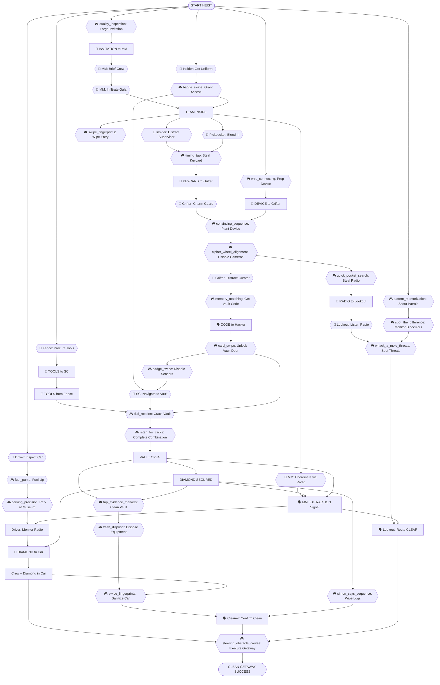
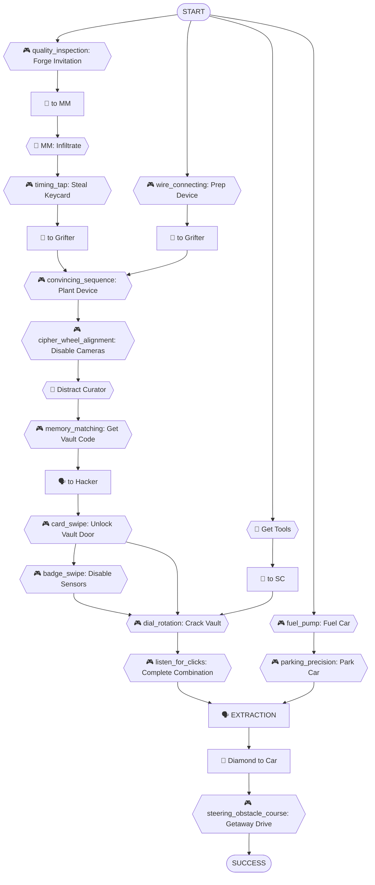

# Museum Gala Vault Heist - Dependency Tree (Revised)

## Objective
Steal the Crimson Diamond from the museum vault during the annual gala and escape cleanly.

## Scenario Overview
The Natural History Museum is hosting its annual black-tie gala. The Crimson Diamond is on display in a vault in the basement. Security includes cameras, motion sensors, armed guards, and a sophisticated vault lock. The crew must infiltrate the gala, disable security systems, crack the vault, and execute a clean getaway.

## Task Types

Every task in this heist is one of three types:

- **🎮 Minigame**: Player-controlled action from `roles.json`
- **💬 NPC/LLM**: Dialogue or interaction with AI-controlled character
- **🤝 Item Handoff**: Physical item transfer between players (tracked in inventory)
- **🗣️ Info Share**: Verbal information exchange between players (real-life conversation)

---

## Roles & Dependencies

### Fence

**Tasks:**
1. **🎮 quality_inspection** - Forge Gala Invitation
   - Create fake gala invitation, inspect for defects
   - *Dependencies:* None (starting task)

2. **🤝 INVITATION** → Deliver to Mastermind
   - Pass forged invitation
   - *Dependencies:* invitation forged

3. **💬 NPC** - Procure Safe Cracking Tools
   - Meet black market contact, negotiate for tools
   - *Dependencies:* None (parallel start)

4. **🤝 TOOLS** → Deliver to Safe Cracker
   - Hand over tools case in parking garage
   - *Dependencies:* tools procured

---

### Mastermind

**Tasks:**
1. **🤝 INVITATION** ← Receive from Fence
   - Get forged invitation
   - *Dependencies:* Fence delivers invitation

2. **💬 NPC** - Brief Crew in Safehouse
   - Review blueprints, assign roles, set contingencies
   - *Dependencies:* invitation received

3. **💬 NPC** - Infiltrate Gala
   - Present invitation at entrance, convince door security
   - *Dependencies:* briefing complete

4. **💬 NPC** - Coordinate Team via Radio
   - Use encrypted radio to synchronize movements, adapt to complications
   - *Dependencies:* team inside building

5. **🗣️ EXTRACTION** → Signal Crew
   - Give "go" signal when vault is open and diamond secured
   - *Dependencies:* vault open, diamond secured

---

### Hacker

**Tasks:**
1. **🎮 wire_connecting** - Prep Hacking Device
   - Assemble USB device in van, connect wires correctly
   - *Dependencies:* None (parallel start)

2. **🤝 DEVICE** → Deliver to Grifter
   - Pass hacking device at gala entrance
   - *Dependencies:* device ready

3. **🎮 cipher_wheel_alignment** - Disable Cameras
   - Access security system, loop camera feeds
   - *Dependencies:* device planted by Grifter

4. **🗣️ CODE** ← Receive from Insider
   - Get vault access code
   - *Dependencies:* Insider retrieves code

5. **🎮 card_swipe** - Unlock Vault Door
   - Override electronic lock on vault anteroom
   - *Dependencies:* code received, cameras disabled

6. **🎮 simon_says_sequence** - Wipe Security Logs
   - Erase digital traces before leaving
   - *Dependencies:* diamond secured

---

### Insider

**Tasks:**
1. **💬 NPC** - Get Staff Uniform
   - Meet contact at loading dock, receive uniform and badge
   - *Dependencies:* None (parallel start)

2. **🎮 badge_swipe** - Grant Building Access
   - Unlock side entrance for team
   - *Dependencies:* uniform acquired

3. **💬 NPC** - Distract Security Supervisor
   - Keep supervisor busy while Pickpocket works
   - *Dependencies:* team inside

4. **🎮 memory_matching** - Retrieve Vault Code
   - Access curator's computer, memorize code
   - *Dependencies:* curator distracted (by Grifter)

5. **🗣️ CODE** → Share with Hacker
   - Radio vault code to Hacker
   - *Dependencies:* code retrieved

6. **🎮 badge_swipe** - Disable Motion Sensors
   - Access maintenance panel, turn off corridor sensors
   - *Dependencies:* vault door unlocked

---

### Pickpocket

**Tasks:**
1. **💬 NPC** - Blend into Gala Crowd
   - Mingle with guests, identify security supervisor
   - *Dependencies:* team inside

2. **🎮 timing_tap** - Steal Keycard
   - Bump supervisor, lift keycard with perfect timing
   - *Dependencies:* supervisor identified, supervisor distracted

3. **🤝 KEYCARD** → Deliver to Grifter
   - Pass keycard discreetly in ballroom
   - *Dependencies:* keycard stolen

4. **🎮 quick_pocket_search** - Steal Guard Radio
   - Swipe backup radio from guard at wine bar
   - *Dependencies:* cameras disabled

5. **🤝 RADIO** → Deliver to Lookout
   - Give radio to Lookout for monitoring
   - *Dependencies:* radio stolen

---

### Grifter

**Tasks:**
1. **🤝 KEYCARD** ← Receive from Pickpocket
   - Get security keycard
   - *Dependencies:* Pickpocket delivers keycard

2. **💬 NPC** - Charm Control Room Guard
   - Approach guard, build rapport and trust
   - *Dependencies:* keycard received

3. **🤝 DEVICE** ← Receive from Hacker
   - Get hacking device
   - *Dependencies:* Hacker delivers device

4. **🎮 convincing_sequence** - Plant Hacking Device
   - Convince guard to let you in, plug device into computer
   - *Dependencies:* guard charmed, device received

5. **💬 NPC** - Distract Museum Curator
   - Keep curator occupied in gallery, away from vault corridor
   - *Dependencies:* device planted

---

### Safe Cracker

**Tasks:**
1. **🤝 TOOLS** ← Receive from Fence
   - Get specialized cracking tools in parking garage
   - *Dependencies:* Fence delivers tools

2. **💬 NPC** - Navigate to Vault
   - Enter via side entrance, move through basement corridors
   - *Dependencies:* building access granted, motion sensors disabled

3. **🎮 dial_rotation** - Crack Vault (Part 1)
   - Manipulate outer dial to find first numbers
   - *Dependencies:* vault reached, vault door unlocked, tools received

4. **🎮 listen_for_clicks** - Crack Vault (Part 2)
   - Listen for internal clicks to complete combination
   - *Dependencies:* dial rotation complete

5. **🤝 DIAMOND** - Secure and Transport
   - Remove diamond from display, carry to getaway vehicle
   - *Dependencies:* vault open, extraction signal

---

### Driver

**Tasks:**
1. **💬 NPC** - Inspect Vehicle
   - Check car for tracking devices, ensure systems operational
   - *Dependencies:* None (parallel start)

2. **🎮 fuel_pump** - Fuel Up Car
   - Fill tank at gas station without overflowing
   - *Dependencies:* car inspected

3. **🎮 parking_precision** - Park at Museum
   - Position car in front of side entrance without drawing attention
   - *Dependencies:* car fueled

4. **🗣️ EXTRACTION** ← Receive Signal
   - Monitor radio for extraction signal from Mastermind
   - *Dependencies:* parked and waiting

5. **🤝 DIAMOND** ← Receive from Safe Cracker
   - Secure diamond in car
   - *Dependencies:* Safe Cracker brings diamond

6. **🎮 steering_obstacle_course** - Execute Getaway
   - Drive crew through city traffic, evade pursuit
   - *Dependencies:* crew in car, diamond in car, extraction signal, route clear

---

### Lookout

**Tasks:**
1. **🎮 pattern_memorization** - Scout Guard Patrols
   - Watch museum perimeter, memorize patrol patterns
   - *Dependencies:* None (parallel start)

2. **🎮 spot_the_difference** - Monitor via Binoculars
   - Watch for anomalies in guard behavior from rooftop
   - *Dependencies:* patrol patterns learned

3. **🤝 RADIO** ← Receive from Pickpocket
   - Get stolen guard radio
   - *Dependencies:* Pickpocket delivers radio

4. **💬 NPC** - Listen to Guard Chatter
   - Monitor radio for security alerts
   - *Dependencies:* radio received

5. **🎮 whack_a_mole_threats** - Spot Threats
   - Identify police, suspicious activity, alert team
   - *Dependencies:* monitoring active

6. **🗣️ CLEAR** → Confirm to Driver
   - Signal that escape route is safe
   - *Dependencies:* extraction signal, threats assessed

---

### Cleaner

**Tasks:**
1. **🎮 swipe_fingerprints** - Wipe Side Entrance
   - Clean door handles and surfaces
   - *Dependencies:* team inside

2. **🎮 tap_evidence_markers** - Clean Vault Area
   - Wipe down vault surfaces, remove traces
   - *Dependencies:* vault open, diamond secured

3. **🎮 trash_disposal** - Dispose Equipment
   - Collect used tools/gloves, bag for disposal
   - *Dependencies:* vault cleaned

4. **🎮 swipe_fingerprints** - Sanitize Getaway Car
   - Wipe interior surfaces, remove dropped evidence
   - *Dependencies:* crew in car

5. **🗣️ CLEAN** → Confirm to Mastermind
   - Final check, signal all-clear
   - *Dependencies:* all areas cleaned

---

## Critical Path

The minimum sequence of tasks to achieve the objective:

```
1. Fence: quality_inspection (forge invitation) → 🤝 to Mastermind
2. Mastermind: Infiltrate Gala (💬 NPC) [needs invitation]
3. Pickpocket: timing_tap (steal keycard) → 🤝 to Grifter
4. Hacker: wire_connecting (prep device) → 🤝 to Grifter
5. Grifter: convincing_sequence (plant device) [needs keycard + device]
6. Hacker: cipher_wheel_alignment (disable cameras) [needs device planted]
7. Grifter: Distract Curator (💬 NPC)
8. Insider: memory_matching (get vault code) [needs curator distracted] → 🗣️ to Hacker
9. Hacker: card_swipe (unlock vault door) [needs code]
10. Insider: badge_swipe (disable motion sensors) [needs door unlocked]
11. Safe Cracker: dial_rotation + listen_for_clicks (crack vault) [needs tools, door unlocked, sensors off]
12. Safe Cracker: inventory_check (secure diamond)
13. Driver: fuel_pump → parking_precision (prep and position car)
14. Mastermind: 🗣️ EXTRACTION signal
15. Safe Cracker: 🤝 DIAMOND to car
16. Driver: steering_obstacle_course (getaway) [needs crew, diamond, clear route]
```

## Supporting Tasks

Tasks that provide backup, intelligence, or cleanup:

- Lookout: All surveillance tasks (pattern_memorization, spot_the_difference, whack_a_mole_threats)
- Mastermind: Coordinate Team via Radio (💬 adapt to changes)
- Hacker: simon_says_sequence (wipe logs)
- Cleaner: All cleanup tasks (swipe_fingerprints, tap_evidence_markers, trash_disposal)
- Pickpocket: Steal and deliver guard radio to Lookout
- Insider: Distract security supervisor

## Task Summary

Total tasks: 39  
Critical path tasks: 16  
Supporting tasks: 23  

By type:
- Minigames (🎮): 21
- NPC/LLM interactions (💬): 11
- Item handoffs (🤝): 11
- Info shares (🗣️): 5

---

## Dependency Tree Diagrams

### Legend
- 🎮 **Minigames**: Player-controlled actions from `roles.json`
- 💬 **NPC/LLM**: Dialogue with AI characters
- 🤝 **Item Handoff**: Physical transfer (inventory-tracked)
- 🗣️ **Info Share**: Verbal exchange (real-life conversation)

### Full Dependency Tree



### Critical Path Only (Simplified)


