# Armored Train Robbery - Dependency Tree

## Objective
Steal the Serpent's Eye artifact from a secure armored car on a moving train before it reaches its destination.

## Scenario Overview
A priceless artifact, the Serpent's Eye, is being transported via armored train car from the National Museum to a secure vault facility. The train has 12 cars, with the artifact in car #8, guarded by armed security. The crew has a 45-minute window from when the train departs until it reaches the next station. They must board the moving train, navigate to the armored car, neutralize guards, breach the container, and escape at the arrival station.

## Task Types

Every task in this heist is one of three types:

- **🎮 Minigame**: Player-controlled action from `roles.json`
- **💬 NPC/LLM**: Dialogue or interaction with AI-controlled character
- **🤝 Item Handoff**: Physical item transfer between players (tracked in inventory)
- **🗣️ Info Share**: Verbal information exchange between players (real-life conversation)

---

## Roles & Dependencies

### Mastermind

**Tasks:**
1. **💬 NPC** - Brief Crew at Rendezvous
   - Review train layout, assign positions, synchronize watches
   - *Dependencies:* None (starting task)

2. **💬 NPC** - Board Train at Station
   - Purchase tickets, blend with passengers
   - *Dependencies:* briefing complete

3. **💬 NPC** - Coordinate via Radio
   - Track timing, adapt to guard movements, manage contingencies
   - *Dependencies:* team on train

4. **🗣️ BREACH** → Signal Team
   - Give "go" signal when artifact is secured
   - *Dependencies:* artifact secured

5. **💬 NPC** - Navigate to Exit Car
   - Move through passenger cars to escape point
   - *Dependencies:* breach signal

---

### Cat Burglar

**Tasks:**
1. **💬 NPC** - Approach Moving Train
   - Reach trackside position as train departs station
   - *Dependencies:* train departed

2. **🎮 climbing_rhythm** - Board Moving Train
   - Climb ladder on last car while train is moving
   - *Dependencies:* approach complete

3. **🎮 balance_meter** - Navigate Train Roof
   - Walk across rooftops toward armored car
   - *Dependencies:* on train

4. **🤝 HARNESS** ← Receive from Lookout
   - Get safety harness for descent
   - *Dependencies:* Lookout delivers harness

5. **🎮 balance_meter** - Descend to Armored Car
   - Lower down side of train to armored car window
   - *Dependencies:* harness received, window location identified

6. **💬 NPC** - Enter Armored Car
   - Slip through window, avoid detection
   - *Dependencies:* descended to car

---

### Muscle

**Tasks:**
1. **🤝 SEDATIVE** ← Receive from Fence
   - Get non-lethal sedative syringes
   - *Dependencies:* Fence delivers sedative

2. **💬 NPC** - Board Train Normally
   - Enter passenger car with ticket
   - *Dependencies:* sedative received

3. **💬 NPC** - Approach Guard Post
   - Move through cars toward armored section
   - *Dependencies:* on train, timing signal from Mastermind

4. **🎮 takedown_timing** - Neutralize Guard #1
   - Stealth takedown of corridor guard
   - *Dependencies:* guard post reached, Cat Burglar in position

5. **🤝 KEYCARD** → Take from Guard
   - Lift access keycard from neutralized guard
   - *Dependencies:* guard neutralized

6. **🎮 button_mash_barrier** - Breach Armored Door
   - Force open reinforced door to armored car
   - *Dependencies:* keycard used, Hacker disabled alarm

7. **🎮 reaction_time** - Neutralize Guard #2
   - Quick takedown of interior guard
   - *Dependencies:* door breached

---

### Hacker

**Tasks:**
1. **🤝 LAPTOP** ← Receive from Fence
   - Get modified laptop with exploits
   - *Dependencies:* Fence delivers laptop

2. **💬 NPC** - Board Train with Luggage
   - Enter train with laptop in carry-on
   - *Dependencies:* laptop received

3. **🎮 wire_connecting** - Tap Train Network
   - Connect to train's internal network via junction box
   - *Dependencies:* on train, Safe Cracker provides access

4. **🎮 cipher_wheel_alignment** - Disable Security Cameras
   - Loop camera feeds in armored section
   - *Dependencies:* network access

5. **🗣️ CAMERAS** → Notify Team
   - Inform team cameras are disabled
   - *Dependencies:* cameras disabled

6. **🎮 card_swipe** - Unlock Armored Door
   - Override electronic lock remotely
   - *Dependencies:* Muscle has keycard, cameras disabled

7. **🎮 simon_says_sequence** - Disable Door Alarm
   - Prevent alarm from triggering when breached
   - *Dependencies:* door unlocked

---

### Safe Cracker

**Tasks:**
1. **🤝 TOOLS** ← Receive from Fence
   - Get container opening tools
   - *Dependencies:* Fence delivers tools

2. **💬 NPC** - Board Train as Passenger
   - Enter with concealed tools
   - *Dependencies:* tools received

3. **💬 NPC** - Locate Network Junction
   - Find access point for Hacker
   - *Dependencies:* on train

4. **🗣️ ACCESS** → Provide to Hacker
   - Give location and access to junction box
   - *Dependencies:* junction located

5. **💬 NPC** - Reach Armored Car
   - Navigate through breached door
   - *Dependencies:* door breached, guards neutralized

6. **🎮 lockpick_timing** - Pick Container Lock
   - Open external lock on artifact container
   - *Dependencies:* in armored car, tools available

7. **🎮 dial_rotation** - Open Container Combination
   - Crack combination lock on container
   - *Dependencies:* external lock picked

8. **🤝 ARTIFACT** → Secure Item
   - Remove Serpent's Eye from container
   - *Dependencies:* container open

---

### Lookout

**Tasks:**
1. **🎮 pattern_memorization** - Study Train Schedule
   - Memorize guard shift changes and timing
   - *Dependencies:* None (parallel start)

2. **🤝 HARNESS** ← Receive from Fence
   - Get climbing harness for Cat Burglar
   - *Dependencies:* Fence delivers harness

3. **💬 NPC** - Board Train First Class
   - Enter with premium ticket for better view
   - *Dependencies:* harness received

4. **🤝 HARNESS** → Deliver to Cat Burglar
   - Pass harness through window to Cat Burglar on roof
   - *Dependencies:* Cat Burglar on roof, on train

5. **🎮 spot_the_difference** - Monitor Guard Movements
   - Watch for pattern changes via window reflections
   - *Dependencies:* on train

6. **🗣️ PATROLS** → Update Team
   - Radio guard positions and movements
   - *Dependencies:* monitoring active

7. **🎮 whack_a_mole_threats** - Spot Conductor Alerts
   - Identify suspicious conductor behavior
   - *Dependencies:* monitoring active

8. **🗣️ CLEAR** → Confirm Escape Route
   - Signal that exit path is safe
   - *Dependencies:* artifact secured, breach signal

---

### Driver

**Tasks:**
1. **💬 NPC** - Scout Arrival Station
   - Survey station layout and escape routes
   - *Dependencies:* None (parallel start)

2. **🎮 fuel_pump** - Fuel Escape Vehicle
   - Fill tank, prepare for high-speed exit
   - *Dependencies:* scout complete

3. **🎮 parking_precision** - Position at Station
   - Park vehicle in optimal extraction spot
   - *Dependencies:* car fueled

4. **🗣️ ARRIVAL** ← Receive from Mastermind
   - Get notification that train is approaching station
   - *Dependencies:* artifact secured, team exiting train

5. **💬 NPC** - Monitor Station Activity
   - Watch for police or security presence
   - *Dependencies:* positioned at station

6. **🤝 ARTIFACT** ← Receive from Safe Cracker
   - Secure artifact in vehicle
   - *Dependencies:* team exits train, Safe Cracker transfers artifact

7. **🎮 steering_obstacle_course** - Execute Getaway
   - Navigate through city traffic to safe house
   - *Dependencies:* crew in car, artifact secured, route clear

---

### Fence

**Tasks:**
1. **💬 NPC** - Procure Specialized Equipment
   - Acquire laptop, tools, sedative, harness from contacts
   - *Dependencies:* None (starting task)

2. **🤝 LAPTOP** → Deliver to Hacker
   - Meet Hacker at safe house, hand over laptop
   - *Dependencies:* equipment procured

3. **🤝 TOOLS** → Deliver to Safe Cracker
   - Give container opening tools
   - *Dependencies:* equipment procured

4. **🤝 SEDATIVE** → Deliver to Muscle
   - Provide non-lethal sedative syringes
   - *Dependencies:* equipment procured

5. **🤝 HARNESS** → Deliver to Lookout
   - Give climbing harness for Cat Burglar
   - *Dependencies:* equipment procured

6. **🎮 item_matching** - Arrange Artifact Buyer
   - Match artifact to interested collector
   - *Dependencies:* artifact secured (can happen after heist)

---

## Critical Path

The minimum sequence of tasks to achieve the objective:

```
1. Fence: Procure Equipment → 🤝 LAPTOP, TOOLS, SEDATIVE, HARNESS to team
2. Mastermind: Brief Crew → Board Train
3. Team: Board train (Muscle, Hacker, Safe Cracker, Lookout via tickets)
4. Cat Burglar: climbing_rhythm (board moving train) → balance_meter (roof navigation)
5. Safe Cracker: Locate junction → 🗣️ ACCESS to Hacker
6. Hacker: wire_connecting (tap network) → cipher_wheel_alignment (disable cameras) → 🗣️ CAMERAS notify
7. Lookout: 🤝 HARNESS to Cat Burglar
8. Cat Burglar: balance_meter (descend to armored car)
9. Muscle: takedown_timing (neutralize guard #1) → get KEYCARD
10. Hacker: card_swipe (unlock door) → simon_says_sequence (disable alarm)
11. Muscle: button_mash_barrier (breach door) → reaction_time (neutralize guard #2)
12. Safe Cracker: lockpick_timing (pick lock) → dial_rotation (combination) → 🤝 ARTIFACT
13. Mastermind: 🗣️ BREACH signal
14. Team: Navigate to exit car
15. Driver: Position at station → 🤝 ARTIFACT from Safe Cracker
16. Driver: steering_obstacle_course (getaway)
```

## Supporting Tasks

Tasks that provide backup, intelligence, or coordination:

- Lookout: pattern_memorization (study schedule), spot_the_difference, whack_a_mole_threats (monitor)
- Mastermind: Coordinate via Radio (adapt to changes)
- Lookout: 🗣️ PATROLS update, 🗣️ CLEAR confirmation
- Driver: Scout station, monitor activity
- Fence: item_matching (arrange buyer, post-heist)

## Task Summary

Total tasks: 41  
Critical path tasks: 16  
Supporting tasks: 25  

By type:
- Minigames (🎮): 20
- NPC/LLM interactions (💬): 17
- Item handoffs (🤝): 10
- Info shares (🗣️): 7

By role:
- Mastermind: 5 tasks
- Cat Burglar: 6 tasks (prominent)
- Muscle: 7 tasks (prominent)
- Hacker: 7 tasks
- Safe Cracker: 8 tasks
- Lookout: 8 tasks
- Driver: 7 tasks
- Fence: 6 tasks

---

## Dependency Tree Diagrams

### Legend
- 🎮 **Minigames**: Player-controlled actions from `roles.json`
- 💬 **NPC/LLM**: Dialogue with AI characters
- 🤝 **Item Handoff**: Physical transfer (inventory-tracked)
- 🗣️ **Info Share**: Verbal exchange (real-life conversation)

### Full Dependency Tree

```mermaid
flowchart TD
    START([START HEIST])
    
    %% Fence equipment procurement
    START --> F1{{💬 Fence: Procure Equipment}}
    F1 --> F2[🤝 LAPTOP to Hacker]
    F1 --> F3[🤝 TOOLS to Safe Cracker]
    F1 --> F4[🤝 SEDATIVE to Muscle]
    F1 --> F5[🤝 HARNESS to Lookout]
    
    %% Mastermind
    START --> MM1{{💬 MM: Brief Crew}}
    MM1 --> MM2{{💬 MM: Board Train}}
    MM2 --> TRAIN_DEPARTED[TRAIN DEPARTED]
    
    %% Muscle sequence
    F4 --> M1{{💬 Muscle: Board Train}}
    M1 --> TEAM_ON_TRAIN[TEAM ON TRAIN]
    MM2 --> TEAM_ON_TRAIN
    
    %% Hacker sequence
    F2 --> H1{{💬 Hacker: Board Train}}
    H1 --> TEAM_ON_TRAIN
    
    %% Safe Cracker sequence
    F3 --> SC1{{💬 SC: Board Train}}
    SC1 --> TEAM_ON_TRAIN
    
    %% Lookout sequence
    F5 --> L1{{💬 Lookout: Board First Class}}
    L1 --> TEAM_ON_TRAIN
    
    %% Cat Burglar boards externally
    TRAIN_DEPARTED --> CB1{{💬 Cat Burglar: Approach Train}}
    CB1 --> CB2{{🎮 climbing_rhythm: Board Moving Train}}
    CB2 --> CB3{{🎮 balance_meter: Navigate Roof}}
    
    %% Safe Cracker locates junction
    TEAM_ON_TRAIN --> SC2{{💬 SC: Locate Junction}}
    SC2 --> SC3[🗣️ ACCESS to Hacker]
    
    %% Hacker taps network
    SC3 --> H2{{🎮 wire_connecting: Tap Network}}
    H2 --> H3{{🎮 cipher_wheel_alignment: Disable Cameras}}
    H3 --> H4[🗣️ CAMERAS notify team]
    
    %% Lookout monitors
    TEAM_ON_TRAIN --> L2{{🎮 spot_the_difference: Monitor Guards}}
    L2 --> L3[🗣️ PATROLS update]
    L2 --> L4{{🎮 whack_a_mole_threats: Spot Threats}}
    
    %% Lookout delivers harness to Cat Burglar
    CB3 --> L5[🤝 HARNESS to CB]
    F5 --> L5
    TEAM_ON_TRAIN --> L5
    
    %% Cat Burglar descends
    L5 --> CB4{{🎮 balance_meter: Descend to Car}}
    L3 --> CB4
    CB4 --> CB5{{💬 CB: Enter Armored Car}}
    
    %% Mastermind coordinates
    TEAM_ON_TRAIN --> MM3{{💬 MM: Coordinate Radio}}
    
    %% Muscle approaches and takes down guard
    MM3 --> M2{{💬 Muscle: Approach Guard}}
    CB5 --> M3{{🎮 takedown_timing: Neutralize Guard 1}}
    M2 --> M3
    M3 --> M4[🤝 KEYCARD from guard]
    
    %% Hacker unlocks door
    M4 --> H5{{🎮 card_swipe: Unlock Door}}
    H4 --> H5
    H5 --> H6{{🎮 simon_says_sequence: Disable Alarm}}
    
    %% Muscle breaches
    H6 --> M5{{🎮 button_mash_barrier: Breach Door}}
    M5 --> M6{{🎮 reaction_time: Neutralize Guard 2}}
    M6 --> DOOR_BREACHED[DOOR BREACHED]
    
    %% Safe Cracker enters and cracks
    DOOR_BREACHED --> SC4{{💬 SC: Reach Armored Car}}
    SC4 --> SC5{{🎮 lockpick_timing: Pick Lock}}
    SC5 --> SC6{{🎮 dial_rotation: Open Container}}
    SC6 --> SC7[🤝 ARTIFACT secured]
    SC7 --> ARTIFACT_SECURED[ARTIFACT SECURED]
    
    %% Mastermind signals breach
    ARTIFACT_SECURED --> MM4[🗣️ MM: BREACH signal]
    MM4 --> MM5{{💬 MM: Navigate to Exit}}
    
    %% Lookout confirms clear
    L4 --> L6[🗣️ CLEAR to team]
    MM4 --> L6
    
    %% Driver prepares
    START --> D1{{💬 Driver: Scout Station}}
    D1 --> D2{{🎮 fuel_pump: Fuel Car}}
    D2 --> D3{{🎮 parking_precision: Position at Station}}
    D3 --> D4{{💬 Driver: Monitor Station}}
    
    %% Driver receives arrival notice
    MM4 --> D5[🗣️ ARRIVAL to Driver]
    D5 --> D4
    
    %% Team exits and transfers artifact
    MM5 --> TEAM_EXITS[Team Exits Train]
    L6 --> TEAM_EXITS
    TEAM_EXITS --> D6[🤝 ARTIFACT to Driver]
    SC7 --> D6
    
    %% Final getaway
    D6 --> D7{{🎮 steering_obstacle_course: Execute Getaway}}
    D7 --> SUCCESS([SUCCESSFUL HEIST])
    
    %% Post-heist
    ARTIFACT_SECURED --> F6{{🎮 item_matching: Arrange Buyer}}
```



### Critical Path Only (Simplified)

```mermaid
flowchart TD
    START([START])
    
    START --> F1{{💬 Procure Equipment}}
    F1 --> F2[🤝 Deliver Equipment]
    
    F2 --> MM1{{💬 MM: Board Train}}
    MM1 --> TRAIN[TRAIN MOVING]
    
    TRAIN --> CB1{{🎮 climbing_rhythm: Board Moving Train}}
    CB1 --> CB2{{🎮 balance_meter: Roof Navigation}}
    
    F2 --> SC1{{💬 SC: Locate Junction}}
    SC1 --> SC2[🗣️ ACCESS to Hacker]
    
    SC2 --> H1{{🎮 wire_connecting: Tap Network}}
    H1 --> H2{{🎮 cipher_wheel_alignment: Disable Cameras}}
    H2 --> H3[🗣️ notify]
    
    CB2 --> CB3{{🎮 balance_meter: Descend}}
    
    CB3 --> M1{{🎮 takedown_timing: Neutralize Guard 1}}
    M1 --> M2[🤝 get KEYCARD]
    
    M2 --> H4{{🎮 card_swipe: Unlock Door}}
    H3 --> H4
    H4 --> H5{{🎮 simon_says_sequence: Disable Alarm}}
    
    H5 --> M3{{🎮 button_mash_barrier: Breach Door}}
    M3 --> M4{{🎮 reaction_time: Neutralize Guard 2}}
    
    M4 --> SC3{{🎮 lockpick_timing: Pick Lock}}
    SC3 --> SC4{{🎮 dial_rotation: Open Container}}
    SC4 --> SC5[🤝 ARTIFACT]
    
    SC5 --> MM2[🗣️ BREACH signal]
    
    START --> D1{{🎮 fuel_pump & parking_precision: Fuel & Position}}
    
    MM2 --> D2[🤝 ARTIFACT to Driver]
    D1 --> D2
    
    D2 --> D3{{🎮 steering_obstacle_course: Getaway}}
    
    D3 --> SUCCESS([SUCCESS])
```


