# Armored Train Robbery - Dependency Tree

> **Generated Example**  
> **Scenario**: `train_robbery_car` - Armored Train Robbery  
> **Selected Roles**: Mastermind, Muscle, Cat Burglar, Hacker, Lookout, Driver  
> **Player Count**: 6 players  
> 
> This example demonstrates dependency tree design for a mobile/time-sensitive scenario with physical infiltration, guard neutralization, and dynamic escape mechanics.

---

## Objective
Steal the Serpent's Eye artifact from a secure armored car on a moving train before it reaches the next station.

## Scenario Overview
A priceless artifact, the Serpent's Eye, is being transported via armored train from the National Museum to a secure vault facility. The crew has a 45-minute window to board the moving train, navigate to the armored car in the center of the train, neutralize guards, breach the container, secure the artifact, and escape at the arrival station.

## Locations

This scenario takes place across the following locations:

### Off-Site Preparation
- **Abandoned Warehouse** - Crew meeting point and equipment prep
- **Rail Yard** - Equipment staging, vehicle positioning
- **Getaway Van** - Driver's mobile command center

### Train Boarding
- **Bridge Overpass** - Cat Burglar's board point (moving train)
- **Station Platform** - Mastermind and Lookout's board point

### Train Interior - Passenger Areas
- **Passenger Car #1** - Front car, public seating
- **Passenger Car #2** - Mid-front car, public seating
- **Dining Car #3** - Food service, staff, passengers
- **Passenger Car #4** - Mid-rear car, public seating
- **Observation Car #5** - Lounge area, windows, socializing

### Train Interior - Restricted Areas
- **Service Car #6** - Staff quarters, supplies, crew rest area
- **Security Car #7** - Guard station, surveillance monitors
- **Armored Car #8** - Target location, artifact container
- **Baggage Car #9** - Luggage storage, maintenance access
- **Engine Room** - Train controls, engineering staff

### Escape Points
- **Rear Platform** - External deck for disembarkation
- **Arrival Station** - Final train stop, escape point
- **Station Parking Lot** - Getaway vehicle rendezvous
- **City Streets** - Escape route through traffic

**Total Locations**: 17

---

## Task Types

Every task in this heist is one of five types:

- **🎮 Minigame**: Player-controlled action from `roles.json`
- **💬 NPC/LLM**: Dialogue or interaction with AI-controlled character
- **🔍 Search/Hunt**: Player searches a location for hidden items
- **🤝 Item Handoff**: Physical item transfer between players (tracked in inventory)
- **🗣️ Info Share**: Verbal information exchange between players (real-life conversation)

---

## Roles & Dependencies

### Mastermind

**Tasks:**
1. **💬 NPC** - Brief Crew at Warehouse
   - Review train layout, timing, assign positions, set contingencies
   - *NPC: None (internal team briefing)*
   - *Location:* Abandoned Warehouse
   - *Dependencies:* None (starting task)

2. **💬 NPC** - Purchase Train Tickets
   - Buy tickets from station kiosk, blend in as passenger
   - *NPC: Ticket Agent (bored, distracted, counting down shift) - "Next train leaves in 10 minutes. Need anything else? I'm trying to close out my register."*
   - *Location:* Station Platform
   - *Dependencies:* briefing complete

3. **💬 NPC** - Board Train Legitimately
   - Present ticket, board with Lookout as cover
   - *NPC: Conductor (by-the-book, cheerful, proud) - "All aboard! Welcome to the Silver Line Express. 45 minutes to Central Station!"*
   - *Location:* Station Platform → Passenger Car #1
   - *Dependencies:* tickets purchased

4. **🔍 Search** - Find Train Schedule
   - Search seat pocket for schedule showing guard shift changes
   - *Find: Train schedule with handwritten guard notes*
   - *Location:* Passenger Car #1
   - *Dependencies:* boarded train

5. **🗣️ TIMING** → Share with Team
   - Radio timing info to Cat Burglar and Muscle
   - *Location:* Passenger Car #1
   - *Dependencies:* schedule found

6. **💬 NPC** - Coordinate Team via Radio
   - Track progress, adapt to complications, manage timing
   - *Location:* Passenger Car #1
   - *Dependencies:* team in position

7. **🗣️ BREACH** → Signal Team
   - Give "go" signal when artifact is secured
   - *Location:* Observation Car #5
   - *Dependencies:* artifact secured

8. **💬 NPC** - Distract Conductor
   - Keep conductor busy during escape
   - *NPC: Conductor - "Is there a problem? We're arriving shortly and I need to prepare the doors."*
   - *Location:* Observation Car #5
   - *Dependencies:* breach signal

---

### Cat Burglar

**Tasks:**
1. **💬 NPC** - Meet Informant at Rail Yard
   - Get intel on train route and guard positions
   - *NPC: Sammy (nervous, owes favors, wants out) - "Okay okay, listen. Three guards in car 7, two in car 8. They change shift at 25 minutes. That's your window."*
   - *Request: Promise to pay $500 after job*
   - *Location:* Rail Yard
   - *Dependencies:* None (parallel start)

2. **🔍 Search** - Hunt for Climbing Rope
   - Search warehouse equipment for rope strong enough for bridge jump
   - *Find: 50ft climbing rope with carabiners*
   - *Location:* Abandoned Warehouse
   - *Dependencies:* informant meeting complete

3. **🎮 climbing_rhythm** - Board Moving Train
   - Drop from bridge overpass onto train roof
   - *Location:* Bridge Overpass → Train Roof
   - *Dependencies:* rope found, timing signal from Mastermind

4. **🎮 balance_meter** - Traverse Train Roof
   - Move across rooftops toward armored car
   - *Location:* Train Roof (Cars #1-7)
   - *Dependencies:* boarded train

5. **💬 NPC** - Enter Through Roof Hatch
   - Pick lock on roof access hatch
   - *Location:* Service Car #6 Roof → Service Car #6 Interior
   - *Dependencies:* reached target area

6. **🔍 Search** - Find Service Uniform
   - Search service car lockers for staff uniform
   - *Find: Service staff uniform and badge*
   - *Location:* Service Car #6
   - *Dependencies:* inside service car

7. **🤝 UNIFORM** → Give to Muscle
   - Pass uniform to Muscle for infiltration
   - *Location:* Service Car #6
   - *Dependencies:* uniform found, Muscle arrives

8. **🎮 laser_maze_timing** - Navigate to Armored Car
   - Move through restricted corridor with motion sensors
   - *Location:* Security Car #7 → Armored Car #8
   - *Dependencies:* guards neutralized, sensors disabled

---

### Muscle

**Tasks:**
1. **💬 NPC** - Intimidate Rail Yard Worker
   - Get rail yard access code through persuasion
   - *NPC: Pete (cowardly, just wants to go home, has kids) - "Whoa whoa, I don't want trouble! The code is 7739. Just... don't hurt anyone, okay?"*
   - *Location:* Rail Yard
   - *Dependencies:* None (parallel start)

2. **💬 NPC** - Board Train as Passenger
   - Buy ticket, board at station
   - *Location:* Station Platform → Passenger Car #2
   - *Dependencies:* code obtained

3. **🔍 Search** - Find Maintenance Access Key
   - Search dining car staff area for restricted access key
   - *Find: Maintenance master key*
   - *Location:* Dining Car #3 (Back area)
   - *Dependencies:* boarded train

4. **💬 NPC** - Chat with Dining Car Staff
   - Gather intel on guard meal schedule
   - *NPC: Chef Rosa (stressed, overworked, gossipy) - "Those security guys? They eat at 20 minutes into the trip. Like clockwork. And they're RUDE. Never tip!"*
   - *Location:* Dining Car #3
   - *Dependencies:* access key found

5. **🤝 UNIFORM** ← Receive from Cat Burglar
   - Get service uniform for disguise
   - *Location:* Service Car #6
   - *Dependencies:* Cat Burglar delivers uniform

6. **💬 NPC** - Deliver Meal to Guards
   - Use uniform to enter security car, offer "complimentary meal"
   - *NPC: Guard Captain (suspicious, ex-military, alert) - "We didn't order food. Who sent you? Show me your ID."*
   - *Request: Need forged meal order slip*
   - *Location:* Security Car #7
   - *Dependencies:* uniform worn, timing right

7. **🔍 Search** - Hunt for Meal Order Slip
   - Return to dining car, forge meal order form
   - *Find: Blank order slip from chef's desk*
   - *Location:* Dining Car #3
   - *Dependencies:* guard made request

8. **🤝 ORDER** → Show to Guards
   - Present forged meal slip
   - *Location:* Security Car #7
   - *Dependencies:* slip found

9. **🎮 takedown_timing** - Neutralize Lead Guard
   - Subdue guard captain when distracted by food
   - *Location:* Security Car #7
   - *Dependencies:* guards distracted, order accepted

10. **🎮 button_mash_barrier** - Breach Armored Door
   - Force open armored car access door
   - *Location:* Security Car #7 → Armored Car #8
   - *Dependencies:* lead guard down

11. **🎮 reaction_time** - Neutralize Second Guard
   - Quick takedown of backup guard
   - *Location:* Armored Car #8
   - *Dependencies:* door breached

12. **🤝 ARTIFACT** → Secure and Carry
   - Remove artifact from container, carry to escape point
   - *Location:* Armored Car #8 → Rear Platform
   - *Dependencies:* guards down, Hacker disables container lock

---

### Hacker

**Tasks:**
1. **💬 NPC** - Meet Tech Dealer
   - Purchase specialized train security bypass device
   - *NPC: Vicki (paranoid, conspiracy theorist, cash only) - "Yeah I got what you need. But they're watching. Always watching. Cash only. No names."*
   - *Location:* Abandoned Warehouse
   - *Dependencies:* None (parallel start)

2. **🔍 Search** - Hunt for Portable Battery
   - Device needs external power; search warehouse for battery pack
   - *Find: High-capacity portable battery*
   - *Location:* Abandoned Warehouse
   - *Dependencies:* device purchased

3. **🎮 wire_connecting** - Prep Bypass Device
   - Connect battery and test device before deployment
   - *Location:* Abandoned Warehouse
   - *Dependencies:* battery found

4. **🤝 DEVICE** → Give to Lookout
   - Pass device to Lookout who boards with Mastermind
   - *Location:* Rail Yard → Station Platform
   - *Dependencies:* device ready

5. **💬 NPC** - Remote Hack from Van
   - Access train security systems remotely once device is planted
   - *Location:* Getaway Van
   - *Dependencies:* Lookout plants device

6. **🎮 cipher_wheel_alignment** - Disable Security Cameras
   - Loop camera feeds in security car and armored car
   - *Location:* Getaway Van (Remote Access)
   - *Dependencies:* remote access established

7. **🎮 card_swipe** - Unlock Artifact Container
   - Override electronic lock on artifact display case
   - *Location:* Getaway Van (Remote Access)
   - *Dependencies:* cameras disabled, Muscle in position

8. **🗣️ CLEAR** → Signal Muscle
   - Confirm container unlocked and guards' radios jammed
   - *Location:* Getaway Van (Radio)
   - *Dependencies:* systems hacked

---

### Lookout

**Tasks:**
1. **💬 NPC** - Scout Station for Security
   - Blend in, observe police and security presence
   - *NPC: Station Guard (lazy, wants coffee, on phone) - "Yeah, yeah, I'm watching. Nothing suspicious. When's my break?"*
   - *Location:* Station Platform
   - *Dependencies:* None (parallel start)

2. **🤝 DEVICE** ← Receive from Hacker
   - Get bypass device from Hacker
   - *Location:* Station Platform
   - *Dependencies:* Hacker delivers device

3. **💬 NPC** - Board Train with Mastermind
   - Use Mastermind as cover to blend as couple/friends
   - *Location:* Station Platform → Passenger Car #1
   - *Dependencies:* device received, tickets purchased

4. **🔍 Search** - Find Power Outlet
   - Search observation car for accessible power source
   - *Find: Standard outlet near window seat*
   - *Location:* Observation Car #5
   - *Dependencies:* boarded train

5. **🎮 wire_connecting** - Plant Bypass Device
   - Plug device into outlet, hide under seat
   - *Location:* Observation Car #5
   - *Dependencies:* outlet found

6. **💬 NPC** - Distract Nosy Passenger
   - Keep curious passenger from noticing device
   - *NPC: Karen (nosy, suspicious, wants to talk to manager) - "Excuse me, what are you doing under that seat? That's very suspicious. I'm going to report this."*
   - *Request: Need believable excuse (dropped earring)*
   - *Location:* Observation Car #5
   - *Dependencies:* device planted

7. **🔍 Search** - Hunt for Prop Earring
   - Search observation car for dropped jewelry to support story
   - *Find: Small hoop earring under seat*
   - *Location:* Observation Car #5
   - *Dependencies:* passenger suspicious

8. **🤝 EARRING** → Show to Passenger
   - Prove you were just looking for dropped earring
   - *Location:* Observation Car #5
   - *Dependencies:* earring found

9. **💬 NPC** - Reassure Passenger
   - Calm Karen down with evidence
   - *NPC: Karen - "Oh. Well. I suppose that makes sense. But I'm watching you!"*
   - *Location:* Observation Car #5
   - *Dependencies:* earring shown

10. **🎮 spot_the_difference** - Monitor Guard Movements
    - Watch security car entrance, track guard shift change
    - *Location:* Observation Car #5 (Window View)
    - *Dependencies:* passenger reassured

11. **🗣️ SHIFT** → Signal Team
    - Alert when guards change shift (best opportunity)
    - *Location:* Observation Car #5
    - *Dependencies:* shift change spotted

---

### Driver

**Tasks:**
1. **💬 NPC** - Meet Corrupt Station Employee
   - Get arrival station parking pass and dock access
   - *NPC: Travis (corrupt, greedy, gambling debts) - "Yeah I can get you access. But it'll cost you. $300 up front."*
   - *Request: Needs $300 cash payment*
   - *Location:* Rail Yard
   - *Dependencies:* None (parallel start)

2. **🔍 Search** - Find Emergency Cash
   - Search warehouse office for petty cash
   - *Find: $350 in desk drawer*
   - *Location:* Abandoned Warehouse (Office)
   - *Dependencies:* Travis made request

3. **🤝 CASH** → Pay Travis
   - Hand over payment for parking pass
   - *Location:* Rail Yard
   - *Dependencies:* cash found

4. **💬 NPC** - Receive Parking Pass
   - Travis provides pass and dock number
   - *NPC: Travis - "Okay, okay. Dock 3. Be there at 2:15. And we never met, got it?"*
   - *Location:* Rail Yard
   - *Dependencies:* payment made

5. **🔍 Search** - Find Train Schedule
   - Search van for exact arrival time and platform number
   - *Find: Current train schedule and platform map*
   - *Location:* Getaway Van
   - *Dependencies:* parking pass obtained

6. **🎮 parking_precision** - Position Van at Station
   - Park at loading dock #3 without drawing attention
   - *Location:* Station Parking Lot → Loading Dock #3
   - *Dependencies:* schedule confirmed

7. **💬 NPC** - Chat with Station Security
   - Blend in, chat casually to avoid suspicion
   - *NPC: Officer Ray (friendly, chatty, sports fan) - "Nice day for a pickup! You catching the game tonight? My team's in the playoffs!"*
   - *Location:* Loading Dock #3
   - *Dependencies:* van positioned

8. **🗣️ READY** ← Receive Signal
   - Monitor radio for extraction signal from Mastermind
   - *Location:* Getaway Van
   - *Dependencies:* parked and waiting

9. **🤝 ARTIFACT** ← Receive from Muscle
   - Muscle delivers artifact at rear platform as train stops
   - *Location:* Station Rear Platform
   - *Dependencies:* breach signal, artifact secured

10. **💬 NPC** - Reassure Nervous Crew
    - Calm team member panicking about close call
    - *Location:* Getaway Van (Radio)
    - *Dependencies:* artifact loaded

11. **🎮 steering_obstacle_course** - Execute Getaway
    - Drive crew through city traffic, evade potential pursuit
    - *Location:* City Streets
    - *Dependencies:* crew in van, artifact secured, clear to leave

---

## Task Summary

Total tasks: 64  
Critical path tasks: 18  
Supporting tasks: 46  

By type:
- Minigames (🎮): 18 (28%)
- NPC/LLM interactions (💬): 27 (42%)
- Search/Hunt (🔍): 9 (14%)
- Item handoffs (🤝): 11 (17%)
- Info shares (🗣️): 5 (8%)

**Social interactions total**: 72% (NPC + Search + Handoffs + Info shares)

**Note**: This example demonstrates:
1. Time-sensitive mobile scenario (moving train, 45-minute window)
2. Physical infiltration mechanics (Cat Burglar roof approach, Muscle disguise)
3. Multi-phase guard neutralization (social → physical → breach)
4. NPC request chains requiring cross-role collaboration
5. Location-based search mechanics across train cars
6. Parallel preparation tasks converging at critical moments

Each NPC has distinct traits, speech patterns, and motivations (see `design/npc_personalities_guide.md`).

---

## Dependency Tree Diagrams

### Legend
- 🎮 **Minigames**: Player-controlled actions from `roles.json`
- 💬 **NPC/LLM**: Dialogue or social engineering with AI-controlled characters
- 🔍 **Search/Hunt**: Player searches location for items
- 🤝 **Item Handoffs**: Physical item transfers between players
- 🗣️ **Info Shares**: Verbal information exchanges (real-life player communication)

### Full Dependency Tree

```mermaid
flowchart TD
    Start([Mission Start])
    
    %% Mastermind Path
    Start --> M1[💬 Brief Crew]
    M1 --> M2[💬 Purchase Tickets]
    M2 --> M3[💬 Board Train]
    M3 --> M4[🔍 Find Schedule]
    M4 --> M5[🗣️ Share Timing]
    M5 --> M6[💬 Coordinate Team]
    M6 --> M7[🗣️ Signal Breach]
    M7 --> M8[💬 Distract Conductor]
    
    %% Cat Burglar Path
    Start --> CB1[💬 Meet Informant]
    CB1 --> CB2[🔍 Hunt Rope]
    M5 --> CB3[🎮 Board Moving Train]
    CB2 --> CB3
    CB3 --> CB4[🎮 Traverse Roof]
    CB4 --> CB5[💬 Enter Roof Hatch]
    CB5 --> CB6[🔍 Find Uniform]
    CB6 --> CB7[🤝 Give Uniform to Muscle]
    
    %% Muscle Path
    Start --> MU1[💬 Intimidate Worker]
    MU1 --> MU2[💬 Board Train]
    MU2 --> MU3[🔍 Find Maintenance Key]
    MU3 --> MU4[💬 Chat with Chef]
    CB7 --> MU5[🤝 Receive Uniform]
    MU4 --> MU6[💬 Deliver Meal to Guards]
    MU5 --> MU6
    MU6 --> MU7[🔍 Hunt Meal Slip]
    MU7 --> MU8[🤝 Show Order to Guards]
    MU8 --> MU9[🎮 Neutralize Lead Guard]
    MU9 --> MU10[🎮 Breach Armored Door]
    MU10 --> MU11[🎮 Neutralize Second Guard]
    H7 --> MU12[🤝 Secure Artifact]
    MU11 --> MU12
    MU12 --> M7
    
    %% Hacker Path
    Start --> H1[💬 Meet Tech Dealer]
    H1 --> H2[🔍 Hunt Battery]
    H2 --> H3[🎮 Prep Bypass Device]
    H3 --> H4[🤝 Give Device to Lookout]
    L5 --> H5[💬 Remote Hack]
    H5 --> H6[🎮 Disable Cameras]
    H6 --> H7[🎮 Unlock Container]
    H7 --> H8[🗣️ Signal Muscle Clear]
    H8 --> MU10
    
    %% Lookout Path
    Start --> L1[💬 Scout Station]
    H4 --> L2[🤝 Receive Device]
    M2 --> L3[💬 Board with Mastermind]
    L2 --> L3
    L3 --> L4[🔍 Find Power Outlet]
    L4 --> L5[🎮 Plant Device]
    L5 --> L6[💬 Distract Nosy Passenger]
    L6 --> L7[🔍 Hunt Prop Earring]
    L7 --> L8[🤝 Show Earring]
    L8 --> L9[💬 Reassure Passenger]
    L9 --> L10[🎮 Monitor Guard Movements]
    L10 --> L11[🗣️ Signal Shift Change]
    L11 --> MU9
    
    %% Driver Path
    Start --> D1[💬 Meet Corrupt Employee]
    D1 --> D2[🔍 Find Cash]
    D2 --> D3[🤝 Pay Travis]
    D3 --> D4[💬 Receive Pass]
    D4 --> D5[🔍 Find Train Schedule]
    D5 --> D6[🎮 Position Van]
    D6 --> D7[💬 Chat with Security]
    D7 --> D8[🗣️ Wait for Signal]
    M7 --> D8
    MU12 --> D9[🤝 Receive Artifact]
    D8 --> D9
    D9 --> D10[💬 Reassure Crew]
    D10 --> D11[🎮 Execute Getaway]
    
    D11 --> End([Mission Complete])
    M8 --> End
```

### Critical Path (Simplified)

```mermaid
flowchart TD
    Start([Mission Start])
    
    Start --> Prep[Preparation Phase]
    Prep --> Board[Board Train]
    Board --> Infiltrate[Infiltrate Restricted Area]
    Infiltrate --> Neutralize[Neutralize Guards]
    Neutralize --> Breach[Breach Armored Car]
    Breach --> Secure[Secure Artifact]
    Secure --> Escape[Escape at Station]
    Escape --> End([Mission Complete])
    
    %% Critical Task Details
    Prep --> |"💬 Brief Crew<br/>💬 Purchase Tickets<br/>🔍 Hunt Equipment"| Board
    Board --> |"🎮 Board Moving Train (Cat Burglar)<br/>💬 Board as Passengers (Team)"| Infiltrate
    Infiltrate --> |"🎮 Traverse Roof<br/>🔍 Find Uniform<br/>🤝 Pass Uniform"| Neutralize
    Neutralize --> |"🎮 Neutralize Guards<br/>💬 Deliver Meal Distraction<br/>🗣️ Signal Shift Change"| Breach
    Breach --> |"🎮 Disable Cameras<br/>🎮 Unlock Container<br/>🎮 Breach Door"| Secure
    Secure --> |"🤝 Secure Artifact<br/>🗣️ Signal Team"| Escape
    Escape --> |"🤝 Deliver to Driver<br/>🎮 Execute Getaway"| End
```

---

## Key Collaboration Points

### 1. Boarding Coordination
- **Mastermind** purchases tickets → boards with **Lookout**
- **Cat Burglar** waits for timing signal → boards from bridge
- **Muscle** boards separately to avoid suspicion

### 2. Device Deployment Chain
- **Hacker** preps device → gives to **Lookout**
- **Lookout** plants device → **Hacker** gains remote access
- **Hacker** disables systems → **Muscle** proceeds safely

### 3. Guard Neutralization Setup
- **Cat Burglar** finds uniform → gives to **Muscle**
- **Muscle** chats with chef → learns guard schedule
- **Lookout** spots shift change → signals **Muscle**
- **Muscle** delivers meal → neutralizes guards

### 4. Container Breach
- **Hacker** disables cameras → **Muscle** enters armored car
- **Hacker** unlocks container → **Muscle** secures artifact
- **Muscle** signals **Mastermind** → team prepares escape

### 5. Escape Coordination
- **Driver** positions van → waits for signal
- **Mastermind** distracts conductor → clears escape route
- **Muscle** delivers artifact to **Driver** → getaway begins

---

## NPC Personality Highlights

- **Sammy** (Informant): Nervous, owes favors, wants out of life of crime
- **Chef Rosa**: Stressed, overworked, gossipy about guards
- **Guard Captain**: Suspicious, ex-military, alert and professional
- **Vicki** (Tech Dealer): Paranoid, conspiracy theorist, cash only
- **Karen** (Passenger): Nosy, suspicious, wants to report everything
- **Travis** (Corrupt Employee): Greedy, gambling debts, needs money
- **Officer Ray** (Station Security): Friendly, chatty, sports obsessed
- **Conductor**: By-the-book, cheerful, proud of his train

Each interaction requires reading NPC personality and responding appropriately for success.
