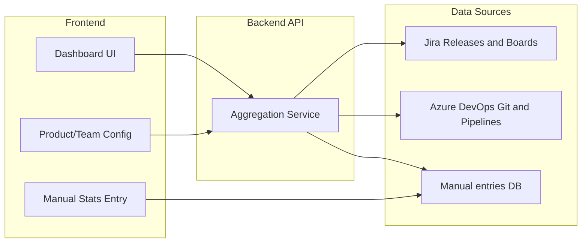

# DORA Dashboards – Custom Web App Plan

## Goal

Deliver a **new separate project** (not inside vision_assist): a custom web app that shows **five DORA-style metrics**, **configurable for multiple products and teams**, with data from:

- **Jira** – **Releases** from configurable Jira projects (deployment frequency), **CORPE01** event board (MTTR), **FSR** board where status **"In Process"** = accepted into team (change failure rate)
- **Azure DevOps** – **Git** (commit and merge data for lead time); **Azure Pipelines** (for **merge to deploy**: time from merge to master to production deploy, CI/CD teams only)
- **Manual entry** – for teams that don't use these tools; for **merge to deploy** (non-CI/CD), user enters **when the SRE manually deployed** (timestamp) and system computes duration from merge time to that deploy time

The app will be built in **phases** so you can use it iteratively.

---

## Architecture (high level)




- **Frontend:** React or Next.js app with five dashboard views and **configuration screens** (Jira projects, Azure DevOps projects/repos, Azure Pipelines for merge-to-deploy where applicable).
- **Backend:** Node.js (or Next.js API routes) that stores configuration, calls Jira and Azure DevOps APIs (Git + Pipelines), and computes the five metrics.
- **Config model:** Products, teams, Jira projects, Azure DevOps projects/repos, **Azure Pipelines** (for merge-to-deploy on CI/CD teams), CORPE01 and FSR settings, phases. Non-CI/CD teams use **manual entry** (including **when the SRE manually deployed** for merge-to-deploy).

---

## Data sources and APIs


| Source                         | What you need                                                        | API approach                                                                                                                                                        |
| ------------------------------ | -------------------------------------------------------------------- | ------------------------------------------------------------------------------------------------------------------------------------------------------------------- |
| **Jira Releases**              | Deployment frequency (count releases per phase)                      | Jira REST API: list releases for project(s); count per time window (phase).                                                                                         |
| **Jira CORPE01 (event board)** | MTTR: Declaration to Resolution                                      | GET issue changelog; parse status Declaration to Resolution; compute duration per incident.                                                                         |
| **Jira FSR**                   | Change failure rate                                                  | Count FSR issues with status **"In Process"** (accepted into team project) in the period.                                                                           |
| **Azure DevOps (Git only)**    | Lead time: first commit to merge to main/master                      | Commit and merge data from configured Azure DevOps projects/repos.                                                                                                  |
| **Azure Pipelines**            | Merge to deploy (CI/CD): merge to production                         | Time from merge to master to production deployment; use pipeline runs and production environment completion.                                                        |
| **Manual entry**               | All metrics for teams without tooling; merge-to-deploy for non-CI/CD | Per team/phase: deployment count, lead time, **deploy timestamp** (when SRE deployed; system computes merge-to-deploy from merge time), change failure count, MTTR. |


Authentication: Jira API token, Azure DevOps PAT (for Git only) stored server-side only.

---

## Metrics to implement (five)

1. **Deployment frequency**
  - **Definition:** How often releases happen in a given time frame (e.g. per phase).
  - **Source:** **Jira Releases** – count releases in the **Jira projects you add in config** (per phase). Manual entry for teams without Jira releases.
2. **Lead time**
  - **Definition:** Time from **first commit** to **merge to master or main**.
  - **Source:** **Azure DevOps Git** – commit and merge data from configured Azure DevOps projects/repos; compute first-commit to merge date per phase. Manual entry for teams without Azure DevOps.
3. **Merge to deploy**
  - **Definition:** Time from **merge to master** to **production deployment**. For CI/CD: how long from merge to production using **Azure Pipelines**. For non-CI/CD: from merge time to when the SRE **manually deployed** (user enters **when the deployment was done**).
  - **Source (CI/CD):** **Azure Pipelines** – time from merge to master to production deployment (pipeline run triggered by merge; production environment completion time). **Source (non-CI/CD):** **Manual entry** – user enters **deployment timestamp** (when the SRE deployed); system has merge time from Git and computes duration = deploy time − merge time. Manual entry can also supply the duration directly for teams without Git.
4. **Change failure rate**
  - **Definition:** Number of **defects accepted into the team project from support** in a given time frame. **"Accepted"** = FSR request with Jira status **"In Process"**.
  - **Source:** **Jira FSR** – count FSR issues that reached status **"In Process"** in the period. Manual entry for teams without this workflow.
5. **Mean time to restore (MTTR)**
  - **Definition:** Time from **Declaration** to **Resolution** on the **event board** in Jira (CORPE01).
  - **Source:** **Jira CORPE01** – from issue changelog, compute duration Declaration → Resolution per incident; report mean (or distribution) per phase. Manual entry for teams without CORPE01.

All five metrics are **configurable by product and team** and by **phase**. **Manual entry** for merge-to-deploy (non-CI/CD) stores **when the deployment was done** (timestamp) so the app can compute duration from merge time.

---

## Phased delivery

### Phase 1 – Deployment frequency (backend + data)

- **Scope:** Backend and data for **deployment frequency** only.
- **Deliverables:**
  - Project scaffold. Config model and storage. Backend: Jira API to list releases for **Jira projects you add in config**; count releases per phase. Manual entry API for deployment count per team/phase. Env: JIRA_HOST, JIRA_API_TOKEN.

### Phase 2 – Lead time (backend + data)

- **Scope:** Backend and data for **lead time** only.
- **Deliverables:** Backend: Azure DevOps Git API (commit and merge data only) for **Azure DevOps projects/repos you configure** to monitor; compute first commit to merge to main/master per phase. Manual entry API for lead time per team/phase. Env: AZURE_DEVOPS_PAT.

### Phase 3 – Change failure rate (backend + data)

- **Scope:** Backend and data for **change failure rate** only.
- **Deliverables:** Backend: Jira FSR – count issues with status **"In Process"** (accepted into team project) per phase. Manual entry API for change failure count per team/phase.

### Phase 4 – Mean time to restore (backend + data)

- **Scope:** Backend and data for **MTTR** only.
- **Deliverables:** Backend: Jira CORPE01 – issue changelog, Declaration to Resolution duration per incident; mean per phase. Manual entry API for MTTR per team/phase.

### Phase 5 – Merge to deploy (backend + data)

- **Scope:** Backend and data for **merge to deploy** only.
- **Deliverables:** **CI/CD:** Azure Pipelines API – for configured pipelines, get time from merge to master to production deployment; compute duration per deploy per phase. **Non-CI/CD:** Manual entry API for **when the deployment was done** (deploy timestamp); system has merge time from Git, computes duration = deploy time − merge time (or user can enter duration directly). Config: which Azure Pipelines (and production environment) to use for CI/CD teams.

### Phase 6 – Dashboard UI and config screens

- **Scope:** Build the **dashboard UI** that displays all five metrics, plus **configuration section** (Jira projects, Azure DevOps projects, Azure Pipelines for merge-to-deploy).
- **Deliverables:** Five dashboard views (deployment frequency, lead time, **merge to deploy**, change failure rate, MTTR). **Config screens:** (1) Jira projects for releases; (2) Azure DevOps projects/repos for commit/merge data; (3) **Azure Pipelines** (and production environment) for merge-to-deploy (CI/CD teams); (4) FSR project and status "In Process"; (5) CORPE01 project and status names (Declaration, Resolution). **Manual entry UI** for all metrics, including **deploy timestamp** (when SRE deployed) for non-CI/CD merge-to-deploy. Product/team and phase selectors.

---

## Tech stack (recommended)

- **Frontend:** Next.js (React) with a charting library (e.g. Recharts or Chart.js) for simple, configurable charts.
- **Backend:** Next.js API routes or a small Node/Express service; server-side only calls to Jira and Azure DevOps (Git).
- **Config:** Start with JSON or SQLite; move to Postgres if you need multi-user or audit.
- **Secrets:** Environment variables or Azure Key Vault / similar; never expose tokens to the browser.

---

## Configuration design (multi-product / team and phases)

### Configure Jira projects and Azure DevOps projects to monitor

The app must include a **configuration section** where you:

1. **Jira projects for deployment frequency** – Add and configure which **Jira projects** to check for **releases** (deployment frequency). The app will query releases for these projects per phase.
2. **Azure DevOps projects for lead time** – Add and configure which **Azure DevOps projects** (and repos) to monitor for **commit and merge data** (lead time).
3. **Azure Pipelines for merge to deploy (CI/CD)** – For teams with CI/CD, configure which **Azure Pipelines** (and production environment) to use to measure time from merge to master to production deployment.
4. **FSR (change failure rate)** – Configure the FSR project; status **"In Process"** = accepted into team project.
5. **CORPE01 (MTTR)** – Configure the CORPE01 project and status names **Declaration** and **Resolution** for the event board.

Products/teams can be mapped to which projects apply. Manual entry remains for teams without these tools.

- **Products / Teams:** List of names. Each can have: **Jira projects** (releases), **Azure DevOps projects/repos** (commit/merge), **Azure Pipelines** (merge-to-deploy for CI/CD), **FSR** and **CORPE01** settings, or **Manual** only.
- **Manual stats (per team, per phase):** teamId, phaseId, deploymentCount, leadTimeHours, **deployTimestamp** (when SRE manually deployed; used to compute merge-to-deploy from merge time), changeFailureCount, mttrMinutes. For merge-to-deploy without Git, user can enter **mergeToDeployMinutes** directly.
- **Status names (CORPE01):** Configurable **Declaration** and **Resolution** for the event board.
- **Phases (iterations):** Define phases as date ranges or sprint identifiers so all metrics can be grouped/filtered by phase.

---

## File structure (new project, suggested)

```
dora-dashboards/
  app/                    # Next.js app (or separate React app)
    page.tsx              # Dashboard home / navigation
    dashboard/
      deployment-frequency/   # Jira releases per phase
      lead-time/              # First commit to merge to main
      merge-to-deploy/        # Merge to production (Azure Pipelines or manual deploy timestamp)
      change-failure-rate/    # Defects accepted from support
      mean-time-to-restore/   # CORPE01 Declaration to Resolution
    config/                   # Product/team, Jira projects, Git, phases
    manual-entry/             # Form to enter all metrics; for merge-to-deploy (non-CI/CD): when deployment was done
  lib/
    api/                      # Jira (releases, CORPE01, FSR), Azure DevOps Git + Pipelines
    metrics/                  # Compute all five metrics; merge tool data + manual (incl. deploy timestamp)
    config/                   # Load/save config
  data/
    config.json
    manual-stats.json         # Manual entries (team + phase + metrics; incl. deployTimestamp for merge-to-deploy)
  .env.example                # JIRA_*, AZURE_DEVOPS_PAT
```

---

## Risks and dependencies

- **Jira:** CORPE01 Declaration/Resolution and FSR "In Process" configurable; only configured Jira projects queried for releases. **Azure DevOps:** Git (commit/merge) for lead time; **Azure Pipelines** for merge-to-deploy (CI/CD). Non-CI/CD merge-to-deploy: manual entry of **when deployment was done** (timestamp). **Rate limits:** Cache or batch by phase.

---

## Summary

- **New repo/project:** Custom web app (Next.js + backend) for **five** DORA-style metrics.
- **Integrations:** **Jira** (releases, CORPE01, FSR "In Process"), **Azure DevOps** (Git for lead time; **Pipelines** for merge-to-deploy on CI/CD teams), plus **manual entry** (including **when the SRE deployed** for non-CI/CD merge-to-deploy).
- **Config section:** Jira projects, Azure DevOps projects/repos, **Azure Pipelines** (for merge-to-deploy), FSR, CORPE01.
- **Metrics:** (1) Deployment frequency – Jira releases; (2) Lead time – first commit to merge to main; (3) **Merge to deploy** – merge to production (Azure Pipelines for CI/CD; manual **deploy timestamp** for non-CI/CD); (4) Change failure rate – FSR "In Process"; (5) MTTR – CORPE01 Declaration to Resolution. All by product/team and phase.
- **Phases:** 1 – Deployment frequency; 2 – Lead time; 3 – Change failure rate; 4 – MTTR; 5 – **Merge to deploy** (backend + data); 6 – **Dashboard UI and config screens**.

---

## Plan note: Phased delivery and config (detailed)

**Phased delivery** is one phase per metric, then dashboard UI:

- **Phase 1 – Deployment frequency:** Backend + data (Jira projects, manual entry API).
- **Phase 2 – Lead time:** Backend + data (Azure DevOps Git, manual entry API).
- **Phase 3 – Change failure rate:** Backend + data (Jira FSR "In Process", manual entry API).
- **Phase 4 – MTTR:** Backend + data (Jira CORPE01 Declaration to Resolution, manual entry API).
- **Phase 5 – Merge to deploy:** Backend + data. **CI/CD:** Azure Pipelines (merge to production). **Non-CI/CD:** Manual entry of **when the deployment was done** (timestamp); system computes duration from merge time.
- **Phase 6 – Dashboard UI and config screens:** Five dashboard views; config for Jira projects, Azure DevOps projects/repos, **Azure Pipelines** (merge-to-deploy), FSR, CORPE01; manual entry UI including **deploy timestamp** for non-CI/CD merge-to-deploy.

**Configuration section** must include: (1) Jira projects for releases; (2) Azure DevOps projects/repos for commit/merge; (3) **Azure Pipelines** (and production environment) for merge-to-deploy (CI/CD); (4) FSR and status "In Process"; (5) CORPE01 and status names Declaration, Resolution.