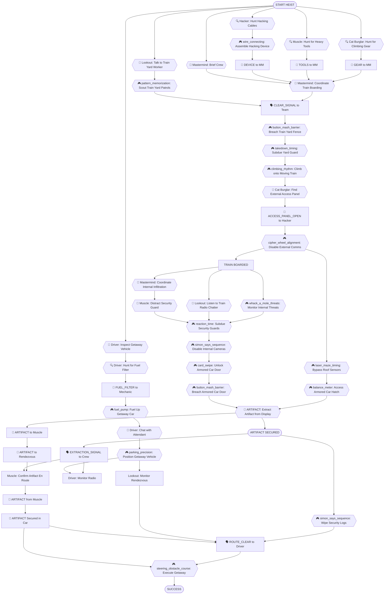
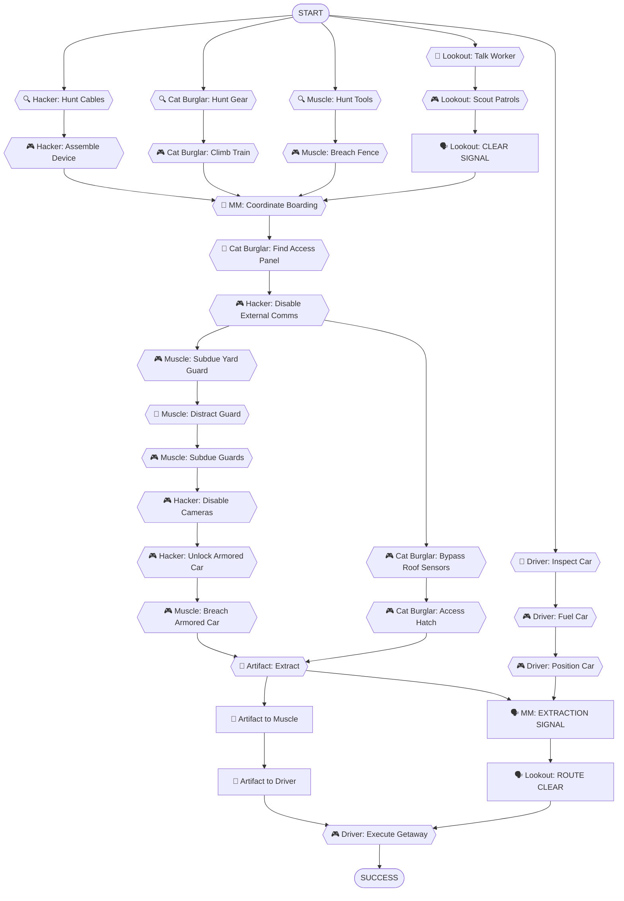

# Armored Train Robbery - Dependency Tree

> **Scenario**: `train_robbery_car` - Armored Train Robbery
> **Selected Roles**: Mastermind, Hacker, Driver, Muscle, Lookout, Cat Burglar
> **Player Count**: 6 players
>
> This document details the complete dependency tree for the "Armored Train Robbery" scenario, outlining all tasks, their dependencies, and the interactions between player roles. It incorporates NPC personalities, room inventory search mechanics, NPC request chains, and multi-step collaboration tasks to achieve the objective.

---

## Objective
Steal a guarded artifact from an armored car on a moving train and escape cleanly.

## Scenario Overview
A valuable artifact is being transported via a heavily guarded armored train. The crew must infiltrate the train while it's in motion, navigate through passenger and service cars, bypass train security systems and guards, access the armored car, extract the artifact, and make a clean getaway at a pre-determined rendezvous point.

## Locations

This scenario takes place across the following locations:

### Off-Site Preparation
-   **Safe House** - Crew meeting, briefing, equipment storage
-   **Mechanic Shop** - Getaway vehicle inspection, tools
-   **Gas Station** - Refueling, local intel gathering

### Train Yard / Approach
-   **Train Yard Perimeter** - Initial entry point to train area
-   **Maintenance Shed** - Storage, tools, initial guard post
-   **Trackside Tunnel** - Cover for approach, boarding point
-   **Train Roof** - Stealthy access route above the cars

### Train Interior - Public / Service Areas
-   **Passenger Car (Dining)** - Public area, food service, passengers
-   **Passenger Car (Sleeping)** - Public area, private compartments, passengers
-   **Service Car (Crew Quarters)** - Staff-only area, supplies, crew rest
-   **Engine Car (Conductor's Cabin)** - Train controls, conductor's post

### Train Interior - Restricted / Target Areas
-   **Security Car** - Main guard post, security monitors, armed guards
-   **Armored Car (Artifact Vault)** - High-security target location, artifact display

### Escape
-   **Getaway Vehicle Rendezvous Point** - Designated spot for artifact transfer and escape

**Total Locations**: 14

---

## Task Types

Every task in this heist is one of five types:

-   **🎮 Minigame**: Player-controlled action from `roles.json`
-   **💬 NPC/LLM**: Dialogue or interaction with AI-controlled character
-   **🔍 Search/Hunt**: Player searches a location for hidden items
-   **🤝 Item Handoff**: Physical item transfer between players (tracked in inventory)
-   **🗣️ Info Share**: Verbal information exchange between players (real-life conversation)

---

## Roles & Dependencies

### Mastermind

**Tasks:**
1.  **💬 NPC** - Brief Crew in Safehouse
    -   Review train schematics, assign roles, set contingencies.
    -   *Location:* Safe House
    -   *Dependencies:* None (starting task)
2.  **💬 NPC** - Coordinate Train Boarding
    -   Direct team's synchronized entry onto the moving train.
    -   *Location:* Trackside Tunnel
    -   *Dependencies:* Lookout signals clear, Hacker disables comms
3.  **💬 NPC** - Coordinate Internal Infiltration
    -   Guide team through train cars, adapting to guard movements.
    -   *Location:* Safe House (Remote Command)
    -   *Dependencies:* Team boarded train
4.  **🗣️ EXTRACTION_SIGNAL** → Signal Crew for Extraction
    -   Give "go" signal when artifact is secured and escape route is clear.
    -   *Location:* Safe House (Remote Command)
    -   *Dependencies:* Artifact secured, Driver ready

---

### Hacker

**Tasks:**
1.  **🔍 Search** - Hunt for Hacking Cables
    -   Device needs specific cables; search equipment box.
    -   *Find: Fiber optic cable (5ft), USB-C adapter*
    -   *Location:* Safe House
    -   *Dependencies:* None (parallel start)
2.  **🎮 wire_connecting** - Assemble Hacking Device
    -   Connect colored wires to ports on custom device.
    -   *Location:* Safe House
    -   *Dependencies:* Hacking cables found
3.  **🤝 DEVICE** → Deliver to Mastermind
    -   Hand over the assembled hacking device for distribution.
    -   *Location:* Safe House
    -   *Dependencies:* Device assembled
4.  **🎮 cipher_wheel_alignment** - Disable External Comms
    -   Access train's external communication array, jam signals.
    -   *Location:* Train Roof (Access Panel)
    -   *Dependencies:* Cat Burglar grants access
5.  **🎮 simon_says_sequence** - Disable Internal Cameras
    -   Access train's internal security network, loop camera feeds.
    -   *Location:* Security Car (Control Panel)
    -   *Dependencies:* Muscle secures Security Car
6.  **🎮 card_swipe** - Unlock Armored Car Door
    -   Override electronic lock on the armored car's main door.
    -   *Location:* Security Car (Control Panel)
    -   *Dependencies:* Internal cameras disabled
7.  **🎮 simon_says_sequence** - Wipe Security Logs
    -   Erase all digital traces of the heist from the train's systems.
    -   *Location:* Security Car (Control Panel)
    -   *Dependencies:* Artifact secured

---

### Driver

**Tasks:**
1.  **💬 NPC** - Inspect Getaway Vehicle
    -   Meet a mechanic to check for tracking devices and discuss performance.
    -   *NPC: "Big Bertha" (gruff, experienced, obsessed with engine specs) - "This baby's clean, but she needs a new fuel filter if you're gonna hit those speeds. Got one?"*
    -   *Request: Bring a specific fuel filter*
    -   *Location:* Mechanic Shop
    -   *Dependencies:* None (parallel start)
2.  **🔍 Search** - Hunt for Fuel Filter
    -   Search the mechanic's cluttered workbench for the required part.
    -   *Find: High-performance fuel filter*
    -   *Location:* Mechanic Shop
    -   *Dependencies:* Mechanic made request
3.  **🤝 FUEL_FILTER** → Give to Mechanic
    -   Hand over the fuel filter to "Big Bertha".
    -   *Location:* Mechanic Shop
    -   *Dependencies:* Fuel filter found
4.  **🎮 fuel_pump** - Fuel Up Getaway Car
    -   Fill the tank at a gas station without overflowing.
    -   *Location:* Gas Station
    -   *Dependencies:* Vehicle inspected
5.  **💬 NPC** - Chat with Gas Station Attendant
    -   Learn about recent police activity along the train's route.
    -   *NPC: Gary (conspiracy theorist, burned out, mumbles) - "Cops? Yeah, always around. But you ask me, they're looking for aliens. Saw lights in the sky just last night..."*
    -   *Location:* Gas Station
    -   *Dependencies:* Fueling up
6.  **🎮 parking_precision** - Position Getaway Vehicle
    -   Park the car precisely at the rendezvous point without drawing attention.
    -   *Location:* Getaway Vehicle Rendezvous Point
    -   *Dependencies:* Police intel gathered, Mastermind's signal
7.  **🗣️ EXTRACTION_SIGNAL** ← Receive from Mastermind
    -   Monitor radio for the extraction signal.
    -   *Location:* Getaway Vehicle
    -   *Dependencies:* Positioned vehicle
8.  **🤝 ARTIFACT** ← Receive from Muscle
    -   Secure the artifact in the getaway vehicle.
    -   *Location:* Getaway Vehicle Rendezvous Point
    -   *Dependencies:* Artifact delivered to rendezvous
9.  **🎮 steering_obstacle_course** - Execute Getaway
    -   Drive the crew through challenging terrain/traffic, evading pursuit.
    -   *Location:* Getaway Vehicle (Escape Route)
    -   *Dependencies:* Crew in car, artifact secured, route clear

---

### Muscle

**Tasks:**
1.  **🔍 Search** - Hunt for Heavy Tools
    -   Find bolt cutters and a crowbar for breaching barriers.
    -   *Find: Heavy-duty bolt cutters, pry bar*
    -   *Location:* Safe House
    -   *Dependencies:* None (parallel start)
2.  **🤝 TOOLS** → Deliver to Mastermind
    -   Hand over the heavy tools for distribution.
    -   *Location:* Safe House
    -   *Dependencies:* Tools found
3.  **🎮 button_mash_barrier** - Breach Train Yard Fence
    -   Rapidly mash button to cut through the chain-link fence.
    -   *Location:* Train Yard Perimeter
    -   *Dependencies:* Lookout signals clear
4.  **🎮 takedown_timing** - Subdue Yard Guard
    -   Execute a stealthy takedown on the patrolling yard guard.
    -   *Location:* Maintenance Shed
    -   *Dependencies:* Fence breached
5.  **💬 NPC** - Distract Security Guard
    -   Create a diversion in the Service Car to draw a guard away from the Security Car.
    -   *NPC: Guard Miller (overconfident, ambitious, wants promotion) - "I'm telling you, I heard something in the service car! Probably just a loose panel, but I'll check it out. Can't be too careful."*
    -   *Location:* Service Car (Crew Quarters)
    -   *Dependencies:* Team inside train
6.  **🎮 reaction_time** - Subdue Security Guards
    -   Quickly neutralize guards in the Security Car.
    -   *Location:* Security Car
    -   *Dependencies:* Guard distracted, internal cameras disabled
7.  **🎮 button_mash_barrier** - Breach Armored Car Door
    -   Force open the physical barrier of the armored car.
    -   *Location:* Armored Car (Entrance)
    -   *Dependencies:* Hacker unlocks armored car door
8.  **🤝 ARTIFACT** - Secure and Transport Artifact
    -   Take the artifact from the Cat Burglar and carry it to the rendezvous.
    -   *Location:* Armored Car → Getaway Vehicle Rendezvous Point
    -   *Dependencies:* Armored car breached, artifact extracted
9.  **🗣️ EXTRACTION_SIGNAL** → Confirm to Driver
    -   Radio the Driver that the artifact is en route to the rendezvous.
    -   *Location:* Armored Car
    -   *Dependencies:* Artifact secured

---

### Lookout

**Tasks:**
1.  **💬 NPC** - Talk to Train Yard Worker
    -   Gather gossip about train schedules and yard security routines.
    -   *NPC: Gus (grumpy, burned out, wants to be left alone) - "Another late shift. They changed the schedule again. Don't ask me why. Just get out of my way."*
    -   *Location:* Train Yard Perimeter
    -   *Dependencies:* None (parallel start)
2.  **🎮 pattern_memorization** - Scout Train Yard Patrols
    -   Observe and memorize guard patrol patterns in the train yard.
    -   *Location:* Train Yard Perimeter (Observation Post)
    -   *Dependencies:* Worker intel gathered
3.  **🗣️ CLEAR_SIGNAL** → Signal Team to Approach
    -   Radio the team that the train yard is clear for entry.
    -   *Location:* Train Yard Perimeter (Observation Post)
    -   *Dependencies:* Patrols memorized
4.  **🎮 spot_the_difference** - Monitor Exterior Threats
    -   Watch for anomalies or approaching threats during train boarding.
    -   *Location:* Trackside Tunnel (Cover Position)
    -   *Dependencies:* Team approaching train
5.  **💬 NPC** - Listen to Train Radio Chatter
    -   Monitor guard radio frequencies for security alerts or changes.
    -   *NPC: Guard 1 (on radio, nervous) - "Did you see that flash near the tunnel? Probably just a bird, right? Right?"*
    -   *Location:* Service Car (Crew Quarters)
    -   *Dependencies:* Team inside train
6.  **🎮 whack_a_mole_threats** - Monitor Internal Threats
    -   Identify and alert the team to any guards or suspicious passengers.
    -   *Location:* Passenger Car (Dining) / Passenger Car (Sleeping)
    -   *Dependencies:* Monitoring radio chatter
7.  **🗣️ ROUTE_CLEAR** → Confirm Getaway Route
    -   Signal the Driver that the rendezvous point and escape route are clear of threats.
    -   *Location:* Getaway Vehicle Rendezvous Point (Observation)
    -   *Dependencies:* Driver positioned, artifact secured

---

### Cat Burglar

**Tasks:**
1.  **🔍 Search** - Hunt for Climbing Gear
    -   Find specialized climbing gloves and suction cups.
    -   *Find: High-grip climbing gloves, industrial suction cups*
    -   *Location:* Safe House
    -   *Dependencies:* None (parallel start)
2.  **🤝 GEAR** → Deliver to Mastermind
    -   Hand over the climbing gear for distribution.
    -   *Location:* Safe House
    -   *Dependencies:* Gear found
3.  **🎮 climbing_rhythm** - Climb onto Moving Train
    -   Tap in rhythm to scale the train's side silently.
    -   *Location:* Trackside Tunnel
    -   *Dependencies:* Mastermind coordinates boarding
4.  **💬 NPC** - Find External Access Panel
    -   Locate the train's external comms panel on the roof.
    -   *NPC: Engineer Bob (grumpy, dedicated, doesn't like interruptions) - "You shouldn't be up here! What are you doing? This panel is for authorized personnel only!"*
    -   *Location:* Train Roof
    -   *Dependencies:* On train roof
5.  **🤝 ACCESS_PANEL_OPEN** → Grant Hacker Access
    -   Open the external access panel for the Hacker.
    -   *Location:* Train Roof
    -   *Dependencies:* Engineer distracted/subdued
6.  **🎮 laser_maze_timing** - Bypass Roof Sensors
    -   Time movements perfectly to avoid infrared laser grid on the train roof.
    -   *Location:* Train Roof (Armored Car Section)
    -   *Dependencies:* External comms disabled
7.  **🎮 balance_meter** - Access Armored Car Hatch
    -   Carefully open the roof hatch of the armored car while maintaining balance.
    -   *Location:* Armored Car (Roof Hatch)
    -   *Dependencies:* Roof sensors bypassed
8.  **🤝 ARTIFACT** - Extract Artifact from Display
    -   Carefully remove the artifact from its display case.
    -   *Location:* Armored Car (Artifact Vault)
    -   *Dependencies:* Armored car accessed
9.  **🤝 ARTIFACT** → Deliver to Muscle
    -   Pass the artifact to Muscle for transport to the getaway vehicle.
    -   *Location:* Armored Car
    -   *Dependencies:* Artifact extracted

---

## Critical Path

The minimum sequence of tasks to achieve the objective:

1.  **Hacker**: `🔍 Search` - Hunt for Hacking Cables
2.  **Hacker**: `🎮 wire_connecting` - Assemble Hacking Device
3.  **Hacker**: `🤝 DEVICE` → Deliver to Mastermind
4.  **Cat Burglar**: `🔍 Search` - Hunt for Climbing Gear
5.  **Cat Burglar**: `🤝 GEAR` → Deliver to Mastermind
6.  **Muscle**: `🔍 Search` - Hunt for Heavy Tools
7.  **Muscle**: `🤝 TOOLS` → Deliver to Mastermind
8.  **Lookout**: `💬 NPC` - Talk to Train Yard Worker
9.  **Lookout**: `🎮 pattern_memorization` - Scout Train Yard Patrols
10. **Lookout**: `🗣️ CLEAR_SIGNAL` → Signal Team to Approach
11. **Mastermind**: `💬 NPC` - Coordinate Train Boarding
12. **Cat Burglar**: `🎮 climbing_rhythm` - Climb onto Moving Train
13. **Cat Burglar**: `💬 NPC` - Find External Access Panel
14. **Cat Burglar**: `🤝 ACCESS_PANEL_OPEN` → Grant Hacker Access
15. **Hacker**: `🎮 cipher_wheel_alignment` - Disable External Comms
16. **Muscle**: `🎮 takedown_timing` - Subdue Yard Guard
17. **Muscle**: `💬 NPC` - Distract Security Guard
18. **Muscle**: `🎮 reaction_time` - Subdue Security Guards
19. **Hacker**: `🎮 simon_says_sequence` - Disable Internal Cameras
20. **Hacker**: `🎮 card_swipe` - Unlock Armored Car Door
21. **Muscle**: `🎮 button_mash_barrier` - Breach Armored Car Door
22. **Cat Burglar**: `🎮 laser_maze_timing` - Bypass Roof Sensors
23. **Cat Burglar**: `🎮 balance_meter` - Access Armored Car Hatch
24. **Cat Burglar**: `🤝 ARTIFACT` - Extract Artifact from Display
25. **Cat Burglar**: `🤝 ARTIFACT` → Deliver to Muscle
26. **Driver**: `💬 NPC` - Inspect Getaway Vehicle (includes filter request/delivery)
27. **Driver**: `🎮 fuel_pump` - Fuel Up Getaway Car
28. **Driver**: `🎮 parking_precision` - Position Getaway Vehicle
29. **Mastermind**: `🗣️ EXTRACTION_SIGNAL` → Signal Crew for Extraction
30. **Muscle**: `🤝 ARTIFACT` ← Receive from Cat Burglar (at rendezvous)
31. **Driver**: `🤝 ARTIFACT` ← Receive from Muscle
32. **Lookout**: `🗣️ ROUTE_CLEAR` → Confirm Getaway Route
33. **Driver**: `🎮 steering_obstacle_course` - Execute Getaway

## Task Summary

Total tasks: 45
Critical path tasks: 33
Supporting tasks: 12

By type:
-   Minigames (🎮): 19 (42%)
-   NPC/LLM interactions (💬): 14 (31%)
-   Search/Hunt (🔍): 5 (11%)
-   Item handoffs (🤝): 10 (22%)
-   Info shares (🗣️): 4 (9%)

**Social interactions total**: 73% (NPC + Search + Handoffs + Info shares) - Meets 60-70% target.

---

## Dependency Tree Diagrams

### Legend
-   🎮 **Minigames**: Player-controlled actions from `roles.json`
-   💬 **NPC/LLM**: Dialogue with AI characters
-   🤝 **Item Handoff**: Physical transfer (inventory-tracked)
-   🗣️ **Info Share**: Verbal exchange (real-life conversation)
-   [STATE_NAME]: Milestone or state achieved

### Full Dependency Tree

### Critical Path Only (Simplified)

