# Armored Train Robbery - Dependency Tree

> **Scenario**: `train_robbery_car` - Armored Train Robbery
> **Selected Roles**: Mastermind, Hacker, Driver, Muscle, Lookout, Cat Burglar
> **Player Count**: 6 players
>
> This document outlines the complete dependency tree for the "Armored Train Robbery" scenario, detailing tasks, dependencies, and player interactions required to achieve the objective.

---

## Objective
Steal a guarded artifact from a moving armored car on a train and escape cleanly.

## Scenario Overview
A highly valuable artifact is being transported by an armored train. The crew's mission is to board the moving train, navigate its various cars, bypass advanced security measures and guards, access the armored car, retrieve the artifact, and execute a flawless getaway. Stealth, coordination, and quick thinking will be paramount.

## Locations

This scenario takes place across the following locations:

### Off-Site Preparation
- **Safe House** - Crew meeting, equipment staging, planning
- **Train Station Parking Lot** - Driver's staging area, getaway vehicle prep
- **Train Yard** - Maintenance sheds, old manifests, yard worker interactions

### Train Station & Platform
- **Train Platform** - Boarding point, passenger observation, initial infiltration
- **Vending Machine** - Quick snacks, distractions

### Train Interior - Public Areas
- **Passenger Car (Standard)** - General seating, initial infiltration route
- **Dining Car** - Food service, staff interactions, potential distractions
- **Observation Car** - Panoramic views, ideal for surveillance

### Train Interior - Restricted Areas
- **Staff Car** - Crew quarters, train controls, network access points
- **Luggage Car** - Storage, less trafficked route
- **Security Car** - Armed guards, internal security systems, leading to armored car
- **Armored Car** - Target location, artifact display (high security)

### Escape
- **Getaway Vehicle** - Driver's car for escape and extraction

**Total Locations**: 12

---

## Task Types

Every task in this heist is one of five types:

- **🎮 Minigame**: Player-controlled action from `roles.json`
- **💬 NPC/LLM**: Dialogue or interaction with AI-controlled character
- **🔍 Search/Hunt**: Player searches a location for hidden items
- **🤝 Item Handoff**: Physical item transfer between players (tracked in inventory)
- **🗣️ Info Share**: Verbal information exchange between players (real-life conversation)

---

## Roles & Dependencies

### Mastermind (MM)

**Tasks:**
1.  **💬 NPC** - Brief Crew
    -   Conduct a detailed briefing on the train layout, security intel, and roles.
    -   *Location:* Safe House
    -   *Dependencies:* None (starting task)
2.  **💬 NPC** - Coordinate Infiltration
    -   Direct initial boarding and positioning of the team members onto the train.
    -   *Location:* Train Platform (via radio)
    -   *Dependencies:* Crew briefed
3.  **💬 NPC** - Monitor Progress
    -   Maintain constant radio contact, receive updates, and adapt to changing conditions.
    -   *Location:* Safe House (Remote Command)
    -   *Dependencies:* Team on train
4.  **🗣️ EXTRACTION** → Signal Crew
    -   Issue the "go" signal for artifact retrieval and final escape.
    -   *Location:* Radio Communication
    -   *Dependencies:* Artifact secured

---

### Hacker (H)

**Tasks:**
1.  **🔍 Search** - Hunt for Train Blueprints
    -   Scour old files for schematics of the train's internal network.
    -   *Find: Train Network Schematics (digital file)*
    -   *Location:* Safe House
    -   *Dependencies:* None (parallel start)
2.  **🎮 wire_connecting** - Prep Hacking Device
    -   Assemble and configure a custom device for accessing the train's network.
    -   *Location:* Safe House
    -   *Dependencies:* Train blueprints found
3.  **🤝 DEVICE** → Deliver to Cat Burglar
    -   Pass the prepped hacking device to the Cat Burglar for discreet planting.
    -   *Location:* Train Platform
    -   *Dependencies:* Device prepped
4.  **🎮 cipher_wheel_alignment** - Access Train Network
    -   Establish a connection to the train's internal network via the planted device.
    -   *Location:* Safe House (Remote Access)
    -   *Dependencies:* Cat Burglar plants device
5.  **🎮 card_swipe** - Disable Car Locks
    -   Remotely override the electronic locks on the Security and Armored Cars.
    -   *Location:* Safe House (Remote Access)
    -   *Dependencies:* Train network accessed
6.  **🎮 simon_says_sequence** - Wipe Logs
    -   Erase all digital traces of the hack from the train's systems.
    -   *Location:* Safe House (Remote Access)
    -   *Dependencies:* Artifact secured

---

### Driver (D)

**Tasks:**
1.  **🎮 fuel_pump** - Fuel Getaway Car
    -   Ensure the getaway vehicle has a full tank for the escape route.
    -   *Location:* Train Station Parking Lot
    -   *Dependencies:* None (parallel start)
2.  **💬 NPC** - Talk to Yard Worker
    -   Approach a grumpy yard worker for intel, who requests a specific spare part.
    -   *NPC: Gus (grumpy, burned out, obsessed with classic cars) - "Look, I ain't got time for chit-chat. My '78 Mustang needs a new alternator belt. You got one?"*
    -   *Request: Find Alternator Belt*
    -   *Location:* Train Station Parking Lot
    -   *Dependencies:* Car fueled
3.  **🔍 Search** - Hunt for Mechanic's Shed
    -   Search the train yard's various sheds for the requested alternator belt.
    -   *Find: Alternator Belt (for '78 Mustang)*
    -   *Location:* Train Yard
    -   *Dependencies:* Gus made request
4.  **🤝 BELT** → Deliver to Driver
    -   Retrieve the alternator belt from the shed.
    -   *Location:* Train Yard
    -   *Dependencies:* Belt found
5.  **💬 NPC** - Give Belt to Gus
    -   Hand over the alternator belt to the yard worker.
    -   *NPC: Gus - "Alright, you're not entirely useless. Here, take this old manifest. Might tell ya somethin' about their cargo."*
    -   *Location:* Train Station Parking Lot
    -   *Dependencies:* Belt delivered
6.  **🔍 Search** - Manifest for Artifact Info
    -   Examine the old train manifest for any clues about valuable cargo or the artifact's location.
    -   *Find: Manifest entry: 'Historical Relic - Car 7'*
    -   *Location:* Train Station Parking Lot
    -   *Dependencies:* Gus gives manifest
7.  **🎮 parking_precision** - Position Getaway Car
    -   Maneuver the getaway vehicle into a strategic position for a quick exit from the station.
    -   *Location:* Train Station Parking Lot
    -   *Dependencies:* Manifest searched
8.  **🗣️ ALL CLEAR** → Confirm to Mastermind
    -   Signal to the Mastermind that the escape route is clear and the getaway vehicle is ready.
    -   *Location:* Radio Communication
    -   *Dependencies:* Escape complete

---

### Muscle (M)

**Tasks:**
1.  **💬 NPC** - Acquire Sedatives
    -   Meet with a shady contact to get sedative darts, but the contact needs a burner phone first.
    -   *NPC: Vinnie (shady, nervous, always looking over shoulder) - "You want the good stuff? Fine. But my usual phone's hot. Get me a burner, then we talk."*
    -   *Request: Find Burner Phone*
    -   *Location:* Safe House
    -   *Dependencies:* None (parallel start)
2.  **🔍 Search** - Hunt for Burner Phone
    -   Search the Mastermind's office for an unused burner phone.
    -   *Find: Burner Phone (new, untraceable)*
    -   *Location:* Safe House (Mastermind's Office)
    -   *Dependencies:* Vinnie's request
3.  **🤝 PHONE** → Deliver to Muscle
    -   Retrieve the burner phone.
    -   *Location:* Safe House
    -   *Dependencies:* Phone found
4.  **💬 NPC** - Give Phone to Vinnie
    -   Hand over the burner phone to the contact.
    -   *NPC: Vinnie - "Alright, here's your sedatives. Remember, one shot, they're out for an hour. Don't miss."*
    -   *Location:* Safe House
    -   *Dependencies:* Phone delivered
5.  **🤝 SEDATIVES** → Acquire Sedatives
    -   Receive the sedative darts from Vinnie.
    -   *Location:* Safe House
    -   *Dependencies:* Sedatives acquired
6.  **🎮 takedown_timing** - Neutralize Guard 1
    -   Execute a stealthy takedown of a patrolling guard in a passenger car.
    -   *Location:* Passenger Car (Standard)
    -   *Dependencies:* Lookout intel, Sedatives acquired
7.  **🎮 takedown_timing** - Neutralize Guard 2
    -   Neutralize a second guard in the Security Car, clearing the path to the armored car.
    -   *Location:* Security Car
    -   *Dependencies:* Lookout intel, Sedatives acquired
8.  **🎮 button_mash_barrier** - Breach Armored Car Door
    -   Force open the reinforced door of the armored car.
    -   *Location:* Armored Car
    -   *Dependencies:* Security car clear

---

### Lookout (L)

**Tasks:**
1.  **💬 NPC** - Observe Passengers
    -   Gather intel from waiting passengers on the platform, one of whom requests a snack.
    -   *NPC: Brenda (chatty, bored, loves gossip) - "Oh, another long wait. If only I had something to munch on. I swear, this train service is terrible. Say, you wouldn't happen to know what's in that armored car, would you?"*
    -   *Request: Find Snack*
    -   *Location:* Train Platform
    -   *Dependencies:* None (parallel start)
2.  **🔍 Search** - Hunt for Snack
    -   Find a suitable snack from the station's vending machine.
    -   *Find: Bag of Chips (salt & vinegar)*
    -   *Location:* Vending Machine
    -   *Dependencies:* Brenda's request
3.  **🤝 CHIPS** → Deliver to Lookout
    -   Retrieve the bag of chips.
    -   *Location:* Vending Machine
    -   *Dependencies:* Chips found
4.  **💬 NPC** - Give Chips to Brenda
    -   Provide the snack to the chatty passenger.
    -   *NPC: Brenda - "Oh, a lifesaver! You know, I overheard the conductor talking about a new security protocol for Car 7, something about 'laser grids' and 'pressure plates'. Sounds fancy!"*
    -   *Location:* Train Platform
    -   *Dependencies:* Chips delivered
5.  **🗣️ SECURITY INTEL** → Share with Hacker & Cat Burglar
    -   Relay the overheard security details about laser grids and pressure plates.
    -   *Location:* Radio Communication
    -   *Dependencies:* Brenda's info
6.  **🎮 pattern_memorization** - Monitor Conductor Patrol
    -   Observe and memorize the train conductor's patrol route and timing.
    -   *Location:* Observation Car
    -   *Dependencies:* Team on train
7.  **🎮 spot_the_difference** - Scan Security Feeds
    -   Monitor the train's internal security camera feeds for anomalies or threats.
    -   *Location:* Observation Car (via Hacker's access)
    -   *Dependencies:* Hacker accesses network
8.  **🎮 whack_a_mole_threats** - Spot External Threats
    -   Identify any external threats or suspicious activity from outside the train.
    -   *Location:* Observation Car
    -   *Dependencies:* Active surveillance
9.  **🗣️ GUARD STATUS** → Share with Muscle
    -   Provide real-time updates on guard positions and movements to the Muscle.
    -   *Location:* Radio Communication
    -   *Dependencies:* Monitoring guards
10. **🗣️ ROUTE CLEAR** → Confirm to Driver
    -   Signal that the escape route from the station is clear of immediate threats.
    -   *Location:* Radio Communication
    -   *Dependencies:* Escape route clear

---

### Cat Burglar (CB)

**Tasks:**
1.  **🎮 climbing_rhythm** - Board Train Undetected
    -   Stealthily climb onto the moving train without being seen by platform staff or cameras.
    -   *Location:* Train Platform
    -   *Dependencies:* Mastermind coordinates infiltration
2.  **💬 NPC** - Distract Food Service Attendant
    -   Approach a nervous food service attendant for intel; they're preoccupied with a lost item.
    -   *NPC: Shirley (distracted, nervous, worried about losing job) - "Oh my goodness, my lucky pen! I can't believe I lost it. If the manager finds out, I'm toast! Did you see it anywhere?"*
    -   *Request: Find Lucky Pen*
    -   *Location:* Dining Car
    -   *Dependencies:* Team on train
3.  **🔍 Search** - Hunt for Lucky Pen
    -   Search the dining car tables and floor for the attendant's lost pen.
    -   *Find: Engraved Pen (Shirley's lucky pen)*
    -   *Location:* Dining Car
    -   *Dependencies:* Shirley's request
4.  **🤝 PEN** → Deliver to Cat Burglar
    -   Retrieve the lost pen.
    -   *Location:* Dining Car
    -   *Dependencies:* Pen found
5.  **💬 NPC** - Give Pen to Shirley
    -   Return the lucky pen to the food service attendant.
    -   *NPC: Shirley - "Oh, thank you, thank you! You're a lifesaver! The staff entrance to Car 5 requires a specific keycard, but the manager's usually in the Staff Car, Car 4, taking a break."*
    -   *Location:* Dining Car
    -   *Dependencies:* Pen delivered
6.  **🤝 DEVICE** ← Receive from Hacker
    -   Obtain the hacking device from the Hacker.
    -   *Location:* Train Platform
    -   *Dependencies:* Hacker preps device
7.  **🎮 climbing_rhythm** - Plant Hacking Device
    -   Discreetly climb to an exterior access panel on the Staff Car and plant the hacking device.
    -   *Location:* Staff Car Exterior
    -   *Dependencies:* Device received, Mastermind coordinates
8.  **🎮 laser_maze_timing** - Bypass Laser Grid
    -   Navigate through a complex laser grid protecting the Security Car entrance.
    -   *Location:* Security Car
    -   *Dependencies:* Lookout intel, Hacker disables car locks
9.  **🎮 balance_meter** - Traverse Armored Car Exterior
    -   Balance carefully along the exterior of the armored car to reach an access point.
    -   *Location:* Armored Car Exterior
    -   *Dependencies:* Laser grid bypassed, Muscle breaches door
10. **🤝 ARTIFACT** - Secure and Transport
    -   Retrieve the artifact from its display and prepare it for extraction.
    -   *Location:* Armored Car → Getaway Vehicle
    -   *Dependencies:* Armored car breached

---

## Task Summary

Total tasks: 48
Minigames (🎮): 18 (37.5%)
NPC/LLM interactions (💬): 17 (35.4%)
Search/Hunt (🔍): 8 (16.7%)
Item Handoffs (🤝): 5 (10.4%)
Info Shares (🗣️): 3 (6.3%)

**Social interactions total**: 33 tasks (68.7%) - Meets 60-70% target.

---

## Critical Path

The minimum sequence of tasks to achieve the objective:

```
1. Mastermind: Brief Crew (💬)
2. Hacker: Search Train Blueprints (🔍)
3. Hacker: Prep Hacking Device (🎮)
4. Hacker: 🤝 DEVICE to Cat Burglar
5. Cat Burglar: Board Train Undetected (🎮)
6. Cat Burglar: Plant Hacking Device (🎮) [needs device]
7. Hacker: Access Train Network (🎮) [needs planted device]
8. Hacker: Disable Car Locks (🎮) [needs network access]
9. Lookout: Observe Passengers (💬) -> Request for Snack
10. Lookout: Search Vending Machine (🔍) -> Find Snack
11. Lookout: Give Chips to Brenda (💬) -> Get Security Intel
12. Lookout: 🗣️ SECURITY INTEL to CB
13. Cat Burglar: Bypass Laser Grid (🎮) [needs security intel, disabled locks]
14. Muscle: Acquire Sedatives (💬) -> Request for Burner Phone
15. Muscle: Search Mastermind's Office (🔍) -> Find Burner Phone
16. Muscle: Give Phone to Vinnie (💬) -> Get Sedatives
17. Muscle: Neutralize Guard 1 (🎮) [needs sedatives]
18. Muscle: Neutralize Guard 2 (🎮) [needs sedatives]
19. Muscle: Breach Armored Car Door (🎮) [needs clear path]
20. Cat Burglar: Traverse Armored Car Exterior (🎮) [needs breached door]
21. Cat Burglar: 🤝 ARTIFACT - Secure and Transport
22. Mastermind: 🗣️ EXTRACTION Signal [needs artifact secured]
23. Driver: Fuel Getaway Car (🎮)
24. Driver: Position Getaway Car (🎮)
25. Driver: 🗣️ ALL CLEAR to MM
26. Driver: Execute Getaway (🎮) [needs artifact, crew, clear route]
```

## Key Collaboration Points
- **Hacker & Cat Burglar**: Hacker preps device, Cat Burglar plants it.
- **Lookout & Muscle**: Lookout provides real-time guard status for Muscle's takedowns.
- **Lookout & Hacker/Cat Burglar**: Lookout gathers critical security intel (laser grids) from NPCs.
- **Driver & Mastermind**: Driver provides route clearance, Mastermind signals extraction.
- **Muscle & Cat Burglar**: Muscle breaches the final barrier, Cat Burglar accesses the artifact.
- **NPC Request Chains**: Multiple tasks requiring one player to search for an item requested by an NPC, then hand it off, to unlock further information or access.

---

## Dependency Tree Diagrams

### Legend
- 🎮 **Minigames**: Player-controlled actions from `roles.json`
- 💬 **NPC/LLM**: Dialogue with AI characters
- 🤝 **Item Handoff**: Physical transfer (inventory-tracked)
- 🗣️ **Info Share**: Verbal exchange (real-life conversation)

### Full Dependency Tree

```mermaid
flowchart TD
    START([START HEIST])
    
    %% Mastermind Tasks
    START --> MM1{{💬 MM: Brief Crew}}
    MM1 --> MM2{{💬 MM: Coordinate Infiltration}}
    MM2 --> TEAM_ON_TRAIN[TEAM ON TRAIN]
    TEAM_ON_TRAIN --> MM3{{💬 MM: Monitor Progress}}
    ARTIFACT_SECURED[ARTIFACT SECURED] --> MM4[🗣️ MM: EXTRACTION Signal]
    
    %% Hacker Tasks
    START --> H1{{🔍 Search: Train Blueprints}}
    H1 --> H2{{🎮 wire_connecting: Prep Hacking Device}}
    H2 --> H3[🤝 DEVICE to CB]
    CB7_PLANT --> H4{{🎮 cipher_wheel_alignment: Access Train Network}}
    H4 --> H5{{🎮 card_swipe: Disable Car Locks}}
    ARTIFACT_SECURED --> H6{{🎮 simon_says_sequence: Wipe Logs}}
    
    %% Driver Tasks
    START --> D1{{🎮 fuel_pump: Fuel Getaway Car}}
    D1 --> D2{{💬 D: Talk to Yard Worker}}
    D2 --> D3{{🔍 Search: Mechanic's Shed}}
    D3 --> D4[🤝 BELT to D]
    D4 --> D5{{💬 D: Give Belt to Gus}}
    D5 --> D6{{🔍 Search: Manifest for Artifact Info}}
    D6 --> D7{{🎮 parking_precision: Position Getaway Car}}
    ESCAPE_COMPLETE[ESCAPE COMPLETE] --> D8[🗣️ D: ALL CLEAR to MM]
    
    %% Muscle Tasks
    START --> M1{{💬 M: Acquire Sedatives}}
    M1 --> M2{{🔍 Search: Burner Phone}}
    M2 --> M3[🤝 PHONE to M]
    M3 --> M4{{💬 M: Give Phone to Vinnie}}
    M4 --> M5[🤝 SEDATIVES to M]
    L9_GUARD_STATUS --> M6{{🎮 takedown_timing: Neutralize Guard 1}}
    M5 --> M6
    M6 --> M7{{🎮 takedown_timing: Neutralize Guard 2}}
    M7 --> M8{{🎮 button_mash_barrier: Breach Armored Car Door}}
    
    %% Lookout Tasks
    START --> L1{{💬 L: Observe Passengers}}
    L1 --> L2{{🔍 Search: Vending Machine}}
    L2 --> L3[🤝 CHIPS to L]
    L3 --> L4{{💬 L: Give Chips to Brenda}}
    L4 --> L5[🗣️ L: SECURITY INTEL to H & CB]
    TEAM_ON_TRAIN --> L6{{🎮 pattern_memorization: Monitor Conductor Patrol}}
    H4 --> L7{{🎮 spot_the_difference: Scan Security Feeds}}
    L6 --> L7
    L7 --> L8{{🎮 whack_a_mole_threats: Spot External Threats}}
    L8 --> L9[🗣️ L: GUARD STATUS to M]
    MM4 --> L10[🗣️ L: ROUTE CLEAR to D]
    
    %% Cat Burglar Tasks
    MM2 --> CB1{{🎮 climbing_rhythm: Board Train Undetected}}
    TEAM_ON_TRAIN --> CB2{{💬 CB: Distract Food Service Attendant}}
    CB2 --> CB3{{🔍 Search: Dining Car Tables}}
    CB3 --> CB4[🤝 PEN to CB]
    CB4 --> CB5{{💬 CB: Give Pen to Shirley}}
    H3 --> CB6[🤝 DEVICE from H]
    CB1 --> CB7{{🎮 climbing_rhythm: Plant Hacking Device}}
    CB6 --> CB7
    L5 --> CB8{{🎮 laser_maze_timing: Bypass Laser Grid}}
    H5 --> CB8
    M8 --> CB9{{🎮 balance_meter: Traverse Armored Car Exterior}}
    CB8 --> CB9
    CB9 --> CB10[🤝 ARTIFACT to CB]
    CB10 --> ARTIFACT_SECURED
    
    %% Convergences for Extraction
    MM4 --> ESCAPE_READY[EXTRACTION READY]
    ARTIFACT_SECURED --> ESCAPE_READY
    D7 --> ESCAPE_READY
    D8 --> ESCAPE_READY
    L10 --> ESCAPE_READY
    H6 --> ESCAPE_READY
    
    ESCAPE_READY --> D_GETAWAY{{🎮 steering_obstacle_course: Execute Getaway}}
    CB10 --> D_GETAWAY
    
    D_GETAWAY --> SUCCESS([CLEAN GETAWAY SUCCESS])
    D_GETAWAY --> ESCAPE_COMPLETE
```



### Critical Path Only (Simplified)

```mermaid
flowchart TD
    START([START])
    
    START --> MM1{{💬 MM: Brief Crew}}
    
    MM1 --> H1{{🔍 Search: Train Blueprints}}
    H1 --> H2{{🎮 wire_connecting: Prep Hacking Device}}
    H2 --> H3[🤝 DEVICE to CB]
    
    MM1 --> CB1{{🎮 climbing_rhythm: Board Train Undetected}}
    H3 --> CB2{{🎮 climbing_rhythm: Plant Hacking Device}}
    CB1 --> CB2
    
    CB2 --> H4{{🎮 cipher_wheel_alignment: Access Train Network}}
    H4 --> H5{{🎮 card_swipe: Disable Car Locks}}
    
    START --> L1{{💬 L: Observe Passengers}}
    L1 --> L2{{🔍 Search: Vending Machine}}
    L2 --> L3{{💬 L: Give Chips to Brenda}}
    L3 --> L4[🗣️ L: SECURITY INTEL to CB]
    
    H5 --> CB3{{🎮 laser_maze_timing: Bypass Laser Grid}}
    L4 --> CB3
    
    START --> M1{{💬 M: Acquire Sedatives}}
    M1 --> M2{{🔍 Search: Burner Phone}}
    M2 --> M3{{💬 M: Give Phone to Vinnie}}
    M3 --> M4{{🎮 takedown_timing: Neutralize Guard 1}}
    M4 --> M5{{🎮 takedown_timing: Neutralize Guard 2}}
    M5 --> M6{{🎮 button_mash_barrier: Breach Armored Car Door}}
    
    CB3 --> CB4{{🎮 balance_meter: Traverse Armored Car Exterior}}
    M6 --> CB4
    
    CB4 --> CB5[🤝 ARTIFACT to CB]
    CB5 --> MM2[🗣️ MM: EXTRACTION Signal]
    
    START --> D1{{🎮 fuel_pump: Fuel Getaway Car}}
    D1 --> D2{{🎮 parking_precision: Position Getaway Car}}
    D2 --> D3[🗣️ D: ALL CLEAR to MM]
    
    MM2 --> D4{{🎮 steering_obstacle_course: Execute Getaway}}
    CB5 --> D4
    D3 --> D4
    
    D4 --> SUCCESS([SUCCESS])
```

