# Museum Gala Vault Heist - Dependency Tree (Revised)

> **Generated Example**  
> **Scenario**: `museum_gala_vault` - Museum Gala Vault Heist  
> **Selected Roles**: Mastermind, Fence, Hacker, Insider, Pickpocket, Grifter, Safe Cracker, Driver, Lookout, Cleaner  
> **Player Count**: 10 players  
> 
> This example demonstrates the full dependency tree design patterns including NPC personalities, room inventory search mechanics, NPC request chains, and multi-step collaboration tasks.

---

## Objective
Steal the Crimson Diamond from the museum vault during the annual gala and escape cleanly.

## Scenario Overview
The Natural History Museum is hosting its annual black-tie gala. The Crimson Diamond is on display in a vault in the basement. Security includes cameras, motion sensors, armed guards, and a sophisticated vault lock. The crew must infiltrate the gala, disable security systems, crack the vault, and execute a clean getaway.

## Locations

This scenario takes place across the following locations:

### Off-Site Preparation
- **Safe House** - Crew meeting, briefing, vehicle prep, equipment storage
- **Gas Station** - Refueling and local intel gathering

### Museum Exterior
- **Museum Front Steps** - Main entrance, public arrival, street vendors
- **Museum Side Entrance** - Staff/service entrance (restricted)
- **Rooftop Across Street** - Lookout surveillance position

### Museum Interior - Public Areas
- **Grand Hall** - Main gala space, guest mingling, socializing, exhibits
- **Coat Check Room** - Guest storage, lost & found

### Museum Interior - Staff/Restricted Areas
- **Loading Dock** - Staff entrance, deliveries, contact meetings
- **Service Area** - Staff passages, catering station, supplies
- **Security Room** - Camera feeds, guard station, security systems
- **Janitorial Closet** - Cleaning supplies, master keys
- **Maintenance Room** - Building systems, tools, equipment
- **Curator's Office** - Administrative office with vault code

### Vault Area
- **Vault Room** - Target location, diamond display (includes vault corridor approach)

### Escape
- **Getaway Vehicle** - Driver's car for escape and getaway

**Total Locations**: 14

---

## Task Types

Every task in this heist is one of five types:

- **🎮 Minigame**: Player-controlled action from `roles.json`
- **💬 NPC/LLM**: Dialogue or interaction with AI-controlled character
- **🔍 Search/Hunt**: Player searches a location for hidden items
- **🤝 Item Handoff**: Physical item transfer between players (tracked in inventory)
- **🗣️ Info Share**: Verbal information exchange between players (real-life conversation)

---

## Roles & Dependencies

### Fence

**Tasks:**
1. **🎮 quality_inspection** - Forge Gala Invitation
   - Create fake gala invitation, inspect for defects
   - *Dependencies:* None (starting task)

2. **🤝 INVITATION** → Deliver to Mastermind
   - Pass forged invitation
   - *Dependencies:* invitation forged

3. **💬 NPC** - Procure Safe Cracking Tools
   - Meet black market contact, negotiate for tools
   - *Dependencies:* None (parallel start)

4. **🤝 TOOLS** → Deliver to Safe Cracker
   - Hand over tools case at safe house
   - *Location:* Safe House
   - *Dependencies:* tools procured

---

### Mastermind

**Tasks:**
1. **🤝 INVITATION** ← Receive from Fence
   - Get forged invitation
   - *Dependencies:* Fence delivers invitation

2. **💬 NPC** - Brief Crew in Safehouse
   - Review blueprints, assign roles, set contingencies
   - *Dependencies:* invitation received

3. **💬 NPC** - Infiltrate Gala
   - Present invitation at entrance, convince door security
   - *Dependencies:* briefing complete

4. **💬 NPC** - Coordinate Team via Radio
   - Use encrypted radio to synchronize movements, adapt to complications
   - *Dependencies:* team inside building

5. **🗣️ EXTRACTION** → Signal Crew
   - Give "go" signal when vault is open and diamond secured
   - *Dependencies:* vault open, diamond secured

---

### Hacker

**Tasks:**
1. **🔍 Search** - Hunt for Ethernet Cable
   - Device needs special cable; search van's equipment box
   - *Find: CAT6 Ethernet cable (20ft)*
   - *Location:* Safe House (Remote Access)
   - *Dependencies:* None (parallel start)

2. **🎮 wire_connecting** - Prep Hacking Device
   - Assemble USB device in van, connect wires correctly
   - *Location:* Safe House (Remote Access)
   - *Dependencies:* cable found

3. **🤝 DEVICE** → Deliver to Grifter
   - Pass hacking device at gala entrance
   - *Location:* Museum Front Steps
   - *Dependencies:* device ready

4. **🎮 cipher_wheel_alignment** - Disable Cameras
   - Access security system, loop camera feeds
   - *Location:* Remote Access (Laptop in Van)
   - *Dependencies:* device planted by Grifter

5. **🗣️ CODE** ← Receive from Insider
   - Get vault access code
   - *Location:* Radio Communication
   - *Dependencies:* Insider retrieves code

6. **🎮 card_swipe** - Unlock Vault Door
   - Override electronic lock on vault anteroom
   - *Location:* Remote Access (Laptop in Van)
   - *Dependencies:* code received, cameras disabled

7. **🎮 simon_says_sequence** - Wipe Security Logs
   - Erase digital traces before leaving
   - *Location:* Remote Access (Laptop in Van)
   - *Dependencies:* diamond secured

---

### Insider

**Tasks:**
1. **💬 NPC** - Meet Contact at Loading Dock
   - Try to get staff uniform, but contact wants payment first
   - *NPC: Carlos (suspicious, greedy, nervous) - "Uniform? Yeah I got it. But prices went up. Security's been tight. I need $200 more than we agreed."*
   - *Request: Bring cash payment*
   - *Location:* Loading Dock
   - *Dependencies:* None (parallel start)

2. **🔍 Search** - Hunt for Emergency Cash
   - Search Fence's car for hidden stash
   - *Find: Envelope with $300 cash*
   - *Location:* Fence's Vehicle
   - *Dependencies:* Carlos made request

3. **🤝 CASH** → Pay Carlos
   - Hand over cash to contact
   - *Location:* Loading Dock
   - *Dependencies:* found cash

4. **💬 NPC** - Receive Staff Uniform
   - Carlos hands over uniform and badge after payment
   - *NPC: Carlos - "Alright, alright. Here's your stuff. Staff entrance code is 4782. Don't get caught."*
   - *Location:* Loading Dock
   - *Dependencies:* payment made

5. **🎮 badge_swipe** - Grant Building Access
   - Unlock side entrance for team
   - *Location:* Museum Side Entrance
   - *Dependencies:* uniform acquired

6. **💬 NPC** - Distract Security Supervisor
   - Keep supervisor busy while Pickpocket works
   - *NPC: Supervisor Mike (by-the-book, stressed) - "These gala events are a nightmare. Did you see the guest list? Three senators!"*
   - *Location:* Security Room
   - *Dependencies:* team inside

7. **🔍 Search** - Find Curator's Office Key
   - Search janitorial closet for master key ring
   - *Find: Master key ring (includes curator's office)*
   - *Location:* Janitorial Closet
   - *Dependencies:* need access to curator's computer

8. **🎮 memory_matching** - Retrieve Vault Code
   - Access curator's computer, memorize code
   - *Location:* Curator's Office
   - *Dependencies:* curator distracted (by Grifter), key obtained

9. **🗣️ CODE** → Share with Hacker
   - Radio vault code to Hacker
   - *Location:* Curator's Office
   - *Dependencies:* code retrieved

10. **🎮 badge_swipe** - Disable Motion Sensors
   - Access maintenance panel, turn off corridor sensors
   - *Location:* Maintenance Room
   - *Dependencies:* vault door unlocked

---

### Pickpocket

**Tasks:**
1. **💬 NPC** - Blend into Gala Crowd
   - Mingle with guests, identify security supervisor
   - *NPC: Helen (gossipy, chatty socialite) - "Oh darling, have you SEEN the security tonight? That supervisor with the gray suit? He's been eyeing me all evening!"*
   - *Location:* Grand Hall
   - *Dependencies:* team inside

2. **🔍 Search** - Hunt for Gala Champagne
   - Supervisor won't relax until he has a drink; search catering area
   - *Find: Bottle of expensive champagne*
   - *Location:* Service Area (Catering Station)
   - *Dependencies:* identified supervisor

3. **🤝 CHAMPAGNE** → Give to Insider
   - Pass champagne so Insider can distract supervisor with a drink
   - *Location:* Security Room
   - *Dependencies:* found champagne

4. **🎮 timing_tap** - Steal Keycard
   - Bump supervisor while he's drinking, lift keycard with perfect timing
   - *Location:* Security Room
   - *Dependencies:* supervisor distracted with champagne

5. **🤝 KEYCARD** → Deliver to Grifter
   - Pass keycard discreetly in grand hall
   - *Location:* Grand Hall
   - *Dependencies:* keycard stolen

6. **🔍 Search** - Find Guard's Backup Radio
   - Search coat check room for guard's spare equipment
   - *Find: Guard radio (backup unit)*
   - *Location:* Coat Check Room
   - *Dependencies:* cameras disabled

7. **🤝 RADIO** → Deliver to Lookout
   - Give radio to Lookout for monitoring
   - *Location:* Near Museum Exit
   - *Dependencies:* radio found

---

### Grifter

**Tasks:**
1. **🤝 KEYCARD** ← Receive from Pickpocket
   - Get security keycard
   - *Location:* Grand Hall
   - *Dependencies:* Pickpocket delivers keycard

2. **💬 NPC** - Approach Control Room Guard
   - Try to charm guard but he's suspicious and bored
   - *NPC: Officer Davis (bored, suspicious, lonely) - "Who are you? Staff only back here. Unless... you got a light? I'm dying for a smoke but left my lighter in the car."*
   - *Request: Bring cigarette lighter*
   - *Location:* Security Room
   - *Dependencies:* keycard received

3. **🔍 Search** - Hunt for Lighter
   - Search coat check lost & found for lighter
   - *Find: Zippo lighter (vintage)*
   - *Location:* Coat Check Room
   - *Dependencies:* guard made request

4. **🤝 LIGHTER** → Give to Guard
   - Hand over lighter to Officer Davis
   - *Location:* Security Room
   - *Dependencies:* found lighter

5. **💬 NPC** - Build Rapport with Guard
   - Chat while guard smokes, gain trust
   - *NPC: Officer Davis - "Thanks, you're a lifesaver. This shift is killing me. Nobody to talk to all night."*
   - *Location:* Security Room
   - *Dependencies:* lighter delivered

6. **🤝 DEVICE** ← Receive from Hacker
   - Get hacking device
   - *Location:* Near Security Room
   - *Dependencies:* Hacker delivers device

7. **🎮 convincing_sequence** - Plant Hacking Device
   - Convince guard to let you in control room, plug device into computer
   - *Location:* Security Room
   - *Dependencies:* guard charmed, device received

8. **💬 NPC** - Distract Museum Curator
   - Keep curator occupied in grand hall, away from vault area
   - *NPC: Dr. Chen (narcissistic, art-obsessed, pedantic) - "Finally someone who appreciates art! Let me tell you about MY curation philosophy..."*
   - *Location:* Grand Hall
   - *Dependencies:* device planted

---

### Safe Cracker

**Tasks:**
1. **🤝 TOOLS** ← Receive from Fence
   - Get specialized cracking tools at safe house
   - *Location:* Safe House
   - *Dependencies:* Fence delivers tools

2. **💬 NPC** - Navigate to Vault
   - Enter via side entrance, move through basement corridors
   - *Location:* Vault Room (Approach)
   - *Dependencies:* building access granted, motion sensors disabled

3. **🔍 Search** - Hunt for Acoustic Amplifier
   - Tools are missing the stethoscope; search maintenance room
   - *Find: Maintenance stethoscope (for pipes, works for safes)*
   - *Location:* Maintenance Room
   - *Dependencies:* vault reached, vault door unlocked

4. **🎮 dial_rotation** - Crack Vault (Part 1)
   - Manipulate outer dial to find first numbers
   - *Location:* Vault Room
   - *Dependencies:* stethoscope found, tools received

5. **🎮 listen_for_clicks** - Crack Vault (Part 2)
   - Listen for internal clicks with stethoscope to complete combination
   - *Location:* Vault Room
   - *Dependencies:* dial rotation complete

6. **🤝 DIAMOND** - Secure and Transport
   - Remove diamond from display, carry to getaway vehicle
   - *Location:* Vault Room → Getaway Vehicle
   - *Dependencies:* vault open, extraction signal

---

### Driver

**Tasks:**
1. **💬 NPC** - Meet Contact at Safe House
   - Talk to informant about museum security schedules
   - *NPC: Marco (nervous, conspiracy theorist, broken English) - "I tell you, museum guard, he change shift at 8pm, but I no trust. Maybe is trap?"*
   - *Location:* Safe House
   - *Dependencies:* None (parallel start)

2. **💬 NPC** - Inspect Vehicle with Mechanic
   - Get car checked for tracking devices, discuss escape routes
   - *NPC: Donna (chatty, oversharer, distracted by personal drama) - "Oh honey, this car is clean. Unlike my ex-husband—did I tell you he took the dog?"*
   - *Location:* Safe House (Vehicle Bay)
   - *Dependencies:* contact meeting complete

3. **🎮 fuel_pump** - Fuel Up Car
   - Fill tank at gas station without overflowing
   - *Location:* Gas Station
   - *Dependencies:* car inspected

4. **💬 NPC** - Chat with Gas Station Attendant
   - Learn about recent police activity in area
   - *NPC: Kyle (burnedout, obsessed with UFOs) - "Yeah, cops been around. But honestly? I saw lights in the sky last week. That's the real story."*
   - *Location:* Gas Station
   - *Dependencies:* fueling up

5. **🎮 parking_precision** - Park at Museum
   - Position car in front of side entrance without drawing attention
   - *Location:* Museum Side Entrance
   - *Dependencies:* car fueled, police intel gathered

6. **💬 NPC** - Bribe Parking Attendant
   - Convince attendant to ignore parked car
   - *NPC: Jerome (lazy, corrupt, wants easy money) - "Look man, I don't see nothing for the right price. How much we talking?"*
   - *Location:* Museum Side Entrance
   - *Dependencies:* car parked

7. **🗣️ EXTRACTION** ← Receive Signal
   - Monitor radio for extraction signal from Mastermind
   - *Location:* In Vehicle
   - *Dependencies:* bribe paid, waiting

8. **🤝 DIAMOND** ← Receive from Safe Cracker
   - Secure diamond in car
   - *Location:* Museum Side Entrance
   - *Dependencies:* Safe Cracker brings diamond

9. **🎮 steering_obstacle_course** - Execute Getaway
   - Drive crew through city traffic, evade pursuit
   - *Location:* Getaway Vehicle (Escape Route)
   - *Dependencies:* crew in car, diamond in car, extraction signal, route clear

---

### Lookout

**Tasks:**
1. **💬 NPC** - Talk to Street Vendor
   - Gather gossip about museum security and guard schedules
   - *NPC: Rosa (gossipy, helpful, ESL) - "Ah yes, the guard? He very lazy. Always on phone. You want churro?"*
   - *Location:* Museum Front Steps
   - *Dependencies:* None (parallel start)

2. **🎮 pattern_memorization** - Scout Guard Patrols
   - Watch museum perimeter, memorize patrol patterns
   - *Location:* Rooftop Across Street
   - *Dependencies:* vendor intel gathered

3. **💬 NPC** - Blend with Museum Visitors
   - Pretend to be tourist, gather information from crowd
   - *NPC: Margaret (narcissistic, chatty, fashion-obsessed) - "Oh, are you here for the gala too? Do you think my dress photographs well? The curator said it's stunning."*
   - *Location:* Museum Front Steps
   - *Dependencies:* patrol patterns learned

4. **🎮 spot_the_difference** - Monitor via Binoculars
   - Watch for anomalies in guard behavior from rooftop
   - *Location:* Rooftop Position
   - *Dependencies:* visitor intel, positioned

5. **🤝 RADIO** ← Receive from Pickpocket
   - Get stolen guard radio
   - *Location:* Museum Interior
   - *Dependencies:* Pickpocket delivers radio

6. **💬 NPC** - Listen to Guard Chatter
   - Monitor radio for security alerts, overhear guard complaints
   - *Guards on Radio: Frank (burned out, fantasy football) - "Yeah copy that. Hey you catch the game? My RB1 is killing me."*
   - *Location:* Monitoring Position
   - *Dependencies:* radio received

7. **🎮 whack_a_mole_threats** - Spot Threats
   - Identify police, suspicious activity, alert team
   - *Location:* Multiple Surveillance Points
   - *Dependencies:* monitoring active

8. **💬 NPC** - Reassure Nervous Insider
   - Check in with team member via radio, boost morale
   - *Location:* Radio Communication
   - *Dependencies:* monitoring active

9. **🗣️ CLEAR** → Confirm to Driver
   - Signal that escape route is safe
   - *Location:* Final Position
   - *Dependencies:* extraction signal, threats assessed

---

### Cleaner

**Tasks:**
1. **💬 NPC** - Convince Museum Janitor
   - Get janitor to leave early or look the other way
   - *NPC: Eddie (conspiracy theorist, helpful, gossipy) - "Between you and me? I heard the curator and director arguing about insurance. Something's fishy with that diamond."*
   - *Location:* Janitorial Closet
   - *Dependencies:* team inside

2. **🎮 swipe_fingerprints** - Wipe Side Entrance
   - Clean door handles and surfaces
   - *Location:* Side Entrance
   - *Dependencies:* janitor distracted

3. **💬 NPC** - Chat with Caterer
   - Blend in, gather information about staff movements
   - *NPC: Sofia (stressed, nervous, overworked) - "Have you seen the kitchen? The shrimp are getting warm! If chef finds out I'm done!"*
   - *Location:* Service Area
   - *Dependencies:* entry cleaned

4. **🎮 tap_evidence_markers** - Clean Vault Area
   - Wipe down vault surfaces, remove traces
   - *Location:* Vault Room
   - *Dependencies:* vault open, diamond secured

5. **💬 NPC** - Brief Disposal Service Contact
   - Arrange for evidence pickup and disposal
   - *NPC: Tony (lazy, corrupt, no questions asked) - "Yeah yeah, I'll pick it up. Same spot as last time. Cash only."*
   - *Location:* Service Entrance (Phone Call)
   - *Dependencies:* vault cleaned

6. **🎮 trash_disposal** - Bag Equipment
   - Collect used tools/gloves, prepare for disposal
   - *Location:* Various Locations
   - *Dependencies:* disposal arranged

7. **💬 NPC** - Reassure Nervous Crew Member
   - Calm down team member who's panicking
   - *Location:* Radio Communication
   - *Dependencies:* cleanup in progress

8. **🎮 swipe_fingerprints** - Sanitize Getaway Car
   - Wipe interior surfaces, remove dropped evidence
   - *Location:* Inside Vehicle
   - *Dependencies:* crew in car

9. **🗣️ CLEAN** → Confirm to Mastermind
   - Final check, signal all-clear
   - *Location:* Vehicle/Final Position
   - *Dependencies:* all areas cleaned

---

## Critical Path

The minimum sequence of tasks to achieve the objective:

```
1. Fence: quality_inspection (forge invitation) → 🤝 to Mastermind
2. Mastermind: Infiltrate Gala (💬 NPC) [needs invitation]
3. Pickpocket: timing_tap (steal keycard) → 🤝 to Grifter
4. Hacker: wire_connecting (prep device) → 🤝 to Grifter
5. Grifter: convincing_sequence (plant device) [needs keycard + device]
6. Hacker: cipher_wheel_alignment (disable cameras) [needs device planted]
7. Grifter: Distract Curator (💬 NPC)
8. Insider: memory_matching (get vault code) [needs curator distracted] → 🗣️ to Hacker
9. Hacker: card_swipe (unlock vault door) [needs code]
10. Insider: badge_swipe (disable motion sensors) [needs door unlocked]
11. Safe Cracker: dial_rotation + listen_for_clicks (crack vault) [needs tools, door unlocked, sensors off]
12. Safe Cracker: inventory_check (secure diamond)
13. Driver: fuel_pump → parking_precision (prep and position car)
14. Mastermind: 🗣️ EXTRACTION signal
15. Safe Cracker: 🤝 DIAMOND to car
16. Driver: steering_obstacle_course (getaway) [needs crew, diamond, clear route]
```

## Supporting Tasks

Tasks that provide backup, intelligence, or cleanup:

- Lookout: All surveillance tasks (pattern_memorization, spot_the_difference, whack_a_mole_threats)
- Mastermind: Coordinate Team via Radio (💬 adapt to changes)
- Hacker: simon_says_sequence (wipe logs)
- Cleaner: All cleanup tasks (swipe_fingerprints, tap_evidence_markers, trash_disposal)
- Pickpocket: Steal and deliver guard radio to Lookout
- Insider: Distract security supervisor

## Task Summary

Total tasks: 62  
Critical path tasks: 20  
Supporting tasks: 42  

By type:
- Minigames (🎮): 21 (34%)
- NPC/LLM interactions (💬): 24 (39%)
- Search/Hunt (🔍): 5 (8%)
- Item handoffs (🤝): 14 (23%)
- Info shares (🗣️): 5 (8%)

**Social interactions total**: 70% (NPC + Search + Handoffs + Info shares)

**Note**: This example demonstrates:
1. Increased NPC interactions with personality-driven dialogue
2. **NPC requests** - NPCs ask for items/favors before helping
3. **Room inventory & search mechanics** - Players hunt for items in locations
4. **Multi-step dependency chains** - Search → Find → Give → NPC helps

Each NPC has distinct traits, speech patterns, and motivations (see `design/npc_personalities_guide.md`).

---

## Dependency Tree Diagrams

### Legend
- 🎮 **Minigames**: Player-controlled actions from `roles.json`
- 💬 **NPC/LLM**: Dialogue with AI characters
- 🤝 **Item Handoff**: Physical transfer (inventory-tracked)
- 🗣️ **Info Share**: Verbal exchange (real-life conversation)

### Full Dependency Tree

```mermaid
flowchart TD
    START([START HEIST])
    
    %% Fence tasks
    START --> F1{{🎮 quality_inspection: Forge Invitation}}
    START --> F2{{💬 Fence: Procure Tools}}
    F1 --> F3[🤝 INVITATION to MM]
    F2 --> F4[🤝 TOOLS to SC]
    
    %% Mastermind
    F3 --> MM1{{💬 MM: Brief Crew}}
    MM1 --> MM2{{💬 MM: Infiltrate Gala}}
    MM2 --> TEAM_INSIDE[TEAM INSIDE]
    
    %% Hacker parallel prep
    START --> H1{{🎮 wire_connecting: Prep Device}}
    H1 --> H2[🤝 DEVICE to Grifter]
    
    %% Insider parallel prep
    START --> I1{{💬 Insider: Get Uniform}}
    I1 --> I2{{🎮 badge_swipe: Grant Access}}
    I2 --> TEAM_INSIDE
    
    %% Insider distracts supervisor
    TEAM_INSIDE --> I3{{💬 Insider: Distract Supervisor}}
    
    %% Pickpocket sequence
    TEAM_INSIDE --> P1{{💬 Pickpocket: Blend In}}
    I3 --> P2{{🎮 timing_tap: Steal Keycard}}
    P1 --> P2
    P2 --> P3[🤝 KEYCARD to Grifter]
    
    %% Grifter sequence
    P3 --> G1{{💬 Grifter: Charm Guard}}
    G1 --> G2{{🎮 convincing_sequence: Plant Device}}
    H2 --> G2
    
    %% Hacker disables cameras
    G2 --> H3{{🎮 cipher_wheel_alignment: Disable Cameras}}
    
    %% Pickpocket steals radio
    H3 --> P4{{🎮 quick_pocket_search: Steal Radio}}
    P4 --> P5[🤝 RADIO to Lookout]
    
    %% Lookout surveillance
    START --> L1{{🎮 pattern_memorization: Scout Patrols}}
    L1 --> L2{{🎮 spot_the_difference: Monitor Binoculars}}
    P5 --> L3{{💬 Lookout: Listen Radio}}
    L3 --> L4{{🎮 whack_a_mole_threats: Spot Threats}}
    L2 --> L4
    
    %% Grifter distracts curator
    H3 --> G3{{💬 Grifter: Distract Curator}}
    
    %% Insider gets vault code
    G3 --> I4{{🎮 memory_matching: Get Vault Code}}
    I4 --> I5[🗣️ CODE to Hacker]
    
    %% Hacker unlocks vault door
    I5 --> H4{{🎮 card_swipe: Unlock Vault Door}}
    
    %% Insider disables sensors
    H4 --> I6{{🎮 badge_swipe: Disable Sensors}}
    
    %% Safe Cracker sequence
    F4 --> SC1[🤝 TOOLS from Fence]
    I2 --> SC2{{💬 SC: Navigate to Vault}}
    I6 --> SC2
    SC1 --> SC3{{🎮 dial_rotation: Crack Vault}}
    SC2 --> SC3
    H4 --> SC3
    SC3 --> SC4{{🎮 listen_for_clicks: Complete Combination}}
    SC4 --> VAULT_OPEN[VAULT OPEN]
    VAULT_OPEN --> DIAMOND_SECURED[DIAMOND SECURED]
    
    %% Driver sequence
    START --> D1{{💬 Driver: Inspect Car}}
    D1 --> D2{{🎮 fuel_pump: Fuel Up}}
    D2 --> D3{{🎮 parking_precision: Park at Museum}}
    D3 --> D4[Driver: Monitor Radio]
    
    %% Cleaner sequence
    TEAM_INSIDE --> C1{{🎮 swipe_fingerprints: Wipe Entry}}
    VAULT_OPEN --> C2{{🎮 tap_evidence_markers: Clean Vault}}
    DIAMOND_SECURED --> C2
    C2 --> C3{{🎮 trash_disposal: Dispose Equipment}}
    
    %% Mastermind coordinates
    TEAM_INSIDE --> MM3{{💬 MM: Coordinate via Radio}}
    MM3 --> MM4[🗣️ MM: EXTRACTION Signal]
    DIAMOND_SECURED --> MM4
    VAULT_OPEN --> MM4
    
    %% Extraction begins
    MM4 --> D4
    D4 --> SC5[🤝 DIAMOND to Car]
    DIAMOND_SECURED --> SC5
    SC5 --> CREW_CAR[Crew + Diamond in Car]
    
    %% Final cleanup
    C3 --> C4{{🎮 swipe_fingerprints: Sanitize Car}}
    CREW_CAR --> C4
    C4 --> CLEAN[🗣️ Cleaner: Confirm Clean]
    
    %% Hacker wipes logs
    DIAMOND_SECURED --> H5{{🎮 simon_says_sequence: Wipe Logs}}
    H5 --> CLEAN
    
    %% Lookout confirms clear
    L4 --> L5[🗣️ Lookout: Route CLEAR]
    MM4 --> L5
    
    %% Final getaway
    CREW_CAR --> D5{{🎮 steering_obstacle_course: Execute Getaway}}
    CLEAN --> D5
    L5 --> D5
    
    D5 --> SUCCESS([CLEAN GETAWAY SUCCESS])
```



### Critical Path Only (Simplified)

```mermaid
flowchart TD
    START([START])
    
    START --> F1{{🎮 quality_inspection: Forge Invitation}}
    F1 --> F2[🤝 to MM]
    F2 --> MM1{{💬 MM: Infiltrate}}
    
    MM1 --> P1{{🎮 timing_tap: Steal Keycard}}
    P1 --> P2[🤝 to Grifter]
    
    START --> H1{{🎮 wire_connecting: Prep Device}}
    H1 --> H2[🤝 to Grifter]
    
    P2 --> G1{{🎮 convincing_sequence: Plant Device}}
    H2 --> G1
    
    G1 --> H3{{🎮 cipher_wheel_alignment: Disable Cameras}}
    
    H3 --> G2{{💬 Distract Curator}}
    
    G2 --> I1{{🎮 memory_matching: Get Vault Code}}
    I1 --> I2[🗣️ to Hacker]
    
    I2 --> H4{{🎮 card_swipe: Unlock Vault Door}}
    
    H4 --> I3{{🎮 badge_swipe: Disable Sensors}}
    
    START --> F3{{💬 Get Tools}}
    F3 --> F4[🤝 to SC]
    
    I3 --> SC1{{🎮 dial_rotation: Crack Vault}}
    H4 --> SC1
    F4 --> SC1
    
    SC1 --> SC2{{🎮 listen_for_clicks: Complete Combination}}
    
    START --> D1{{🎮 fuel_pump: Fuel Car}}
    D1 --> D2{{🎮 parking_precision: Park Car}}
    
    SC2 --> MM2[🗣️ EXTRACTION]
    D2 --> MM2
    
    MM2 --> SC3[🤝 Diamond to Car]
    
    SC3 --> D3{{🎮 steering_obstacle_course: Getaway Drive}}
    
    D3 --> SUCCESS([SUCCESS])
```


